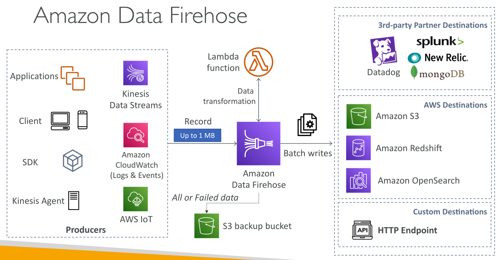

# Amazon Data Firehose

**Amazon Data Firehose** เป็นบริการที่ออกแบบมาเพื่อ **ส่งข้อมูลจากแหล่งต่าง ๆ ไปยังปลายทางที่ต้องการ**

* ช่วยให้การ **นำเข้าข้อมูลและส่งต่อเพื่อการวิเคราะห์หรือเก็บรักษา** เป็นไปอย่างราบรื่น

## ผู้ผลิตข้อมูลและวิธีการนำเข้า (Data Producers & Ingestion Methods)

ข้อมูลสามารถส่งเข้า **Amazon Data Firehose** ผ่านหลายแหล่ง เช่น

* แอปพลิเคชันของคุณ
* ไคลเอนต์
* เครื่องมือที่เขียนขึ้นเอง

สามารถใช้ได้ทั้ง:

* **AWS SDK**
* **Kinesis Agent**

นอกจากนี้ Firehose ยังสามารถ **ดึงข้อมูลโดยตรงจากบริการ AWS บางตัว** เช่น

* Kinesis Data Streams
* Amazon CloudWatch Logs และ Events
* AWS IoT

## การไหลและการแปลงข้อมูล (Data Flow & Transformation)

* ข้อมูลที่ Firehose รับเข้ามาสามารถ **แปลงข้อมูลโดยใช้ AWS Lambda** ก่อนส่งต่อไปยังปลายทาง
* ข้อมูลจะถูกสะสมใน **buffer** และถูก **flush เป็น batch** เพื่อเขียนข้อมูลไปยังปลายทางตามรอบ

## ปลายทางที่รองรับ (Supported Destinations)

Amazon Data Firehose รองรับปลายทางหลายประเภท:

1. **AWS Destinations**

   * Amazon S3
   * Amazon Redshift (สำหรับวิเคราะห์)
   * Amazon OpenSearch Service
2. **Third-party Partner Destinations**

   * Datadog, Splunk, New Relic, MongoDB
3. **Custom Destinations**

   * ผ่าน **HTTP endpoint** ส่งข้อมูลไปยังปลายทางใดก็ได้

## ตัวเลือกการสำรองข้อมูล (Data Backup Options)

* Firehose สามารถเขียน **ข้อมูลทั้งหมด** หรือ **เฉพาะข้อมูลที่ส่งล้มเหลว** ไปยัง Amazon S3
* ช่วยให้ **ข้อมูลมีความทนทานและสามารถกู้คืนได้**

## ภาพรวมและคุณสมบัติของ Amazon Data Firehose

* เดิมชื่อว่า **Kinesis Data Firehose**
* เป็น **บริการ fully managed** รองรับปลายทางทั้ง Redshift, S3, OpenSearch รวมถึง third-party และ HTTP endpoints
* **ปรับขนาดอัตโนมัติ (automatic scaling)**
* **Serverless เต็มรูปแบบ**
* คิดค่าบริการ **ตามการใช้งานจริง**

## การส่งข้อมูลแบบใกล้เรียลไทม์ (Near Real-Time Data Delivery)

* Firehose ถือเป็น **near real-time** เพราะใช้ **buffering**
* ข้อมูลถูกสะสมตาม **ขนาดหรือเวลา** ก่อน flush ไปยังปลายทาง
* มี **ความหน่วงเล็กน้อย** จึงต่างจากบริการ **real-time streaming**

## รูปแบบข้อมูลและการแปลง (Supported Data Formats & Transformations)

* รองรับข้อมูล **CSV, JSON, Parquet, Avro, text, binary**
* สามารถ **แปลงเป็น Parquet หรือ ORC** และใช้ **compression** เช่น gzip หรือ snappy
* สามารถใช้ **AWS Lambda** แปลงข้อมูล เช่น แปลง CSV เป็น JSON ก่อนเก็บใน S3

## เปรียบเทียบ Kinesis Data Streams กับ Amazon Data Firehose

| Feature         | Kinesis Data Streams                          | Amazon Data Firehose                                         |
| --------------- | --------------------------------------------- | ------------------------------------------------------------ |
| Service Type    | Streaming data collection service             | Data loading service into target destinations                |
| Data Processing | ต้องเขียน producer และ consumer code เอง      | Fully managed พร้อม automatic scaling                        |
| Latency         | Real-time                                     | Near real-time                                               |
| Modes           | Provisioned / On-demand                       | Fully serverless                                             |
| Data Storage    | เก็บข้อมูลได้ถึง 1 ปี พร้อม replay capability | ไม่มีการเก็บข้อมูลหรือ replay                                |
| Destinations    | ต้องประมวลผลโดย consumer เอง                  | รองรับ S3, Redshift, OpenSearch, third-party, HTTP endpoints |

## สรุป

* Amazon Data Firehose เป็น **บริการ fully managed สำหรับส่งข้อมูลสตรีมไปยังปลายทางหลายประเภท**
* รองรับ **near real-time delivery**
* มี **buffering และ automatic scaling**
* สามารถ **นำเข้าข้อมูลหลายแหล่ง, แปลงข้อมูลด้วย Lambda, และส่งต่อไปยัง AWS หรือ third-party**
* แตกต่างจาก Kinesis Data Streams ตรงที่ **ไม่เก็บข้อมูลและไม่มี replay capability**

## Key Takeaways

* เป็น **บริการ fully managed และ serverless** สำหรับส่งข้อมูลสตรีมไปยังปลายทางหลายประเภท
* รองรับ **near real-time delivery** พร้อม **buffering และ scaling อัตโนมัติ**
* สามารถ **แปลงข้อมูลก่อนส่งด้วย AWS Lambda**
* **ไม่เก็บข้อมูลหรือรองรับการ replay** ต่างจาก Kinesis Data Streams