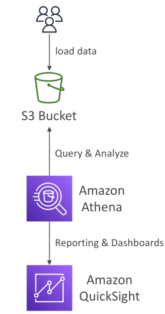
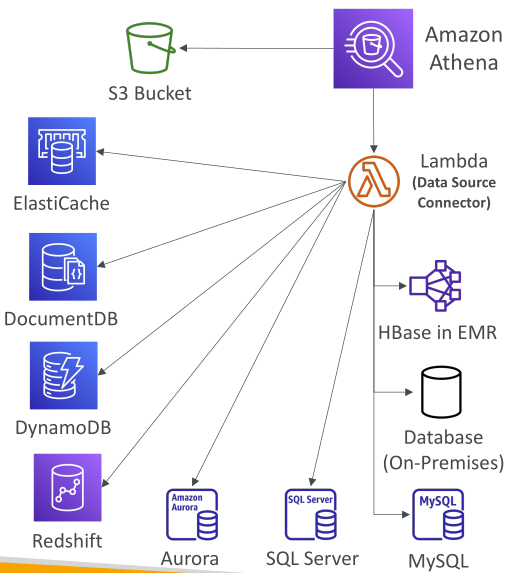

# Amazon Athena

Amazon Athena เป็นบริการ **Serverless Query Service** ที่ออกแบบมาเพื่อช่วยวิเคราะห์ข้อมูลที่จัดเก็บอยู่ใน **Amazon S3** โดยสามารถใช้ **ภาษา SQL มาตรฐาน** ในการ query ไฟล์ที่อยู่บน S3 ได้โดยตรง โดยไม่จำเป็นต้องย้ายข้อมูลออกมา

Athena สร้างขึ้นบน **Presto Engine** ซึ่งรองรับการ query ด้วย SQL

ผู้ใช้งานเพียงแค่เก็บข้อมูลไว้ใน **S3 bucket** แล้วใช้ Athena เพื่อ query และวิเคราะห์ข้อมูลนั้นได้ทันที โดยไม่ต้องจัดการหรือดูแลโครงสร้างพื้นฐานของฐานข้อมูลใด ๆ เนื่องจากเป็น **Serverless**

  

## รูปแบบข้อมูลที่รองรับและการคิดราคา

* Athena รองรับหลายรูปแบบไฟล์ เช่น **CSV, JSON, ORC, Avro, Parquet**
* การคิดราคาเป็นแบบง่าย ๆ: **จ่ายตามปริมาณข้อมูลที่ถูกสแกน (ต่อ TB)**
* เนื่องจากเป็น Serverless จึง **ไม่ต้อง provision ฐานข้อมูลเอง**

## การทำงานร่วมกับ Amazon QuickSight

Athena มักถูกใช้งานร่วมกับ **Amazon QuickSight** เพื่อสร้าง **รายงานและ Dashboard**
QuickSight จะเชื่อมต่อกับ Athena และ Athena จะ query ข้อมูลที่เก็บอยู่ใน S3 จากนั้น QuickSight แสดงผลออกมาในรูปแบบ Visualization

## กรณีใช้งานของ Amazon Athena

* การทำ **ad hoc queries**
* **Business Intelligence (BI)**
* **Analytics และ Reporting**
* การวิเคราะห์ **Logs** ที่สร้างโดย AWS services เช่น

  * VPC Flow Logs
  * Load Balancer Logs
  * CloudTrail Trails

## เคล็ดลับสำหรับการสอบ (Exam Tip)

เมื่อใดก็ตามที่ต้องการ **วิเคราะห์ข้อมูลที่เก็บใน Amazon S3 ด้วย SQL และไม่ต้องการดูแลเซิร์ฟเวอร์** → คำตอบคือ **Amazon Athena**

## การปรับปรุงประสิทธิภาพของ Amazon Athena

* การคิดค่าบริการขึ้นอยู่กับ **ขนาดข้อมูลที่ถูกสแกน**
* เทคนิคการลดปริมาณข้อมูลที่ต้องสแกน (ช่วยลดทั้งค่าใช้จ่ายและเวลา):

  * ใช้ **Columnar Data Formats** → สแกนเฉพาะคอลัมน์ที่ต้องการ
  * แนะนำให้ใช้ **Apache Parquet** และ **ORC** เนื่องจากช่วยเพิ่มประสิทธิภาพสูงสุด
  * ใช้ **AWS Glue** ในการทำ ETL เพื่อแปลงไฟล์เช่น **CSV → Parquet**
  * **บีบอัดข้อมูล (Compression)** เพื่อลดปริมาณข้อมูลและเพิ่มความเร็วในการอ่าน
  * **Partition ข้อมูล** → จัดโครงสร้างข้อมูลใน S3 เป็นโฟลเดอร์ตามคอลัมน์ เช่น `year=1991/month=1/day=1` → เวลา query เฉพาะวัน/เดือน/ปี จะสแกนเฉพาะ partition ที่เกี่ยวข้อง
  * ใช้ **ไฟล์ใหญ่แทนไฟล์เล็กจำนวนมาก** (เช่น 128 MB ขึ้นไป) → ทำให้สแกนเร็วขึ้นและมีประสิทธิภาพ

## Federated Query

Athena ไม่ได้ query ได้เฉพาะข้อมูลใน S3 เท่านั้น แต่ยังสามารถ query ข้าม **หลายแหล่งข้อมูล (data sources)** ได้ เช่น:

* AWS services: **CloudWatch Logs, DynamoDB, RDS, Redshift, Aurora**
* ฐานข้อมูลภายนอก: **SQL Server, MySQL, DocumentDB, HBase on EMR**
* ระบบ **On-premises**

Athena ใช้ **Data Source Connectors (Lambda Functions)** เพื่อเชื่อมต่อและทำ federated queries ข้ามระบบเหล่านี้ และผลลัพธ์สามารถเก็บกลับไปที่ **Amazon S3** ได้

  

## สรุป

Amazon Athena เป็นบริการ **Serverless Query Service** ที่ช่วยให้ query และวิเคราะห์ข้อมูลใน S3 ได้อย่างมีประสิทธิภาพ รวมถึง query ข้ามระบบผ่าน **Federated Query** ได้ด้วย

## Key Takeaways

* Athena เป็น **Serverless SQL Query Service** สำหรับการวิเคราะห์ข้อมูลใน **Amazon S3**
* รองรับไฟล์หลายประเภท เช่น **CSV, JSON, ORC, Avro, Parquet** (แนะนำ **Parquet / ORC** เพื่อประสิทธิภาพและลดค่าใช้จ่าย)
* การเพิ่มประสิทธิภาพ: ใช้ Columnar Format, Compression, Partitioning, และไฟล์ขนาดใหญ่
* รองรับ **Federated Query** ผ่าน Lambda connectors → query ได้ทั้ง AWS และฐานข้อมูล On-premises