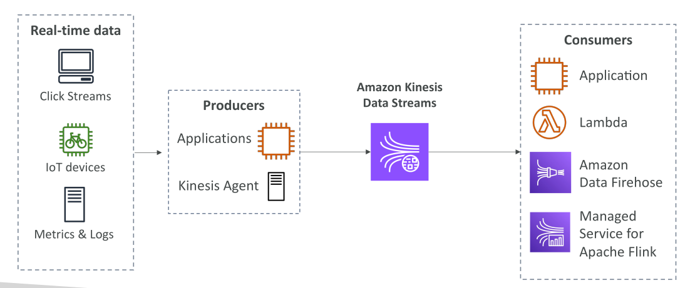

# Amazon Kinesis Data Streams

**Amazon Kinesis Data Streams** คือบริการที่ใช้ในการ **เก็บและจัดการข้อมูลแบบสตรีม (Streaming Data) แบบ Real-Time** จุดสำคัญคือการทำงานที่ **เกิดขึ้นและถูกประมวลผลทันที**

## ความเข้าใจเกี่ยวกับ Real-Time Data

**Real-Time Data** คือข้อมูลที่ถูกสร้างและนำมาใช้ทันที เช่น:

* Click Streams → ข้อมูลที่ถูกสร้างทุกครั้งที่ผู้ใช้คลิกบนเว็บไซต์
* ข้อมูลจากอุปกรณ์ IoT เช่น จักรยานที่เชื่อมต่ออินเทอร์เน็ต
* Metrics และ Logs จากเซิร์ฟเวอร์ที่ต้องถูกประมวลผลทันที

ข้อมูลเหล่านี้จะถูกส่งเข้า **Kinesis Data Streams** เพื่อการประมวลผลแบบเรียลไทม์

## Producers: การส่งข้อมูลเข้าสู่ Kinesis Data Streams

ผู้ที่ส่งข้อมูลเข้าสู่ Kinesis เรียกว่า **Producers** เช่น:

* **Applications** → โค้ดที่เขียนขึ้นเพื่อดึงข้อมูลจากเว็บไซต์หรืออุปกรณ์แล้วส่งเข้า Stream
* **Kinesis Agent** → ตัว Agent ที่ติดตั้งบนเซิร์ฟเวอร์เพื่อส่ง Metrics และ Logs

➡ Producers ทำหน้าที่ส่งข้อมูลเข้าสู่ Stream **ทันทีที่ข้อมูลเกิดขึ้น**

## Consumers: การประมวลผลข้อมูลจาก Kinesis Data Streams

ผู้ที่อ่านและประมวลผลข้อมูลเรียกว่า **Consumers** เช่น:

* แอปพลิเคชันที่เขียนขึ้นเองเพื่ออ่านข้อมูลจาก Stream
* **AWS Lambda** → Trigger อัตโนมัติเมื่อมีข้อมูลใหม่
* **Amazon Kinesis Data Firehose** (จะอธิบายในภายหลัง)
* **Managed Service for Apache Flink** สำหรับการประมวลผลเชิง Analytics

➡ ทำให้สามารถใช้ข้อมูลสตรีมได้ **ทันทีที่มันเข้ามา**

## คุณสมบัติสำคัญของ Kinesis Data Streams

* เก็บข้อมูลได้นานสูงสุด **365 วัน**
* ข้อมูลที่เก็บไว้สามารถนำมา **Replay / Reprocess** ได้
* ข้อมูลที่ถูกส่งเข้า Stream **ไม่สามารถลบเองได้** (จะหมดอายุเองตามเวลาที่ตั้งค่าไว้)
* Record หนึ่งสามารถมีขนาดสูงสุด **1 MB**
* ใช้กับกรณีที่มีข้อมูลเล็ก ๆ จำนวนมากแบบ Real-Time
* การจัดลำดับข้อมูล (Ordering) จะทำโดยใช้ **Partition ID** → ข้อมูลที่ Partition เดียวกันจะถูกเรียงลำดับตามเวลา
* ความปลอดภัย:

  * **Encryption at Rest** (ใช้ AWS KMS)
  * **Encryption in Transit** (ผ่าน HTTPS)

## การปรับแต่ง Producer และ Consumer

* **Kinesis Producer Library (KPL)** → สำหรับ Producers ที่ต้องการ Throughput สูง
* **Kinesis Client Library (KCL)** → สำหรับ Consumers เพื่อจัดการการอ่านข้อมูลอย่างมีประสิทธิภาพ

## โหมดการจัดการความจุ (Capacity Modes)

### 1. Provisioned Mode

* ผู้ใช้ต้องระบุจำนวน **Shards** ใน Stream
* **Shard = หน่วยความจุของ Stream**
* จำนวน Shard ตั้งแต่ **1 → 1,000 Shards**
* ความสามารถของ 1 Shard:

  * **เขียน (Write):** 1 MB/วินาที หรือ 1,000 Records/วินาที
  * **อ่าน (Read):** 2 MB/วินาที
* หากต้องการ Throughput สูงขึ้น → เพิ่มจำนวน Shards
* สามารถ Scale จำนวน Shards **ขึ้น/ลงได้เอง**
* ค่าใช้จ่ายคิดตามจำนวน Shards ต่อชั่วโมง

### 2. On-Demand Mode

* **ไม่ต้องจัดการ Shards เอง**
* ค่าเริ่มต้น: **~4,000 Records/วินาที หรือ 4 MB/วินาที**
* Kinesis จะ **Auto Scale** ตามปริมาณการใช้งานจริงใน 30 วันที่ผ่านมา
* ค่าใช้จ่ายคิดตาม **Data Ingestion และ Data Egress** ต่อชั่วโมง

## SQS vs SNS vs Kinesis

**การทำความเข้าใจ SQS, SNS และ Kinesis**
สิ่งสำคัญคือเราต้องเข้าใจความแตกต่างระหว่าง SQS, SNS และ Kinesis

### Amazon SQS (Simple Queue Service)

* SQS ใช้โมเดลที่ **ผู้บริโภค (consumer)** จะ **ดึงข้อมูล (pull)** โดยการร้องขอข้อความจากคิว (SQS queue)
* เมื่อข้อความถูกประมวลผลแล้ว ผู้บริโภคต้องลบข้อความออกจากคิว เพื่อป้องกันไม่ให้ผู้บริโภครายอื่นอ่านข้อความนั้นซ้ำอีก
* สามารถมี worker หรือ consumer กี่คนก็ได้ ทุกคนจะช่วยกันอ่านข้อความและลบออกจากคิว
* ไม่ต้องกำหนดปริมาณ throughput ล่วงหน้า เพราะเป็นบริการที่ **จัดการให้อัตโนมัติ (managed service)** และสามารถสเกลไปได้ถึงหลักแสนข้อความอย่างรวดเร็ว
* การรับประกันลำดับ (ordering guarantees) มีเฉพาะเมื่อเปิดใช้ **FIFO queue** (First In, First Out) เท่านั้น
* SQS รองรับความสามารถ **delay message** เช่น สามารถตั้งให้ข้อความไปถึง consumer หลังจาก 30 วินาที

### Amazon SNS (Simple Notification Service)

* SNS ใช้โมเดลที่ต่างออกไป คือ **publish-subscribe (pub-sub)**
* ในโมเดลนี้คุณจะ **push ข้อมูล** ไปหาผู้ติดตาม (subscribers) หลายคน และทุกคนจะได้รับข้อความสำเนาเดียวกัน
* รองรับผู้ติดตามสูงสุด **12,500,000 subscribers ต่อ 1 topic**
* ข้อมูลใน SNS **ไม่ถูกเก็บถาวร (not persistent)** ถ้าส่งไม่สำเร็จก็อาจทำให้ข้อความหายได้
* SNS สามารถสเกลได้ถึงหลักแสน topics โดยไม่ต้องกำหนด throughput ล่วงหน้า
* สามารถใช้ร่วมกับ SQS ได้ในรูปแบบ **fan-out architecture** เช่น ส่งข้อความจาก SNS ไปยัง SQS หลาย ๆ ตัว เพื่อจัดการโหลดการประมวลผล

### Amazon Kinesis

* Kinesis มี 2 โหมดสำหรับการรับข้อมูล:

  1. **Standard mode** – ผู้บริโภค **ดึงข้อมูล (pull)** จาก Kinesis, มี throughput **2 MB ต่อวินาทีต่อ shard**
  2. **Enhanced fan-out mode** – Kinesis จะ **push ข้อมูล** ให้ผู้บริโภคโดยตรง, ได้ throughput **2 MB ต่อวินาทีต่อ shard ต่อ consumer** (สูงกว่า standard มาก และให้หลายแอปอ่านข้อมูลได้พร้อมกัน)

* Kinesis มีการ **เก็บข้อมูลถาวร (data persistence)** ทำให้สามารถ **replay ข้อมูลย้อนหลังได้**

* ใช้บ่อยในการทำ **Big Data Analytics แบบเรียลไทม์** และงาน **ETL (Extract, Transform, Load)**

* **Ordering** (การรักษาลำดับ) มีให้เฉพาะในระดับ shard

* ต้องกำหนดจำนวน **shards** ของ data stream ล่วงหน้า (แต่สามารถใช้ **on-demand mode** ให้ระบบปรับ shards อัตโนมัติได้)

* ข้อมูลจะหมดอายุหลังจากช่วงเวลาที่ตั้งไว้ (ระหว่าง **1 – 365 วัน**)

### Kinesis Capacity Modes

* **Provisioned mode** → ต้องกำหนดจำนวน shard ที่ต้องการล่วงหน้า
* **On-demand capacity mode** → Kinesis จะปรับจำนวน shard ให้อัตโนมัติตามการใช้งานจริง

## สรุป

**Amazon Kinesis Data Streams** เป็นบริการสตรีมมิ่งข้อมูลแบบ Real-Time ที่สามารถ Scale ได้ ยืดหยุ่น และรองรับการเก็บข้อมูลได้นาน เหมาะสำหรับการสร้างระบบที่ต้อง **รับ → ประมวลผล → ใช้งานข้อมูลทันที**

* **SQS** → ใช้ **pull model** ผู้บริโภคดึงและลบข้อความ, รองรับหลาย consumer, มี FIFO เป็นตัวเลือก, ไม่ต้องกำหนด throughput ล่วงหน้า
* **SNS** → ใช้ **pub-sub model** ข้อความถูก **push** ไปหาผู้ติดตามจำนวนมาก, สเกลสูงมาก, แต่ **ไม่เก็บข้อความถาวร**
* **Kinesis** → รองรับทั้ง pull และ push, มี **data persistence**, การรักษาลำดับที่ shard, ใช้สำหรับ **big data และ real-time analytics**, ต้องจัดการ shards เอง (หรือใช้ on-demand)
* **SNS + SQS** → ใช้สร้าง **fan-out architecture** เพื่อกระจายโหลดได้อย่างมีประสิทธิภาพ

## Key Takeaways

* Kinesis Data Streams คือบริการสำหรับ **เก็บและจัดการข้อมูลแบบ Real-Time**
* **Producers** เช่น Applications, Kinesis Agent → ส่งข้อมูลเข้า Stream
* **Consumers** เช่น Applications, Lambda → อ่านและประมวลผลข้อมูล
* ข้อมูลเก็บได้สูงสุด **365 วัน** → Replay / Reprocess ได้ แต่ **ลบเองไม่ได้**
* มี **2 โหมดความจุ**: Provisioned (Shard-based) และ On-Demand (Auto Scale)
* SQS = **คิวสำหรับ worker** (ต้องดึงเอง + ลบเอง)
* SNS = **กระจายข้อความ** (push ไปหลายที่ แต่ไม่เก็บถาวร)
* Kinesis = **สตรีมข้อมูลเรียลไทม์** (เก็บย้อนหลังได้ + เหมาะกับ big data)
