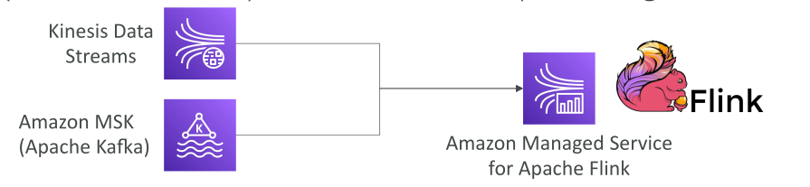

# Amazon MSK

**Amazon Managed Streaming for Apache Kafka (Amazon MSK)** คือบริการด้าน **การวิเคราะห์ข้อมูลแบบสตรีม (analytics service)** ของ AWS ที่จัดการ Kafka ให้แบบเต็มรูปแบบ (fully managed) ผู้ใช้สามารถสร้าง อัปเดต หรือลบ Kafka cluster ได้ตามต้องการ

Kafka เป็นอีกหนึ่งทางเลือกที่ทำงานคล้าย **Amazon Kinesis** โดยทั้งสองบริการรองรับ **การสตรีมข้อมูล (data streaming)**

Amazon MSK จะจัดการ **Kafka broker nodes** และ **Zookeeper broker nodes** ภายใน cluster ของคุณ ซึ่งสามารถถูก deploy ไว้ใน **VPC** และกระจายข้าม **3 Availability Zones (AZs)** เพื่อให้มี **High Availability (HA)**

MSK รองรับการ **กู้คืนอัตโนมัติ** จากความล้มเหลวที่พบบ่อยใน Kafka และข้อมูลจะถูกเก็บไว้ใน **EBS (Elastic Block Store)** ตามระยะเวลาที่คุณต้องการ

การติดตั้ง Kafka ด้วยตัวเองอาจซับซ้อน แต่ MSK ทำให้เรียบง่ายขึ้นด้วยการ **กดเพียงครั้งเดียวก็ deploy ได้บน AWS**

## MSK Serverless

นอกจาก MSK ปกติแล้ว ยังมี **Amazon MSK Serverless** ซึ่งทำให้ Apache Kafka ทำงานได้โดยไม่ต้อง **จัดการเซิร์ฟเวอร์หรือความจุเอง**

* MSK จะ **จัดสรรทรัพยากรให้เองอัตโนมัติ**
* สามารถ **scale คำนวณและ storage ได้ตามการใช้งานจริง**

## การทำงานของ Apache Kafka

Apache Kafka ใช้สำหรับการสตรีมข้อมูล โดย cluster จะประกอบด้วย **หลาย broker**

* **Producers** → ส่งข้อมูลจากแหล่งต่าง ๆ เช่น Kinesis, IoT, หรือ RDS เข้ามายัง **Kafka Topics**
* Topics จะถูก **replicate** (ทำสำเนา) ข้าม broker หลายตัว เพื่อความทนทานและเรียลไทม์
* **Consumers** → จะดึงข้อมูลจาก Kafka Topics และนำไปประมวลผล หรือนำส่งต่อไปยังระบบต่าง ๆ เช่น **EMR, S3, SageMaker, Kinesis, RDS**

Kafka ทำงานคล้าย Kinesis แต่มีความแตกต่างที่สำคัญบางประการ

## ความแตกต่างระหว่าง Kinesis Data Streams และ Amazon MSK

* **Message Size Limit (ขนาดข้อความ)**

  * Kinesis → จำกัดข้อความ **1 MB**
  * MSK → ค่าเริ่มต้น **1 MB** แต่สามารถปรับเพิ่มได้ถึง **10 MB**

* **Scaling (การสเกล)**

  * Kinesis → ใช้ **shards** ที่สามารถ split หรือ merge ได้
  * MSK → ใช้ **partitions** (เพิ่ม partition ได้ แต่ไม่สามารถลบออกได้)

* **Encryption (การเข้ารหัส)**

  * Kinesis → รองรับ **in-flight encryption**
  * MSK → รองรับทั้ง **plain text** และ **TLS in-flight encryption**
  * ทั้งคู่รองรับ **at-rest encryption**

* **Data Retention (การเก็บข้อมูล)**

  * Kinesis → เก็บตาม retention policy ที่ตั้งค่าไว้ (สูงสุด 365 วัน)
  * MSK → เก็บข้อมูลได้นาน **เท่าที่ต้องการ** (ขึ้นอยู่กับค่าใช้จ่ายของ EBS)

## การ Produce และ Consume Data กับ Amazon MSK

### การส่งข้อมูลเข้า (Producing)

* ใช้ **Kafka Producer** เพื่อส่งข้อมูลเข้าสู่ MSK

### การดึงข้อมูลออก (Consuming)

* ใช้ **Kinesis Data Analytics (Apache Flink)** → อ่านตรงจาก MSK
* ใช้ **AWS Glue** → สำหรับทำ Streaming ETL (Apache Spark Streaming)
* ใช้ **AWS Lambda** → ตั้งค่า MSK เป็น event source ได้
* เขียน **Kafka Consumer เอง** แล้วรันบน **EC2, ECS, หรือ EKS**

## สรุป (Conclusion & Key Takeaways)

* **Amazon MSK** คือบริการ Kafka ที่จัดการโดย AWS ช่วยให้การสร้างและดูแล Kafka cluster ง่ายขึ้น
* รองรับ **High Availability** โดยการ deploy cluster ข้าม AZs และมี **auto recovery**
* **MSK Serverless** → ไม่ต้องจัดการ server หรือ capacity เอง, scale อัตโนมัติ
* **แตกต่างจาก Kinesis** ตรง **message size limit, วิธี scaling, การเข้ารหัส และการเก็บข้อมูล**
* MSK ผสานการทำงานกับบริการ AWS อื่น ๆ ได้ดี เช่น EMR, Glue, Lambda, S3
* **Kinesis** = managed service ของ AWS โดยตรง (ใช้ง่าย แต่ยืดหยุ่นน้อยกว่า)
* **MSK** = Kafka เวอร์ชัน managed บน AWS (ยืดหยุ่นสูงกว่า แต่ซับซ้อนกว่าเล็กน้อย)