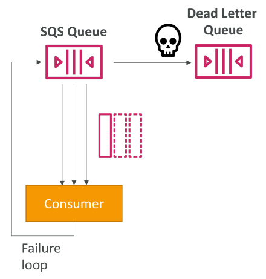
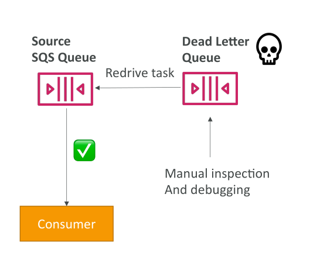

# **SQS - Dead Letter Queues (DLQ)**

Dead Letter Queue คือกลไกใน Amazon SQS ที่ใช้จัดการข้อความที่ไม่สามารถประมวลผลได้สำเร็จ หลังจากถูกลองประมวลผลหลายครั้ง

## **กรณีที่ข้อความประมวลผลล้มเหลว**

ลองพิจารณาสถานการณ์:

* Consumer พยายามประมวลผลข้อความ แต่ไม่สำเร็จภายในเวลาที่กำหนด (**Visibility Timeout**)
* เมื่อหมดเวลา ข้อความนั้นจะถูกส่งกลับเข้าคิวอีกครั้ง
* Consumer อาจลองอ่านข้อความนั้นอีก แต่ก็ยังล้มเหลว → ข้อความจึงถูกส่งกลับเข้าคิวซ้ำอีก

## **ปัญหาที่เกิดจากความล้มเหลวซ้ำๆ**

ถ้าสถานการณ์นี้เกิดบ่อย:

* ข้อความที่มีปัญหาจะถูกวนซ้ำไปเรื่อยๆ → ดึงจากคิว → ประมวลผลล้มเหลว → กลับเข้าคิว
* สิ่งนี้อาจทำให้ระบบเสียทรัพยากรและไม่สามารถทำงานได้ตามปกติ

## **การตั้งค่า MaximumReceives**

เพื่อแก้ปัญหา เราสามารถตั้งค่า **MaximumReceives** (จำนวนครั้งสูงสุดที่อนุญาตให้ข้อความถูกดึงมา)

* ถ้าข้อความถูกประมวลผลเกินจำนวนครั้งที่กำหนด → SQS จะถือว่าข้อความนี้มีปัญหา
* ข้อความนั้นจะถูกส่งไปยัง **Dead Letter Queue (DLQ)**

## **การย้ายข้อความไปยัง Dead Letter Queue**

* เมื่อข้อความถูกส่งเข้า **DLQ** → มันจะถูก **ลบออกจากคิวต้นทาง**
* และถูกเก็บไว้ใน DLQ เพื่อรอให้ผู้ดูแลระบบตรวจสอบหรือประมวลผลภายหลัง

## **จุดประสงค์ของ Dead Letter Queue**

* **Debugging (แก้ปัญหาและตรวจสอบ)**
  DLQ ช่วยให้เรามีเวลาในการตรวจสอบว่าเกิดอะไรขึ้นกับข้อความนั้น
* DLQ เองก็คือ **SQS Queue ปกติ** ที่สามารถประมวลผลได้เหมือนกัน

## **ข้อควรระวังเกี่ยวกับ DLQ**

1. **Queue ต้องเป็นชนิดเดียวกัน**

   * ถ้าคิวต้นทางเป็น **FIFO** → DLQ ต้องเป็น **FIFO**
   * ถ้าคิวต้นทางเป็น **Standard** → DLQ ต้องเป็น **Standard**
2. **ระยะเวลาเก็บข้อความ (Retention Period)**

   * ควรตั้งค่า retention time ให้นาน เช่น **14 วัน** เพื่อให้มีเวลาตรวจสอบและแก้ไข

## **การจัดการ Dead Letter Queue ด้วย Re-drive to Source**

AWS มีฟีเจอร์ที่ชื่อว่า **Re-drive to Source**

* ใช้ในการนำข้อความจาก DLQ → ส่งกลับไปยังคิวต้นทาง (Source Queue)
* เหมาะในกรณีที่:

  * เราได้แก้โค้ด Consumer แล้ว
  * หรือแก้ปัญหาที่ทำให้ข้อความไม่ถูกประมวลผลได้สำเร็จ

## **ขั้นตอน**

1. ตรวจสอบข้อความใน DLQ → ดูว่าปัญหาคืออะไร
2. แก้ไข Consumer หรือระบบที่ทำงานผิดพลาด
3. ใช้ **Re-drive** ส่งข้อความจาก DLQ → กลับไปที่ Source Queue
4. Consumer จะประมวลผลข้อความตามปกติ (เหมือนไม่เคยล้มเหลวมาก่อน)

## **สรุป (Key Takeaways)**

* **Dead Letter Queue (DLQ)** ใช้สำหรับจัดการข้อความที่ล้มเหลวหลายครั้งในการประมวลผล
* ใช้ค่า **MaximumReceives** เพื่อตัดสินใจว่าจะย้ายข้อความไป DLQ เมื่อไหร่
* DLQ มีประโยชน์มากในการ **Debugging และการแก้ไขปัญหา**
* ควรตั้งค่า **Retention Period** ให้ยาวพอ (เช่น 14 วัน)
* ฟีเจอร์ **Re-drive** ช่วยนำข้อความจาก DLQ กลับไป Source Queue หลังจากแก้ปัญหาแล้ว