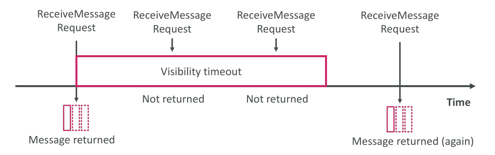

# SQS - Message Visibility Timeout

## **Message Visibility Timeout คืออะไร?**

ใน Amazon SQS มีกลไกที่เรียกว่า **Message Visibility Timeout** ซึ่งมีความสำคัญมากในการทำงานของ Queue

เมื่อ **Consumer** (ผู้ดึงข้อความ) ทำการดึงข้อความจาก Queue (ผ่าน `ReceiveMessage` API) ข้อความนั้นจะ **มองไม่เห็น (Invisible)** สำหรับ Consumer อื่นทันที

## **ลำดับการทำงาน (Timeline)**

1. Consumer ส่งคำสั่ง `ReceiveMessage` → ได้รับข้อความจาก Queue

2. เมื่อข้อความถูกส่งออกมาแล้ว → **เริ่มนับเวลา Visibility Timeout**

3. ค่า **ค่าเริ่มต้น (Default)** ของ Visibility Timeout = **30 วินาที**

   * ภายใน 30 วินาทีนี้ ข้อความจะต้องถูกประมวลผล (Processed)
   * ถ้า Consumer หรือ Consumer อื่นพยายามดึงข้อความในช่วงเวลานี้ → จะไม่ได้รับข้อความนั้น เพราะมันยังอยู่ในสถานะ "Invisible"

4. ถ้าครบเวลา Visibility Timeout แต่ **ยังไม่ได้ลบ (DeleteMessage)** ข้อความ:

   * ข้อความจะถูก "คืนกลับ" เข้าไปใน Queue
   * ทำให้ Consumer เดิมหรือ Consumer อื่นสามารถดึงข้อความนั้นออกมาได้อีกครั้ง

## **ปัญหาที่เกิดขึ้นได้**

* ถ้า Consumer ใช้เวลาประมวลผล **นานกว่า Visibility Timeout** → ข้อความจะถูกดึงซ้ำ (Duplicate Processing)

  * อาจจะถูกดึงซ้ำโดย **Consumer เดิม** หรือ **Consumer อื่น**

## **การจัดการ Visibility Timeout**

* ถ้า Consumer ต้องการเวลามากขึ้นในการประมวลผลข้อความ → สามารถเรียกใช้ API:

  * **`ChangeMessageVisibility`**
    เพื่อแจ้งให้ SQS ขยายเวลาการมองไม่เห็นของข้อความ (Visibility Timeout)

## **การตั้งค่า Timeout**

* ถ้าตั้ง Timeout **ยาวเกินไป (เช่น หลายชั่วโมง)**

  * ถ้า Consumer ล้มเหลวหรือหยุดทำงาน → ข้อความจะไม่กลับเข้ามาใน Queue จนกว่าจะครบ Timeout → เกิดความล่าช้า
* ถ้าตั้ง Timeout **สั้นเกินไป (เช่น ไม่กี่วินาที)**

  * ข้อความอาจถูกดึงซ้ำโดย Consumer อื่นก่อนที่ Consumer แรกจะประมวลผลเสร็จ → ทำให้เกิดการประมวลผลซ้ำ

👉 ดังนั้นควรตั้งค่า Timeout ให้เหมาะสมกับเวลาในการประมวลผลของแอปพลิเคชัน
👉 และใช้ `ChangeMessageVisibility` หากต้องการเวลาเพิ่ม

## **การสาธิตใน AWS Console**

* ส่งข้อความ "hello world" เข้าคิว → ค่า Default ของ Visibility Timeout = 30 วินาที
* มี **2 Consumers**

  * Consumer 1 ดึงข้อความ → ได้ข้อความ
  * Consumer 2 ดึงข้อความในช่วง 30 วินาทีนี้ → จะไม่ได้ข้อความ เพราะ Invisible
* หลังจากครบ 30 วินาที → ข้อความกลับมา Visible อีกครั้ง → Consumer 2 สามารถดึงข้อความได้
* ถ้า Consumer 1 หรือ Consumer 2 ลบข้อความ (`DeleteMessage`) → ข้อความจะถูกประมวลผลเสร็จสิ้น

## **การเปลี่ยนค่า Visibility Timeout**

* ไปที่การตั้งค่า (Edit Settings) ของ SQS Queue
* สามารถเปลี่ยนค่า Visibility Timeout ได้ตั้งแต่ **0 วินาที (ไม่แนะนำ)** → สูงสุด **12 ชั่วโมง**
* Default = **30 วินาที**
* ถ้า Consumer ต้องการเวลามากกว่า 30 วินาที → ใช้ **`ChangeMessageVisibility`** แทนการตั้งค่า Timeout ให้นานเกินไป

## **สรุป (Key Takeaways)**

* **Message Visibility Timeout** ทำให้ข้อความ **มองไม่เห็น** สำหรับ Consumer อื่นเมื่อถูกดึงออกมา
* ค่า Default = **30 วินาที**
* ถ้าไม่ลบข้อความก่อน Timeout → ข้อความจะกลับมา Visible และถูกดึงซ้ำได้
* ใช้ **`ChangeMessageVisibility`** เพื่อขยายเวลา Timeout ถ้า Consumer ต้องการเวลามากขึ้น
* ต้องเลือกค่าที่เหมาะสมเพื่อหลีกเลี่ยงปัญหา **ประมวลผลซ้ำ (Duplicate Processing)** หรือ **ความล่าช้า (Delay)**
