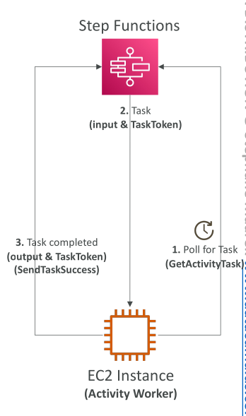

# Activity Tasks

ในหัวข้อนี้ เราจะมาดูเรื่อง **Activity Tasks** ของ Step Functions กันครับ จุดประสงค์ของ Activity Tasks คล้ายกับ **wait-for-task-token pattern** ที่เราเรียนไปก่อนหน้านี้ แต่แตกต่างกันในด้านวิธีการทำงานเล็กน้อย

## วิธีการทำงานของ Activity Tasks

* มีสิ่งที่เรียกว่า **activity workers** ซึ่งเป็นตัวทำงาน (workers) ที่จะประมวลผลงานที่ Step Functions มอบหมาย
* Workers เหล่านี้สามารถรันอยู่บน **EC2, Lambda, อุปกรณ์มือถือ หรือแพลตฟอร์มใด ๆ** ก็ได้
* Workers จะทำการ **poll (ดึงงาน)** จาก Step Functions เป็นประจำ โดยใช้ API `GetActivityTask`
* เมื่อได้รับงาน → worker จะประมวลผล → จากนั้นส่งผลลัพธ์กลับไปที่ Step Functions ผ่าน `SendTaskSuccess` หรือ `SendTaskFailure` พร้อมกับ task token

**ตัวอย่าง**
EC2 instance ที่ทำหน้าที่เป็น activity worker → จะ poll งานจาก Step Functions ด้วย `GetActivityTask`

* ถ้ามีงาน Step Functions จะส่ง input + task token กลับมา
* เมื่อทำงานเสร็จ → EC2 จะส่งผลลัพธ์พร้อม task token กลับไปด้วย `SendTaskSuccess`

## ความแตกต่างหลัก (Activity Task vs Wait-for-Task-Token)

* **Activity Task (Pull mechanism)**

  * Workers ต้องดึงงานจาก Step Functions เอง
  * โครงสร้างเครือข่ายง่ายกว่า เพราะ worker แค่ต้องเชื่อมต่อไปที่ Step Functions เท่านั้น

* **Wait-for-Task-Token (Push mechanism)**

  * Step Functions จะ **push event ออกไป** เช่น ส่งเข้า SQS
  * แล้วมีคอมโพเนนต์ภายนอก (เช่น Lambda หรือ App) ดึงงานจาก SQS → ส่งกลับเข้า Step Functions
  * ทำให้โครงสร้างซับซ้อนกว่า เพราะต้องมีตัวกลาง

สรุป: Activity Task = **Pull** | Wait-for-Task-Token = **Push**

## Parameters ที่สำคัญของ Activity Tasks

* **TimeoutSeconds** → เวลาสูงสุดที่ task สามารถทำงานได้ก่อนถูกมองว่า fail
* **HeartbeatSeconds** → เวลาสูงสุดระหว่างสัญญาณ heartbeat จาก worker ที่ต้องส่งมา เพื่อยืนยันว่ายังทำงานอยู่

worker ต้องเรียก API `SendHeartbeat` เป็นระยะ ๆ
เช่น ถ้า `HeartbeatSeconds = 10 วินาที` → ควรส่ง heartbeat ทุก 5 วินาที เพื่อให้ Step Functions รู้ว่างานยังไม่ตาย
หากตั้ง `TimeoutSeconds` ยาวมาก + ส่ง heartbeat ตลอด → Activity Task สามารถรันต่อเนื่องได้นานถึง **1 ปี**

## Key Takeaways

* **Activity Tasks ใช้กลไกแบบ Pull**: workers จะ poll งานจาก Step Functions ด้วย `GetActivityTask`
* Workers อาจรันบน EC2, Lambda, มือถือ หรือแพลตฟอร์มอื่น ๆ
* การรายงานผลกลับทำผ่าน `SendTaskSuccess` หรือ `SendTaskFailure` พร้อม task token
* **TimeoutSeconds** → ควบคุมระยะเวลาสูงสุดของงาน
* **HeartbeatSeconds** → กำหนดช่วงเวลาสูงสุดของ heartbeat signal ที่ worker ต้องส่ง เพื่อยืนยันว่างานยังทำงานอยู่