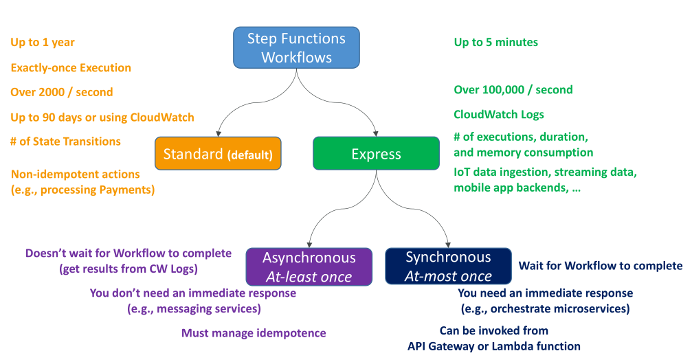

# Standard vs Express

## Standard Workflows

* เป็นค่า **default** ของ Step Functions
* รองรับเวลาการทำงานของ workflow สูงสุด **1 ปี**
* มีการรับประกัน **exactly-once execution** (ทำงานเพียงครั้งเดียวเท่านั้น)
* รองรับการทำงานพร้อมกันได้ประมาณ **2,000 workflows ต่อวินาที**
* มีประวัติการทำงาน (execution history) ใน Console นาน **90 วัน**
* สามารถใช้ **CloudWatch Logs** เพื่อเก็บ log ได้นานขึ้นตามที่กำหนด
* **การคิดราคา**: คิดตามจำนวน **state transitions** (ทุกครั้งที่ workflow เปลี่ยน state)
* **Use case ที่เหมาะสม**: งานที่ **ไม่สามารถซ้ำได้ (non-idempotent)** เช่น **การจ่ายเงิน (payment processing)**

## Express Workflows

* เหมาะสำหรับงานที่รันสั้น ๆ ใช้เวลาไม่เกิน **5 นาที**
* รองรับปริมาณงานสูงมาก ๆ ได้มากกว่า **100,000 executions ต่อวินาที**
* **ไม่มี execution history ใน Console**
* ต้องใช้ **CloudWatch Logs** เพื่อตรวจสอบผลลัพธ์และการทำงานย้อนหลัง
* **การคิดราคา**: คิดตาม

  1. จำนวน executions
  2. ระยะเวลาของ execution
  3. การใช้ memory
* **Use case ที่เหมาะสม**: งานที่ปริมาณสูงและสั้น เช่น **IoT data ingestion, streaming data, mobile app backend**

## Express Workflows: Asynchronous vs Synchronous

### 🔹 Asynchronous Express Workflows

* เริ่มการทำงานแล้ว **ไม่รอผลลัพธ์ทันที**
* ต้องตรวจสอบผลลัพธ์จาก **CloudWatch Logs**
* เหมาะสำหรับงานที่ไม่ต้องการคำตอบทันที เช่น **ระบบส่งข้อความ (messaging service)**
* Execution model: **At least once** → หากมี error ระบบจะ retry ให้อัตโนมัติ → อาจทำงานซ้ำได้ → ต้องจัดการ **idempotence** ด้วยตัวเอง

### 🔹 Synchronous Express Workflows

* เรียกใช้งานแล้ว **รอจนเสร็จและได้ผลลัพธ์ทันที**
* เหมาะสำหรับงานที่ต้องการคำตอบเดี๋ยวนั้น เช่น **การ orchestrate microservices**
* สามารถเรียกจาก **API Gateway หรือ Lambda** และรับผลลัพธ์ได้เลย
* Execution model: **At most once** → ถ้า error ขึ้น Step Functions **จะไม่ retry ให้อัตโนมัติ** → ต้องเขียน retry logic เอง

## สรุป

* **Standard Workflows** → เหมาะสำหรับงานที่ต้องการความน่าเชื่อถือสูง, ไม่ซ้ำได้, ใช้เวลายาวนาน (สูงสุด 1 ปี), throughput ปานกลาง และต้องเก็บประวัติการทำงานละเอียด
* **Express Workflows** → เหมาะสำหรับงานที่ต้องการ throughput สูงมาก, รันสั้น (ไม่เกิน 5 นาที), และใช้กับงานที่ต้องประมวลผลปริมาณมาก เช่น IoT และ streaming

## Key Takeaways

* **Standard Workflows**:

  * ใช้ได้สูงสุด **1 ปี**
  * การทำงานแบบ **exactly-once**
  * throughput ปานกลาง
  * มี execution history

* **Express Workflows**:

  * ใช้ได้สูงสุด **5 นาที**
  * throughput สูงมาก
  * แบ่งเป็น **Asynchronous (at least once)** และ **Synchronous (at most once)**
  * เหมาะสำหรับงานปริมาณสูงและสั้น