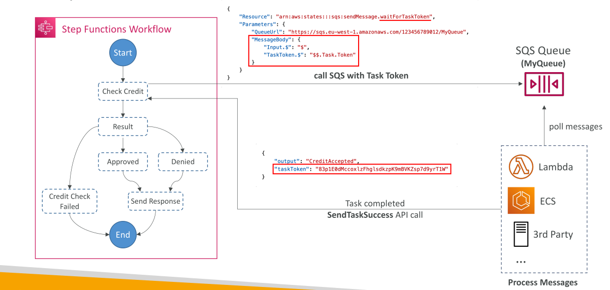

# Wait For Task Token

ในการบรรยายนี้ เราจะพูดถึงฟีเจอร์ **Wait for Task Token** ของ Step Functions ฟีเจอร์นี้ทำให้ workflow ของ Step Functions สามารถ **หยุดรอ (pause)** ได้ จนกว่าจะมีการส่ง **task token** กลับมา ก่อนที่จะดำเนินการต่อ

## จุดประสงค์ของการรอ Task Token

การรอ task token มีไว้เพื่อให้ workflow สามารถ **รอเหตุการณ์หรือกระบวนการจากภายนอก** ได้ เช่น

* AWS service อื่น ๆ ที่กำลังทำงานอยู่
* การอนุมัติจากมนุษย์ (human approval)
* การเชื่อมต่อกับ third-party service
* การเรียกใช้งานระบบ legacy

## วิธีการทำงาน

คุณสามารถเปิดใช้ฟีเจอร์นี้ได้โดยเพิ่ม `.waitForTaskToken` ต่อท้าย resource ใน task ของ Step Functions ซึ่งจะบอกให้ Step Functions **หยุดรอจนกว่าจะได้รับ task token ที่ถูกต้อง** ก่อนที่จะไปยังขั้นตอนถัดไป

**ตัวอย่าง**

* ถ้ามี resource ชื่อ `sqs:sendMessage` แล้วเพิ่ม `.waitForTaskToken` → Step Functions จะหยุดรอจนกว่าจะได้รับ task token กลับมาผ่าน API `SendTaskSuccess` หรือ `SendTaskFailure`

## ตัวอย่าง Workflow

1. Workflow เริ่มต้นและตรวจสอบเครดิตลูกค้า ซึ่งขึ้นอยู่กับ service ภายนอก
2. Workflow เรียก SQS พร้อมกับส่ง task token โดยใช้ `.waitForTaskToken`
3. ข้อความที่ส่งไป SQS จะมี task token อยู่ด้วย เพื่อให้แอปพลิเคชันปลายทางรู้ว่าต้อง callback Step Functions อย่างไร
4. แอปพลิเคชัน (อาจเป็น Lambda, ECS, EC2 หรือ third-party server) จะดึงข้อความจาก SQS ไปประมวลผล
5. แอปพลิเคชันจะอ่าน message body และ task token
6. เมื่อสำเร็จหรือเกิดข้อผิดพลาด แอปพลิเคชันจะเรียก `SendTaskSuccess` หรือ `SendTaskFailure` API พร้อมกับผลลัพธ์และ task token
7. เมื่อ Step Functions ได้รับการ callback ที่ถูกต้องพร้อม task token → Workflow จะดำเนินการต่อ

## สรุป

การใช้ **Wait for Task Token** ช่วยให้ Step Functions สามารถทำงานร่วมกับระบบภายนอกได้อย่างยืดหยุ่น โดย workflow จะดำเนินการต่อก็ต่อเมื่อได้รับการตอบกลับที่ถูกต้องจากภายนอกเท่านั้น

## Key Takeaways

* `waitForTaskToken` ช่วยให้ workflow หยุดรอจนกว่าจะได้รับ task token จากภายนอก
* ใช้ได้กับหลายกรณี เช่น การอนุมัติจากมนุษย์ การเชื่อมต่อ third-party หรือระบบ legacy
* Workflow จะส่ง task token ไปพร้อมกับข้อความ (เช่น SQS) เพื่อให้ภายนอกรู้วิธี callback กลับ
* ภายนอกจะต้องเรียก `SendTaskSuccess` หรือ `SendTaskFailure` เพื่อให้ workflow ดำเนินต่อ
* ช่วยให้ Step Functions ประสานงานกับระบบภายนอกได้อย่างน่าเชื่อถือและควบคุมได้