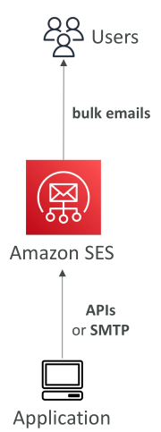

# Amazon Simple Email Service (Amazon SES)

* เป็น **บริการจัดการเต็มรูปแบบ (fully managed service)** สำหรับส่งอีเมลอย่าง **ปลอดภัย**, **ทั่วโลก**, และ **ในปริมาณมาก**
* รองรับ **อีเมลเข้าและอีเมลออก** (Inbound/Outbound Emails)
* มี **Reputation Dashboard**, ข้อมูลเชิงลึกด้านประสิทธิภาพ, และ **ฟีดแบ็คด้านสแปม**
* ให้ **สถิติอีเมล** เช่น:

  * จำนวนอีเมลที่ส่งสำเร็จ (deliveries)
  * อีเมลที่ถูกตีกลับ (bounces)
  * ผลลัพธ์จาก feedback loop
  * จำนวนอีเมลที่ถูกเปิดอ่าน (email open)
* รองรับมาตรฐาน **DomainKeys Identified Mail (DKIM)** และ **Sender Policy Framework (SPF)**
* มีตัวเลือกการใช้งาน IP แบบ **ยืดหยุ่น**:

  * IP ที่แชร์กับผู้ใช้คนอื่น (shared)
  * IP เฉพาะตัว (dedicated)
  * IP ของลูกค้าเอง (customer-owned)
* ส่งอีเมลจากแอปพลิเคชันของคุณโดยใช้:

  * **AWS Management Console**
  * **API**
  * **SMTP**
* **กรณีการใช้งาน (Use cases)**:

  * อีเมลเชิงธุรกรรม (transactional)
  * การตลาด (marketing)
  * การส่งอีเมลจำนวนมาก (bulk email communications)

