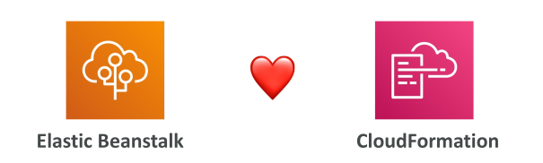

# Beanstalk & CloudFormation

มาดูกันว่าเบื้องหลัง **Elastic Beanstalk** ทำงานอย่างไร จริง ๆ แล้ว Beanstalk อาศัยบริการที่ชื่อว่า **CloudFormation** อยู่เบื้องหลัง

ภายหลังในคอร์สนี้ เราจะได้เรียนรู้ CloudFormation แบบเจาะลึก แต่ในที่นี้จะขอเกริ่นให้เข้าใจก่อนว่า **CloudFormation ใช้สำหรับ Provision AWS Services อื่น ๆ** เพื่อให้สามารถทำงานในรูปแบบ **Infrastructure as Code (IaC)** ได้

Elastic Beanstalk ใช้ CloudFormation เป็นรากฐานในการทำงานหลายอย่าง และสิ่งสำคัญที่ต้องรู้คือ คุณสามารถใช้ **CloudFormation resources** ผ่านโฟลเดอร์ **`.ebextensions`** ที่เราได้เรียนไปแล้ว เพื่อ Provision ทรัพยากรใด ๆ ก็ได้ตามที่คุณต้องการ

ตัวอย่างเช่น คุณสามารถ Provision:

* **ElastiCache cluster**
* **S3 bucket**
* **DynamoDB table**
* หรือแม้กระทั่ง **AWS resource อื่น ๆ**

ข้อดีคือ ถึงแม้ใน Beanstalk UI คุณจะตั้งค่าได้แค่บางส่วน แต่ถ้าใช้ **.ebextensions + CloudFormation** คุณสามารถตั้งค่าได้ทุกอย่างที่ต้องการใน AWS Environment ของคุณ

## การสำรวจ CloudFormation Stacks ที่ถูกสร้างโดย Elastic Beanstalk

ลองมาดูกันว่า Beanstalk ใช้ CloudFormation อย่างไร

ใน **Beanstalk Console** เรามีแอปพลิเคชันที่มี 2 Environments
เมื่อเข้าไปดูใน **CloudFormation Console** จะพบว่ามี **2 Stacks** ที่เกี่ยวข้อง ซึ่งถูกสร้างโดย Beanstalk

* Stack แรกชื่อ `eb-e-stack` → ตรงกับ **-en environment**
* Stack ที่สองชื่อ `eb-e-stacks` → ตรงกับ **-prod environment**

เมื่อคลิกเข้าไปที่ Stack เช่น -en จะเห็นว่า Stack นั้นมี **CloudFormation Template** กำกับอยู่ สามารถเปิดดูได้ในแท็บ **Template** (ยังไม่ต้องกังวลเรื่องอ่าน Template เพราะเราจะเรียนต่อไปในคอร์ส)

ส่วนที่มีประโยชน์คือแท็บ **Resources** ซึ่งจะแสดงว่า Stack นี้ได้สร้างทรัพยากรอะไรบ้าง ตัวอย่างเช่น:

* Auto Scaling Group
* Auto Scaling Group Launch Configuration
* Elastic IP (EIP)
* EC2 Security Group
* Wait Conditions (อันนี้ยังไม่ต้องสนใจตอนนี้)

เมื่อไปดูที่ **-prod stack** จะพบว่ามีการสร้างทรัพยากรทั้งหมด 16 รายการ เช่น:

* Auto Scaling Group
* Launch Configuration
* หลาย Scaling Policies
* CloudWatch Alarms (ใช้สำหรับ Scaling Policies)
* EC2 Security Groups
* Elastic Load Balancer
* Listener Rules
* Target Group

## สรุป

* **CloudFormation** คือกลไกเบื้องหลังที่ใช้ Provision Elastic Beanstalk Environment
* ถึงแม้เราจะไม่ต้องไปยุ่งกับ CloudFormation โดยตรง แต่การรู้ว่ามันเป็นกลไกหลัก จะทำให้เราใช้ **.ebextensions + CloudFormation** เพื่อขยายความสามารถของ Beanstalk ได้ เช่น Provision **ElastiCache, DynamoDB, หรือ S3 bucket** เพิ่มเติม
* ความสามารถนี้ทำให้เราสามารถต่อยอด Elastic Beanstalk Application ของเราให้มี **AWS Resources ครบตามที่ต้องการ**

## Key Takeaways (สรุปใจความสำคัญ)

* Elastic Beanstalk ใช้ **CloudFormation** เพื่อ Provision AWS Resources ในรูปแบบ **Infrastructure as Code**
* ด้วย **.ebextensions + CloudFormation** เราสามารถ Provision AWS Services เพิ่มเติมได้ เช่น **ElastiCache, S3, DynamoDB**
* CloudFormation Stacks ที่ Beanstalk สร้างขึ้นจะบริหารทรัพยากร เช่น **Auto Scaling Group, Security Group, Load Balancer, Scaling Policies**
* การเข้าใจ CloudFormation ช่วยให้เราสามารถขยายความสามารถของ Beanstalk เกินกว่าที่ UI อนุญาตให้ตั้งค่า
