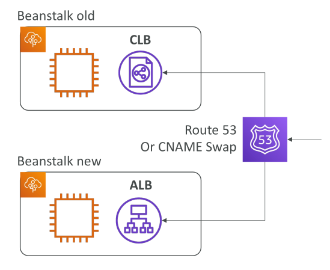
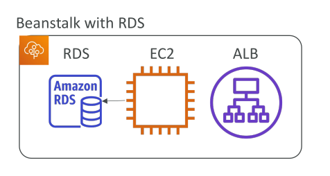
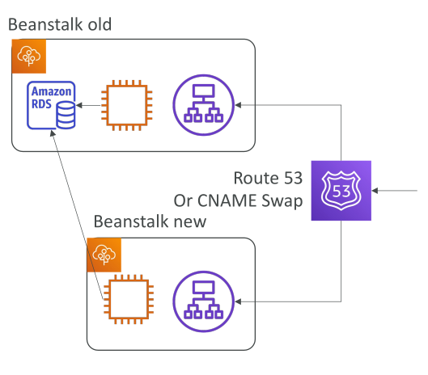

# Beanstalk Migrations

หัวข้อนี้ครอบคลุมวิธีการย้าย (migration) บน Elastic Beanstalk ซึ่งอาจปรากฏเป็นคำถามในข้อสอบ

## ข้อจำกัดของ Load Balancer

เมื่อสร้าง Elastic Beanstalk environment ขึ้นมาแล้ว **ไม่สามารถเปลี่ยนชนิดของ Elastic Load Balancer ได้** สามารถเปลี่ยนแค่การตั้งค่าเท่านั้น
เช่น หากคุณสร้าง Classic Load Balancer ขึ้นมา คุณจะสามารถแก้ไขการตั้งค่าได้ แต่ **ไม่สามารถอัปเกรดเป็น Application Load Balancer ได้**

## ขั้นตอนการย้ายเพื่ออัปเกรด Load Balancer

หากต้องการอัปเกรดจาก Classic Load Balancer ไปเป็น Application Load Balancer หรือจาก Application Load Balancer ไปเป็น Network Load Balancer จะต้องทำการ **migration** โดยทำตามขั้นตอนดังนี้:

1. สร้าง environment ใหม่ โดยใช้การตั้งค่าเหมือนเดิม ยกเว้นชนิดของ Load Balancer
2. **ไม่สามารถใช้ฟีเจอร์ Clone ได้** เพราะ Clone จะคัดลอกชนิด Load Balancer แบบเดิมทั้งหมด
3. ต้องสร้างการตั้งค่าด้วยตนเองให้เหมือนกับ environment เดิม
4. environment เก่าจะถูกคัดลอก (ไม่ใช่ clone) ไปยัง environment ใหม่
5. environment ใหม่นี้จะมี Load Balancer แบบที่ต้องการ เช่น Application Load Balancer
6. Deploy แอปพลิเคชันไปยัง environment ใหม่
7. โอนย้ายการรับส่งทราฟฟิกจาก environment เก่าไปยัง environment ใหม่ ด้วยการทำ **CNAME swap** หรืออัปเดต DNS ผ่าน Route 53

## RDS และ Elastic Beanstalk

คุณสามารถสร้าง RDS ขึ้นมาพร้อมกับ Beanstalk application ได้ ซึ่งเหมาะสำหรับ **development และ testing environment** เพราะทุกอย่างอยู่ใน stack เดียวกัน

## สิ่งที่ควรพิจารณาสำหรับ Production

สำหรับ production setup การสร้าง RDS รวมใน Beanstalk environment ไม่ใช่วิธีที่เหมาะสม
เพราะ **วงจรชีวิตของฐานข้อมูลจะผูกติดกับ Beanstalk environment** หากลบ environment อาจทำให้ฐานข้อมูลหายไปด้วย
แนวทางที่ถูกต้องคือ **แยก RDS ออกจาก Elastic Beanstalk** แล้วใช้การเชื่อมต่อผ่าน connection string เช่น environment variable

## วิธีแยก RDS ออกจาก Elastic Beanstalk

หากคุณมี RDS ที่ผูกกับ Beanstalk อยู่แล้ว สามารถแยกออกมาได้ตามขั้นตอนนี้:

1. สร้าง **snapshot** ของ RDS database เพื่อสำรองข้อมูล
2. ไปที่ RDS console แล้วเปิดใช้งาน **deletion protection** เพื่อป้องกันการลบโดยไม่ตั้งใจ
3. สร้าง Elastic Beanstalk environment ใหม่ โดย **ไม่ผูก RDS**
4. ตั้งค่า application ให้ชี้ไปที่ RDS เดิม เช่น ใช้ environment variable
5. ทำการ **CNAME swap (blue/green deployment)** หรืออัปเดต DNS ผ่าน Route 53 เพื่อโอนย้ายการใช้งานไปยัง environment ใหม่
6. ตรวจสอบว่า environment ใหม่ทำงานได้ปกติ
7. ลบ environment เก่าออกไป

   * เนื่องจากเปิด deletion protection ไว้ RDS จะไม่ถูกลบ
   * CloudFormation stack ของ environment เก่าอาจลบไม่สำเร็จและอยู่ในสถานะ **Delete Failed**
   * ต้องไปลบ CloudFormation stack นั้นด้วยตนเองผ่าน AWS CloudFormation console

วิธีนี้ทำให้คุณได้ RDS ที่ **แยกออกมาเป็นอิสระจาก Beanstalk environment** ซึ่งเป็นแนวทางที่แนะนำสำหรับ production

## Key Takeaways (สรุปสำคัญ)

* Elastic Beanstalk **ไม่อนุญาตให้เปลี่ยนชนิด Load Balancer** หลังจากสร้างแล้ว สามารถเปลี่ยนได้แค่การตั้งค่า
* หากต้องการอัปเกรด Load Balancer ต้องทำ migration โดยสร้าง environment ใหม่
* ใน production ควรแยก RDS ออกจาก Beanstalk environment เพื่อไม่ให้ lifecycle ผูกกัน
* การแยก RDS ทำได้โดยการ snapshot, เปิด deletion protection, สร้าง environment ใหม่โดยไม่ผูก RDS, ชี้ application ไปที่ฐานข้อมูลเดิม, ทำ CNAME swap และสุดท้ายลบ environment เก่า
