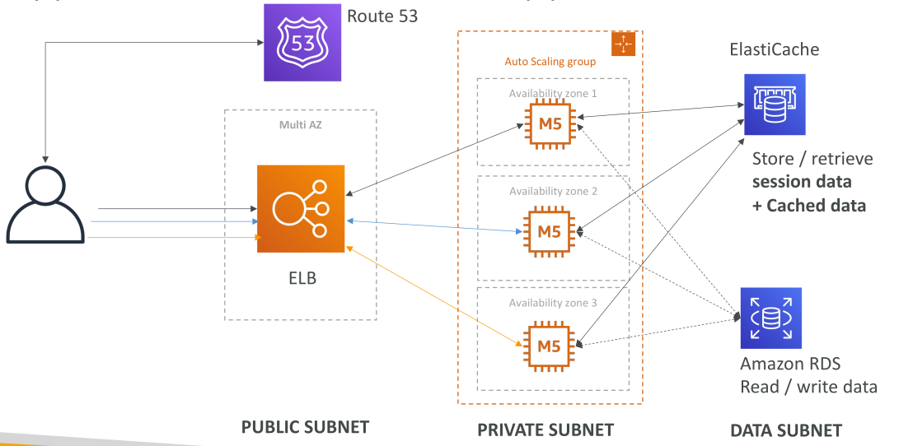
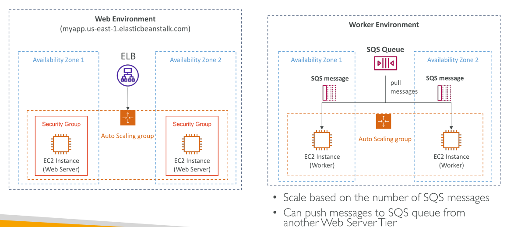
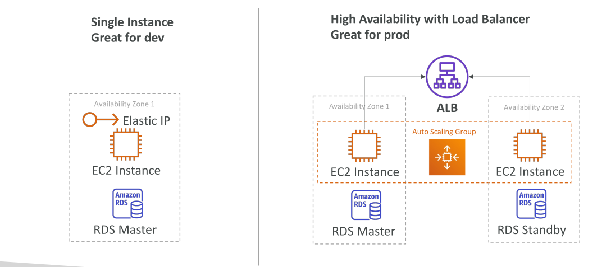

# AWS Elastic Beanstalk

จนถึงตอนนี้ ในคอร์สนี้ เมื่อเราจะ deploy แอปพลิเคชัน เรามักใช้สถาปัตยกรรมเดียวกัน:

* มี **Load Balancer** ที่รับ request ทั้งหมดจากผู้ใช้
* ตามด้วย **Auto Scaling Group** ที่กระจายไปหลาย Availability Zone
* ในแต่ละ Availability Zone มี **EC2 instances** ถูก deploy ไว้
* ด้านหลังอาจมี **Data Subnets** ที่มี **RDS Database** สำหรับอ่าน/เขียน (และอาจมี replicas)
* สำหรับการ cache เราอาจใช้ **ElastiCache**

ถ้ามีหลายแอปพลิเคชันที่ต้อง deploy ตามสถาปัตยกรรมนี้ การสร้างขึ้นใหม่ทุกครั้งจะเป็นเรื่องน่าเบื่อ และในฐานะนักพัฒนา การจัดการโครงสร้างพื้นฐานกับการ deploy โค้ดเป็นสิ่งที่ซับซ้อน เราไม่อยากต้องตั้งค่าฐานข้อมูล, Load Balancer, และองค์ประกอบอื่น ๆ ซ้ำไปซ้ำมา อีกทั้งยังต้องการให้ทุกอย่างสามารถ scale ได้อัตโนมัติ

แอปพลิเคชันเว็บส่วนใหญ่ก็มีสถาปัตยกรรมนี้เหมือนกัน (Load Balancer + Auto Scaling Group) ในฐานะนักพัฒนา สิ่งสำคัญคือโค้ดของเราต้องทำงานได้ โดยไม่ต้องกังวลกับโครงสร้างพื้นฐาน และในกรณีที่ใช้ภาษาหรือสภาพแวดล้อมต่างกัน เราก็อยากได้ **วิธีการ deploy แบบเดียวกัน**

ตรงนี้เองที่ **Elastic Beanstalk** เข้ามาช่วยเรา

Elastic Beanstalk มอบมุมมองที่เน้นนักพัฒนาในการ deploy แอปพลิเคชันบน AWS จาก **อินเทอร์เฟซเดียว** มันจะใช้ซ้ำ components อย่าง EC2, Auto Scaling Groups, Load Balancers, และ RDS โดยเป็นบริการแบบ Managed ที่ deploy องค์ประกอบเหล่านี้แทนคุณ พร้อมดูแล Capacity Provisioning, การตั้งค่า Load Balancer, การ Scaling, การตรวจสอบสุขภาพของแอป และการตั้งค่า Instances

หน้าที่เดียวของคุณในฐานะนักพัฒนาคือ **ตัวโค้ดของแอปพลิเคชัน** คุณยังสามารถปรับแต่งการตั้งค่าของแต่ละ component ได้เอง แต่ทุกอย่างรวมกันมาอยู่ในอินเทอร์เฟซเดียวผ่าน Elastic Beanstalk

นอกจากนี้ Beanstalk ยังมีวิธีอัปเดตแอปที่สะดวก ตัวบริการ Beanstalk เอง **ฟรี** แต่คุณต้องจ่ายค่าใช้จ่ายสำหรับทรัพยากรที่อยู่เบื้องหลัง (เช่น EC2, Auto Scaling Groups, Load Balancers)

## องค์ประกอบของ Elastic Beanstalk

* **Application**: กลุ่มของ Beanstalk components ที่รวม Environment, Versions และ Configurations
* **Application Version**: Iteration ของโค้ดแอป เช่น เวอร์ชัน 1, 2, 3
* **Environment**: กลุ่มของทรัพยากรที่รันแอปในเวอร์ชันหนึ่ง ๆ (ในหนึ่ง Environment รันได้เพียงเวอร์ชันเดียวในเวลาเดียวกัน แต่สามารถอัปเดตเป็นเวอร์ชันใหม่ได้)
* **Tiers**: Beanstalk มี 2 Tier → **Web Server Environment** และ **Worker Environment**
* **Multiple Environments**: สามารถสร้างหลาย Environment ได้ เช่น Development, Testing, Production

ขั้นตอนปกติคือ:

1. สร้าง Application
2. อัปโหลด Application Version
3. สร้าง Environment
4. จัดการ lifecycle ของ Environment
   และหากมีการเปลี่ยนแปลง → ก็เพียงอัปโหลดเวอร์ชันใหม่แล้ว deploy

## ภาษาที่รองรับ

Elastic Beanstalk รองรับหลายภาษาและแพลตฟอร์ม เช่น:

* Go
* Java SE / Java with Tomcat
* .NET Core (Linux)
* .NET (Windows Server)
* Node.js
* PHP
* Python
* Ruby
* Packer Builder
* Docker (Single, Multi, Pre-configured)

**เป้าหมายคือทำให้ deploy แอปใด ๆ บน Beanstalk ได้เกือบทั้งหมด**

## Web Server และ Worker Environment Tiers

* **Web Server Tier**: สถาปัตยกรรมแบบดั้งเดิม → Load Balancer ส่งทราฟฟิกไปยัง Auto Scaling Group ของ EC2 instances ที่ทำหน้าที่เป็น Web Servers
* **Worker Tier**: แตกต่างออกไป → ลูกค้าไม่ได้เข้าถึง EC2 โดยตรง แต่จะส่งข้อความไปที่ **SQS Queue** จากนั้น EC2 instances จะดึงข้อความจากคิวมาประมวลผล Worker Environment จะ scale ตามจำนวนข้อความใน SQS Queue

คุณสามารถรวม Web + Worker Environment ได้ โดยให้ Web Environment ส่งข้อความเข้า SQS Queue ของ Worker Environment

## Deployment Modes

Elastic Beanstalk มี 2 โหมด:

1. **Single Instance**

   * เหมาะสำหรับ Development
   * ใช้ EC2 instance เดียว + Elastic IP
   * สามารถเพิ่ม RDS ได้
   * เรียบง่าย แต่ไม่รองรับ High Availability

2. **High Availability**

   * เหมาะกับ Production
   * ใช้ Load Balancer กระจายทราฟฟิกไปยังหลาย EC2 instances
   * บริหารโดย Auto Scaling Group ในหลาย Availability Zone
   * อาจรวม Multi-AZ RDS (Master + Standby)

## Key Takeaways

* Elastic Beanstalk ช่วยทำให้การ Deploy แอปพลิเคชันบน AWS **ง่ายขึ้น**
* เป็นการ Deploy ที่มี **โครงสร้างชัดเจนและปลอดภัย**
* หัวข้อนี้จะเน้นไปที่การ **เข้าใจ Elastic Beanstalk ให้ลึกซึ้ง** ซึ่งเป็นเรื่องท้าทายแต่มีประโยชน์มาก
* เมื่อเข้าใจ Elastic Beanstalk แล้ว จะช่วยให้คุณสามารถ **Deploy แอปพลิเคชันได้อย่างถูกต้องและมีประสิทธิภาพ**
* Elastic Beanstalk ช่วยลดความซับซ้อนของการ deploy แอป โดยจัดการ Components อย่าง EC2, Load Balancer, Auto Scaling
* นักพัฒนาโฟกัสที่โค้ด ส่วน Beanstalk ดูแล Provisioning, Scaling และ Health Monitoring
* รองรับหลายภาษาและหลายรูปแบบ Environment (Web, Worker)
* มี 2 Deployment Mode: **Single Instance (Dev)** และ **High Availability (Prod)**