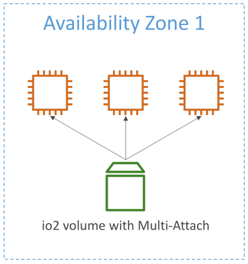

# EBS Multi-Attach

ฟีเจอร์ **Multi-Attach** ของ EBS ช่วยให้เราสามารถ **แนบ (attach) EBS volume เดียวกันไปยังหลาย EC2 instance** ได้ใน **Availability Zone เดียวกัน**

ตามชื่อ ฟีเจอร์นี้ออกแบบมาเพื่อให้ volume หนึ่งสามารถถูกแนบกับหลาย instance พร้อมกันใน AZ เดียวกัน

## ประเภท Volume ที่รองรับ

* รองรับเฉพาะ **io1 และ io2**
* ตัวอย่าง: หากคุณมีหลาย EC2 instance และ volume แบบ io2 ที่เปิด Multi-Attach ฟีเจอร์นี้ Volume จะสามารถ **attach กับหลาย instance พร้อมกันได้**
* ทุก instance ที่แนบ volume นี้จะมี **สิทธิ์อ่าน-เขียนเต็ม** ทำให้ทุก instance สามารถอ่านและเขียนข้อมูลพร้อมกันได้

## การใช้งาน (Use Cases)

* เพิ่ม **ความพร้อมใช้งานของแอปพลิเคชัน** เช่น แอปแบบ clustered Linux อย่าง Teradata
* เหมาะสำหรับแอปที่ต้องจัดการ **การเขียนข้อมูลพร้อมกัน (concurrent write)**

## ข้อจำกัด

* **Availability Zone:** จำกัดอยู่ใน AZ เดียว ไม่สามารถแนบ volume จาก AZ หนึ่งไปยังอีก AZ ได้
* **จำนวน instance ที่แนบได้:** สูงสุด 16 EC2 instance ต่อ volume
* **File System:** ต้องใช้ **cluster-aware file system** เพื่อให้ Multi-Attach ทำงานได้อย่างถูกต้อง (ไม่เหมือน XFS หรือ EXT4 ทั่วไป)

## Key Takeaways

* ฟีเจอร์ Multi-Attach ทำให้ **EBS volume เดียวสามารถ attach กับหลาย EC2 instance ใน AZ เดียวกันได้**
* รองรับเฉพาะ **io1 และ io2**
* แนบได้สูงสุด **16 instance พร้อมกัน**
* ต้องใช้ **cluster-aware file system** เพื่อใช้งาน Multi-Attach ได้อย่างมีประสิทธิภาพ