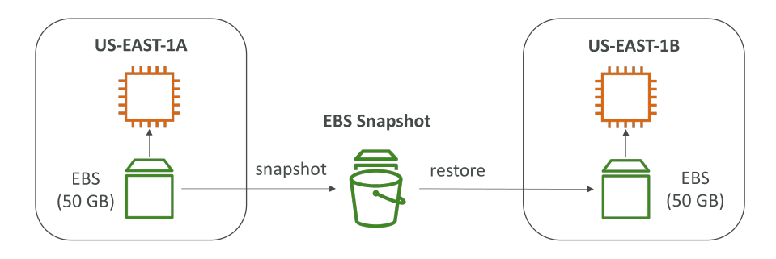
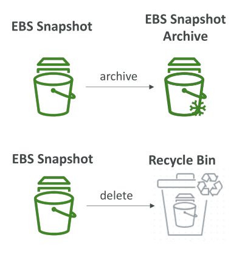

# EBS Snapshots

## บทนำเกี่ยวกับ EBS Snapshots

EBS Snapshot คือการสำรองข้อมูล (Backup) ของ EBS Volume ณ ช่วงเวลาใดเวลาหนึ่ง (point-in-time).
ไม่จำเป็นต้องถอด (detach) EBS Volume ออกจาก EC2 Instance เพื่อสร้าง Snapshot แม้ว่าการถอดออกก่อนจะเป็นสิ่งที่แนะนำก็ตาม

## การคัดลอก Snapshot ข้าม Availability Zone และ Region

คุณสามารถคัดลอก (copy) EBS Snapshots ข้าม Availability Zone หรือแม้แต่ข้าม Region ได้
ตัวอย่างเช่น มี EC2 Instance ที่ผูกกับ EBS Volume ใน **us-east-1a** และอีกเครื่องใน **us-east-1b**
คุณสามารถสร้าง Snapshot ของ EBS Volume ใน **us-east-1a** แล้วกู้คืน (restore) มันใน **us-east-1b** ได้
นี่คือวิธีการย้าย EBS Volume จาก Availability Zone หนึ่งไปยังอีก Availability Zone หนึ่ง

## ฟีเจอร์สำคัญของ EBS Snapshots

### 📌 EBS Snapshot Archive

* ย้าย Snapshot ไปเก็บใน **Archive Tier** ที่มีราคาถูกลงสูงสุดถึง **75%**
* แต่การกู้คืน (restore) จาก Archive Tier จะใช้เวลา **24 ถึง 72 ชั่วโมง** จึงไม่สามารถใช้งานได้ทันที

### 📌 Recycle Bin สำหรับ EBS Snapshots

* เมื่อคุณลบ Snapshot มันจะไม่ถูกลบถาวร แต่จะถูกย้ายไปยัง **Recycle Bin**
* สิ่งนี้ช่วยให้คุณสามารถกู้คืน Snapshot ที่ถูกลบโดยไม่ตั้งใจได้
* กำหนดระยะเวลาเก็บ (retention period) ได้ตั้งแต่ **1 วัน ถึง 1 ปี**

### 📌 Fast Snapshot Restore

* ฟีเจอร์นี้บังคับให้มีการ **initialize** Snapshot แบบเต็มทันที
* ช่วยกำจัดความหน่วง (latency) ในการใช้งานครั้งแรก
* เหมาะกับ Snapshot ที่มีขนาดใหญ่มากและคุณต้องการสร้าง EBS Volume หรือเปิด Instance จาก Snapshot อย่างรวดเร็ว
* แต่มีค่าใช้จ่ายสูง ควรใช้อย่างระมัดระวัง

## สรุป

นี่คือเนื้อหาเกี่ยวกับ EBS Snapshots ขอบคุณที่ติดตาม แล้วพบกันใหม่ในหัวข้อถัดไปครับ

## Key Takeaways

* EBS Snapshots คือการสำรองข้อมูลของ EBS Volume ในแต่ละช่วงเวลา โดยไม่จำเป็นต้องถอด Volume ออกจาก EC2 Instance
* Snapshots สามารถคัดลอกข้าม Availability Zone และ Region ได้ ทำให้กู้คืน Volume ไปยังที่อื่นได้
* EBS Snapshot Archive ลดค่าใช้จ่ายได้ถึง 75% แต่ต้องใช้เวลา 24–72 ชั่วโมงในการกู้คืน
* Recycle Bin ช่วยกู้คืน Snapshot ที่ถูกลบโดยไม่ตั้งใจได้ โดยกำหนดระยะเวลาเก็บได้ 1 วัน – 1 ปี
* Fast Snapshot Restore ช่วยลดความหน่วงในการใช้งานครั้งแรก แต่มีค่าใช้จ่ายสูง