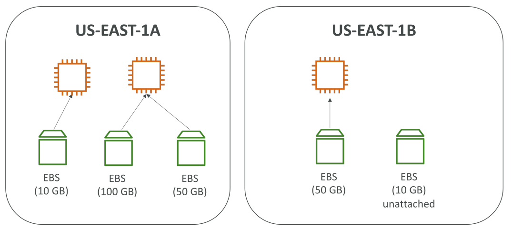
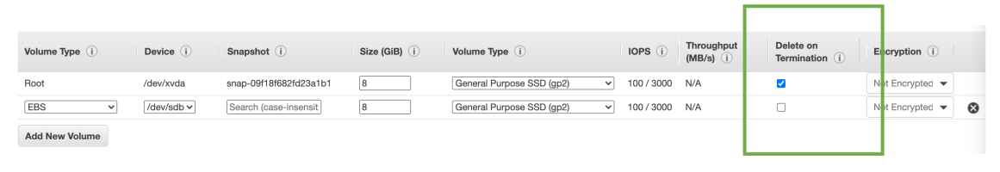

# EBS

## EBS Volume คืออะไร?

EBS (Elastic Block Store) คือ **network drive** ที่สามารถผูก (attach) เข้ากับ instance ของคุณขณะมันทำงานอยู่ จริง ๆ แล้วเราก็ได้ใช้งานมันมาตลอดโดยไม่รู้ตัว

คุณสมบัติหลักของ EBS คือ **เก็บข้อมูลต่อไปได้แม้ว่า instance จะถูก terminate ไปแล้ว** หมายความว่า คุณสามารถสร้าง instance ใหม่แล้วนำ EBS เดิมมา attach ได้ ทำให้ดึงข้อมูลเก่ากลับมาใช้งานได้ทันที ซึ่งเป็นสิ่งที่มีประโยชน์มาก

ในระดับ **Certified Cloud Practitioner**:

* EBS Volume **ผูกกับ instance ได้ครั้งละหนึ่งเครื่องเท่านั้น**
* เมื่อสร้าง EBS Volume มันจะถูกผูกกับ **Availability Zone (AZ)** ที่ระบุ เช่น หากคุณสร้างไว้ที่ `us-east-1a` จะไม่สามารถนำไปผูกกับ instance ที่อยู่ `us-east-1b` ได้

คุณสามารถเปรียบเทียบ EBS Volume ได้กับ **USB Stick แบบ network**:

* ปกติ USB เราต้องเสียบกับคอมพิวเตอร์ แต่ EBS ใช้การเชื่อมต่อผ่าน network
* ทำให้มี **latency บ้าง** เนื่องจากการติดต่อผ่านเครือข่าย

ข้อดีคือ EBS สามารถ **ถอดจาก instance หนึ่งแล้วไป attach อีก instance ได้อย่างรวดเร็ว** ซึ่งมีประโยชน์มากในกรณี **failover**

หากคุณต้องการย้าย EBS ไปอีก AZ โดยตรงไม่สามารถทำได้ แต่คุณสามารถสร้าง **snapshot** ของ EBS แล้วนำ snapshot นั้นไปสร้าง volume ใหม่ใน AZ อื่นได้

## การจัดการ Capacity และ Performance

EBS เป็น **Block Storage** หมายความว่าคุณต้อง **กำหนดขนาด (GB) และ IOPS ล่วงหน้า**

* คิดค่าบริการตามขนาดที่ provision
* สามารถเพิ่มขนาดหรือปรับ performance ได้ในภายหลัง

## ตัวอย่างการใช้งาน

* Instance หนึ่งสามารถมีหลาย EBS Volume (เหมือนเสียบ USB หลายตัวในเครื่องเดียว)
* แต่ EBS Volume หนึ่งจะใช้ได้กับ instance เดียวในเวลาเดียวกัน (ในระดับ CCP)
* หากต้องการใช้ใน AZ อื่น → ต้องสร้างใหม่ใน AZ นั้น

คุณยังสามารถ **สร้าง EBS Volume โดยไม่ต้อง attach** กับ instance ทันทีได้เช่นกัน เพื่อความยืดหยุ่น

## Delete on Termination Attribute

เมื่อคุณสร้าง EC2 instance ระบบจะสร้าง EBS Volume ขึ้นมาเป็น **Root Volume** พร้อมกัน โดย Volume จะมี attribute ที่ชื่อว่า **Delete on Termination**

* **Root Volume** → ถูกเปิดใช้งาน (enabled) โดยค่าเริ่มต้น → จะถูกลบไปเมื่อ instance ถูก terminate
* **Additional Volumes** (ที่ attach เพิ่มเอง) → ค่าเริ่มต้นจะ **ไม่ถูกลบ** เมื่อ instance ถูก terminate

คุณสามารถแก้ไข attribute นี้ได้ตามต้องการ เช่น:

* หากต้องการเก็บข้อมูล root volume ไว้แม้ terminate instance → ปิด Delete on Termination

นี่คือ use case ที่ออกสอบได้

## สรุป Key Takeaways

* **EBS คือ network-attached storage** ที่เก็บข้อมูลได้ต่อเนื่องแม้ instance จะถูก terminate
* **แต่ละ EBS Volume ถูกผูกกับ AZ หนึ่งเดียว** และใช้ได้กับ instance ครั้งละ 1 ตัว
* ต้อง **กำหนดขนาดและ IOPS ล่วงหน้า** และสามารถขยายได้ภายหลัง
* **Delete on Termination** ควบคุมว่า EBS จะถูกลบพร้อม instance หรือไม่ (ค่าเริ่มต้น: root volume ถูกลบ, ส่วนอื่นไม่ถูกลบ)