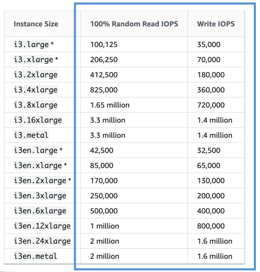

# EC2 Instance Store

## บทนำเกี่ยวกับ EC2 Instance Store

ก่อนหน้านี้เราเห็นวิธีการ **แนบไดรฟ์แบบเครือข่าย (network drive)** เข้ากับ EC2 instance ซึ่งให้ประสิทธิภาพดี แต่บางครั้งต้องการ **ประสิทธิภาพสูงขึ้นอีก** ซึ่งสามารถทำได้ด้วยการใช้ **ฮาร์ดดิสก์ที่เชื่อมต่อโดยตรงกับ EC2 instance**

แม้ EC2 instance จะเป็น **เครื่องเสมือน (virtual machine)** แต่ instance แต่ละตัวจะถูกเชื่อมต่อกับ **เซิร์ฟเวอร์ฮาร์ดแวร์จริง** บางเซิร์ฟเวอร์มี **พื้นที่ดิสก์ติดตั้งอยู่กับเครื่องเซิร์ฟเวอร์** EC2 บางประเภทสามารถใช้ **EC2 Instance Store** ซึ่งหมายถึง **ฮาร์ดดิสก์ที่ติดตั้งกับเซิร์ฟเวอร์จริง**

## ประโยชน์และลักษณะของ EC2 Instance Store

* EC2 Instance Store **ให้ประสิทธิภาพการอ่าน/เขียน (I/O) สูงมาก**
* เหมาะสำหรับงานที่ต้องการ **disk throughput สูง**
* ข้อควรระวัง: **หากหยุดหรือ terminate instance ข้อมูลใน Instance Store จะหายไป**

เพราะฉะนั้น EC2 Instance Store จึงถูกเรียกว่า **ephemeral storage** หรือ **storage ชั่วคราว** ซึ่ง **ไม่เหมาะสำหรับเก็บข้อมูลระยะยาว**

## กรณีการใช้งานที่เหมาะสม

* เก็บ **buffer**
* เก็บ **cache**
* เก็บ **scratch data** หรือ **temporary content**

> สำหรับการเก็บข้อมูลระยะยาว ควรใช้ **EBS (Elastic Block Store)**

* หาก **เซิร์ฟเวอร์ฮาร์ดแวร์หลักล้มเหลว** ข้อมูลจะสูญหาย ดังนั้นหากใช้ Instance Store คุณต้อง **สำรองและทำ replication ข้อมูลด้วยตัวเอง**

## ตัวอย่างประสิทธิภาพ

* ตัวอย่าง **I3 instance** มี Instance Store

  * **Read IOPS** สูงสุด: 3.3 ล้าน
  * **Write IOPS** สูงสุด: 1.4 ล้าน
* เปรียบเทียบกับ **EBS GP2**

  * IOPS ประมาณ 32,000

→ แสดงให้เห็นว่า **Instance Store มีประสิทธิภาพสูงกว่ามาก**

**เคล็ดลับสำหรับสอบ:**
เมื่อเจอ **volume ประสิทธิภาพสูงที่ติดฮาร์ดแวร์กับ EC2 instance** ให้คิดว่าเป็น **EC2 Instance Store**

## Key Takeaways

* **EC2 Instance Store** คือ storage แบบฮาร์ดแวร์ติดเครื่องสำหรับ EC2 instance ให้ **ประสิทธิภาพ I/O สูงมาก**
* **Instance Store เป็น ephemeral** ข้อมูลจะหายหาก instance ถูก stop หรือ terminate
* เหมาะสำหรับ **buffer, cache, scratch data, temporary content** แต่ **ไม่เหมาะสำหรับการเก็บระยะยาว**
* ผู้ใช้ต้อง **สำรองและ replicate ข้อมูลเอง** เพื่อป้องกันการสูญหาย