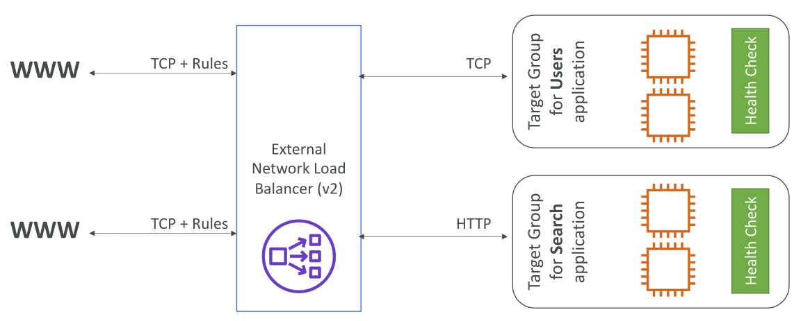
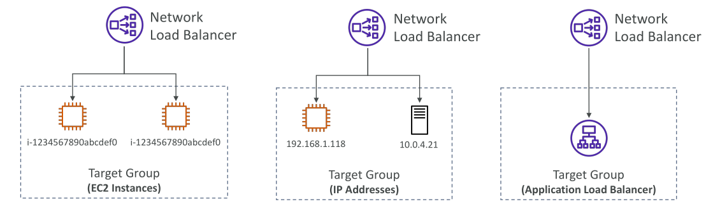

# Network Load Balancer (NLB)

## Overview

* **Network Load Balancer (NLB)** ทำงานที่ **Layer 4**

  * หมายถึง รองรับ **TCP และ UDP traffic**
  * ต่ำกว่าการทำงานของ **Layer 7** (HTTP)
* เหมาะกับการ **Load Balance TCP หรือ UDP traffic**

**จุดเด่น:**

* ออกแบบมาสำหรับ **ประสิทธิภาพสูงสุด**
* รองรับ **ล้านคำขอต่อวินาที** (millions of requests per second)
* **Latency ต่ำมาก** → เหมาะกับงานเครือข่ายที่ต้องการความเร็วสูง

**IP คงที่ (Static IP)**

* NLB ให้ **IP คงที่ 1 IP ต่อ Availability Zone**
* สามารถ **กำหนด Elastic IP** ให้แต่ละ Availability Zone ได้
* ใช้เมื่อแอปต้องเข้าถึงผ่าน **IP เฉพาะหนึ่งหรือหลาย IP**

**ตัวอย่างสำหรับสอบ:**

* ถ้าโจทย์บอกว่า ต้องเข้าผ่าน IP เฉพาะ หรือ ต้องการประสิทธิภาพสูงสำหรับ TCP/UDP → **คิดถึง NLB**

## วิธีการทำงานของ Network Load Balancer

* คล้ายกับ **Application Load Balancer (ALB)**
* สร้าง **Target Groups** → NLB ส่ง Traffic ไปยัง Target Groups
* ตัวอย่าง: Frontend ใช้ **TCP**, Backend อาจใช้ **GTP** หรือ Protocol อื่น

## Target Groups

* Target Groups ของ NLB สามารถประกอบด้วย:

  * **EC2 Instances** → NLB ส่ง TCP/UDP traffic ตรงไปยัง EC2
  * **IP Addresses** → ต้องเป็น **Private IP** และ Hard-Coded

    * ใช้ได้ทั้ง EC2 ใน AWS และ **Server On-Premises**
* NLB สามารถวาง **หน้าของ ALB** ได้

  * NLB → จัดการ IP คงที่
  * ALB → จัดการ HTTP Traffic + Routing Rules
  * ทำให้ได้ประสิทธิภาพสูงและยังรองรับ Routing Rules ของ HTTP

  

## Health Checks

* Target Groups ของ NLB รองรับ **Health Checks** ผ่าน:

  * TCP
  * HTTP
  * HTTPS
* ถ้า Backend Application รองรับ HTTP/HTTPS → สามารถตั้ง Health Check ได้

## สรุป Key Takeaways

* NLB ทำงานที่ **Layer 4** → รองรับ TCP และ UDP
* ประสิทธิภาพสูงมาก → ล้านคำขอต่อวินาที + Latency ต่ำ
* **Static IP** 1 IP ต่อ Availability Zone, สามารถใช้ Elastic IP
* Target Groups → EC2 Instances หรือ Private IP (รวมถึง On-Premises)
* สามารถวาง **หน้าของ ALB** → รวมข้อดีของ IP คงที่กับ HTTP Routing
* Health Checks รองรับ TCP, HTTP, และ HTTPS
