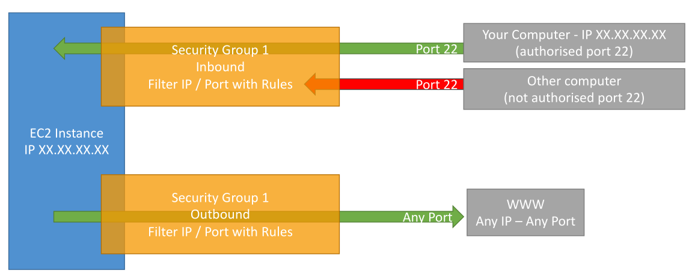
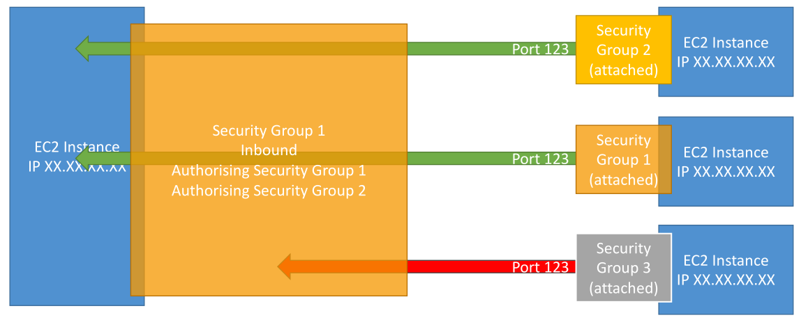

# Security Groups

เรามาเริ่มพูดถึง **ไฟร์วอลล์รอบ ๆ EC2 instances** กัน Security Groups เป็นอีกหนึ่งหัวข้อพื้นฐานที่สำคัญมากในเรื่อง **Network Security บน AWS Cloud** โดย Security Groups จะควบคุมว่า traffic แบบใดสามารถเข้าออกจาก EC2 instances ได้

## ความง่ายในการใช้งาน Security Groups

Security Groups ใช้งานง่ายมาก เนื่องจากมันมีเฉพาะ **Allow Rules** เท่านั้น หมายความว่าเราต้องกำหนดเองว่า traffic แบบใดอนุญาตให้เข้าออกได้

Security Groups สามารถอ้างอิงได้ทั้ง:

* IP Address (เช่น IP ของคอมพิวเตอร์เรา)
* Security Group อื่น ๆ (สามารถอ้างถึงกันได้)

### ตัวอย่างการทำงาน

สมมติว่าเรามีคอมพิวเตอร์ที่เชื่อมต่อกับอินเทอร์เน็ต และพยายามเข้าถึง EC2 Instance ของเรา เราจำเป็นต้องสร้าง **Security Group** มาล้อมรอบ EC2 Instance ทำหน้าที่เหมือน Firewall

Security Group นี้จะมี **กฎ (Rules)** ที่ตัดสินใจว่า:

* Traffic **ขาเข้า (Inbound)** จากภายนอกสามารถเข้ามายัง EC2 Instance ได้หรือไม่
* Traffic **ขาออก (Outbound)** จาก EC2 Instance สามารถออกไปยังอินเทอร์เน็ตได้หรือไม่

## Security Group และ Firewall

Security Groups เป็นเหมือนไฟร์วอลล์รอบ ๆ EC2 Instance โดยสามารถกำหนดได้ว่า:

* **Inbound Traffic**: อนุญาตให้ IP (IPv4 หรือ IPv6) เข้ามาได้หรือไม่
* **Outbound Traffic**: อนุญาตให้ EC2 ส่งออกไปยังภายนอกหรือไม่

เมื่อเราดู **กฎของ Security Group** เราจะเห็น:

* **Type** (ประเภท เช่น SSH, HTTP)
* **Protocol** (โปรโตคอล เช่น TCP)
* **Port** (หมายเลขพอร์ตที่จะเปิดใช้งาน)
* **Source** (แหล่งที่มาของ traffic เช่น IP หรือ Security Group)

เช่น `0.0.0.0/0` หมายถึง **อนุญาตให้ทุก IP เข้ามาได้** แต่เราก็สามารถจำกัดให้เฉพาะ IP ใด IP หนึ่งได้เช่นกัน

### การทำงานจริง

ถ้า Security Group ของเราเปิด **Port 22 (SSH)** ให้เฉพาะ IP คอมพิวเตอร์เรา เราก็จะสามารถเชื่อมต่อ EC2 Instance ได้ แต่ถ้าเป็นคอมพิวเตอร์ของคนอื่น (ที่มี IP ไม่ตรง) ก็จะถูกบล็อกและเจอ **Timeout**

โดย **ค่าเริ่มต้น (Default)**:

* Outbound traffic จะถูก **อนุญาตทั้งหมด** → EC2 สามารถเข้าถึงอินเทอร์เน็ตได้
* Inbound traffic จะถูก **บล็อกทั้งหมด** → ไม่มีใครเข้ามาได้จนกว่าจะอนุญาตเอง

## ข้อควรรู้เกี่ยวกับ Security Groups

* Security Group **ใช้ได้กับหลาย Instance** (ไม่จำเป็นต้องผูกแค่เครื่องเดียว)
* Instance **สามารถมีหลาย Security Groups** ได้พร้อมกัน
* Security Groups ถูกจำกัดอยู่ใน **Region และ VPC เดียวกัน** ถ้าไป Region หรือ VPC อื่น ต้องสร้างใหม่
* Security Group **อยู่ภายนอก EC2 Instance** ถ้า traffic ถูกบล็อก → Instance จะไม่เห็นการเชื่อมต่อนั้นเลย
👉 คำแนะนำจาก Developer:
ควรมี **Security Group แยกเฉพาะสำหรับ SSH** เพื่อจัดการง่ายขึ้น เพราะ SSH เป็นพอร์ตที่ซับซ้อนและต้องระวังเรื่องความปลอดภัยมากที่สุด

## Security Groups Diagram

## Debugging ปัญหาการเชื่อมต่อ

* **Timeout** → เกิดจาก Security Group ไม่อนุญาต (Inbound rule ไม่มี)
* **Connection Refused** → Security Group อนุญาตแล้ว แต่ Application ใน Instance ไม่ได้รัน

## ฟีเจอร์ขั้นสูง – Security Group referencing

Security Group สามารถอ้างอิง Security Group อื่นได้ ซึ่งมีประโยชน์มากตอนใช้กับ Load Balancer เช่น:

* Instance A ใช้ Security Group 1
* Instance B ใช้ Security Group 2
* ถ้า Security Group 1 อนุญาตให้ Security Group 2 เข้ามา → A และ B สามารถสื่อสารกันได้

ถ้า Security Group 3 ไม่ถูกอ้างอิงใน Security Group 1 → การเชื่อมต่อจาก Instance ที่ใช้ Group 3 จะถูกปฏิเสธ

## พอร์ตที่ควรรู้สำหรับการสอบ

* **22 (SSH)** → สำหรับ Linux Instances
* **21 (FTP)** → สำหรับอัปโหลดไฟล์
* **22 (SFTP)** → Secure File Transfer ใช้ SSH
* **80 (HTTP)** → สำหรับเว็บที่ไม่เข้ารหัส
* **443 (HTTPS)** → สำหรับเว็บที่เข้ารหัส
* **3389 (RDP)** → Remote Desktop Protocol สำหรับ Windows Instances

📌 **สรุป**:

* **Security Groups = Firewall ของ EC2** ควบคุม Inbound / Outbound Traffic
* ค่า Default = Block Inbound, Allow Outbound
* ใช้เฉพาะ Allow Rules (ไม่มี Deny Rules)
* พอร์ตสำคัญ: **22 (Linux SSH), 3389 (Windows RDP), 80/443 (Web), 21/22 (FTP/SFTP)**
