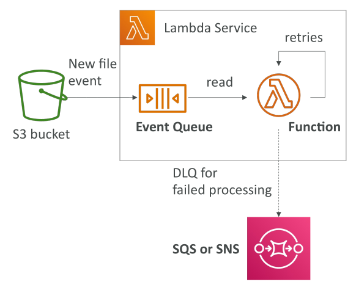

# Lambda – Asynchronous Invocations

## การแนะนำการเรียกใช้งานแบบ Asynchronous

หลังจากเรียนรู้เกี่ยวกับ **Synchronous Invocation** แล้ว เราจะมาดู **Asynchronous Invocation**

* ใช้สำหรับบริการที่เรียก Lambda function **เบื้องหลังโดยไม่รอผลลัพธ์**
* ตัวอย่างบริการ: Amazon S3, SNS topics, CloudWatch Events และอื่น ๆ

## ตัวอย่าง: การแจ้งเตือน Event ของ S3

สมมติว่ามี S3 bucket ตั้งค่า **Event Notification** เมื่อมีไฟล์ใหม่ถูกอัปโหลด

* เมื่อมีไฟล์ใหม่เกิดขึ้น **Event จะถูกส่งไปยัง Lambda Service**
* เนื่องจากเป็นแบบ Asynchronous, **Event จะถูกวางลงใน Event Queue ภายใน**
* Lambda function จะอ่านจาก Event Queue เพื่อประมวลผล Event

## กลไก Retry

* Lambda function จะพยายามประมวลผล Event
* หากเกิดข้อผิดพลาด **Lambda จะทำการ Retry อัตโนมัติสูงสุด 3 ครั้ง**

ลำดับการ Retry:

1. ครั้งแรก: ทำทันที
2. ครั้งที่สอง: 1 นาทีหลังจากครั้งแรก
3. ครั้งที่สาม: 2 นาทีหลังจากครั้งที่สอง

**รวมทั้งหมด 3 ครั้ง**

## ความสำคัญของ Idempotency

* เนื่องจากการ Retry อาจทำให้ Lambda ประมวลผล Event เดิมหลายครั้ง
* **Lambda function ต้องเป็น Idempotent**

  * Idempotent = การประมวลผลซ้ำกับข้อมูลเดียวกันต้องได้ผลลัพธ์เดียวกัน
  * หากไม่ใช่ Idempotent, การประมวลผลซ้ำอาจทำให้เกิดปัญหา

## Duplicate Logs

* ในกรณี Retry จะเห็น **Log ซ้ำใน CloudWatch Logs**
* เนื่องจาก Lambda function พยายามประมวลผล Event ซ้ำหลายครั้ง

## Dead-Letter Queue (DLQ)

* สามารถตั้งค่า **DLQ** เพื่อเก็บ Event ที่ประมวลผลไม่สำเร็จหลังจาก Retry ทั้งหมด
* Event เหล่านี้สามารถส่งไปที่ **SQS queue หรือ SNS topic** เพื่อประมวลผลในภายหลัง

## สรุปการเรียกใช้งานแบบ Asynchronous

* กลไกหลัก: **วาง Event ลง Queue → Retry → ส่ง Event ที่ล้มเหลวไปยัง DLQ (ถ้ามี)**
* เป็นแก่นหลักของ **การเรียกใช้งาน Lambda แบบ Asynchronous**

## เมื่อใดควรใช้ Asynchronous vs Synchronous

* บางบริการ **บังคับใช้ Asynchronous**
* Asynchronous ช่วยให้ **ประมวลผลหลายงานพร้อมกัน** โดยไม่ต้องรอแต่ละงานเสร็จ

  * ตัวอย่าง: ประมวลผลไฟล์ 1,000 ไฟล์พร้อมกัน ลดเวลาประมวลผลรวม

## บริการ AWS ที่เรียก Lambda แบบ Asynchronous

**บริการหลัก:**

* Amazon S3 (ผ่าน Event Notifications)
* Amazon SNS (Simple Notification Service)
* CloudWatch Events / EventBridge

**บริการอื่น ๆ (ไม่ค่อยเจอใน labs):**

* AWS CodeCommit (trigger Lambda เมื่อมี branch, tag, หรือ push ใหม่)
* AWS CodePipeline (เรียก Lambda ระหว่าง pipeline โดยต้อง callback)
* Amazon CloudWatch Logs (ประมวลผล log)
* Amazon SES (ส่งอีเมล)
* AWS CloudFormation
* AWS Config
* AWS IoT
* AWS IoT Events

**สำหรับการสอบ:**

* ควรเข้าใจการทำงานของ Lambda กับ **S3, SNS, CloudWatch Events / EventBridge** แบบ Asynchronous

## Key Takeaways

* การเรียกใช้งาน Lambda แบบ **Asynchronous** จะวาง Event ลงใน **internal event queue** เพื่อประมวลผล
* Lambda จะ **Retry อัตโนมัติสูงสุด 3 ครั้ง** ด้วยเวลาหน่วงเพิ่มขึ้น
* Lambda function ต้อง **idempotent** เพื่อรองรับ Event ซ้ำจาก Retry
* สามารถตั้งค่า **Dead-Letter Queue (DLQ)** เพื่อเก็บ Event ที่ประมวลผลไม่สำเร็จ
* บริการ AWS ที่เรียก Lambda แบบ Asynchronous: **S3, SNS, CloudWatch Events / EventBridge, CodeCommit, CodePipeline, CloudWatch Logs, SES, CloudFormation, Config, IoT, IoT Events**