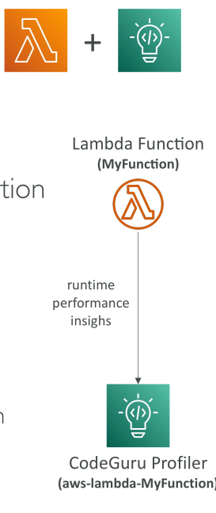

# Lambda - CodeGuru Integration

## การรวม Lambda กับ CodeGuru

ในบทเรียนนี้ เราจะพูดถึงวิธีการที่ **Lambda** ทำงานร่วมกับ **CodeGuru** เพื่อปรับปรุงการตรวจสอบประสิทธิภาพ

โดยการใช้ **CodeGuru Profiler** คุณจะได้รับข้อมูลเชิงลึกเกี่ยวกับ **ประสิทธิภาพ runtime** ของ Lambda function ของคุณ การรวมนี้ช่วยให้สามารถ **profiling อย่างละเอียด** เพื่อปรับแต่งแอปพลิเคชัน serverless ของคุณได้

เมื่อคุณเปิดใช้งานการรวมนี้ CodeGuru จะสร้าง **profiler group** เฉพาะสำหรับ Lambda function ของคุณ ฟีเจอร์นี้รองรับทั้ง **Java และ Python runtimes**

  

## วิธีเปิดใช้งาน CodeGuru Integration

* เปิดใช้งานผ่าน **Lambda console**
* หลังจากเปิดใช้งาน คุณจะได้รับ **ข้อมูลเชิงลึกเกี่ยวกับประสิทธิภาพ runtime** ของ Lambda function

เมื่อเปิดใช้งานแล้ว:

1. **CodeGuru Profiler layer** จะถูกเพิ่มเข้าไปในฟังก์ชันของคุณเป็น **Lambda layer**
2. **Environment variables** ที่เกี่ยวข้องกับ CodeGuru จะถูกใส่เข้าไปใน configuration ของฟังก์ชัน

## สิทธิ์ IAM ที่จำเป็น

Lambda function ของคุณต้องมี **IAM permissions** ที่เหมาะสมเพื่อให้การรวมทำงานเต็มประสิทธิภาพ

* โดยเฉพาะ **AmazonCodeGuruProfilerAgentAccess policy** ต้องถูกแนบกับ **IAM role ของฟังก์ชัน**

การตั้งค่านี้จะช่วยให้ CodeGuru Profiler **เก็บและวิเคราะห์ข้อมูลประสิทธิภาพ** ได้อย่างปลอดภัยและมีประสิทธิภาพ

## สรุป

* **CodeGuru Profiler** ให้ข้อมูลเชิงลึกเกี่ยวกับประสิทธิภาพ runtime ของ Lambda functions
* การรวมรองรับ **Java และ Python runtimes**
* เปิดใช้งานผ่าน **Lambda console** โดยจะเพิ่ม **profiler layer** และ **environment variables**
* ต้องมี **IAM permissions** ที่ถูกต้องพร้อม **AmazonCodeGuruProfilerAgentAccess policy** เพื่อให้ทำงานได้ครบถ้วน