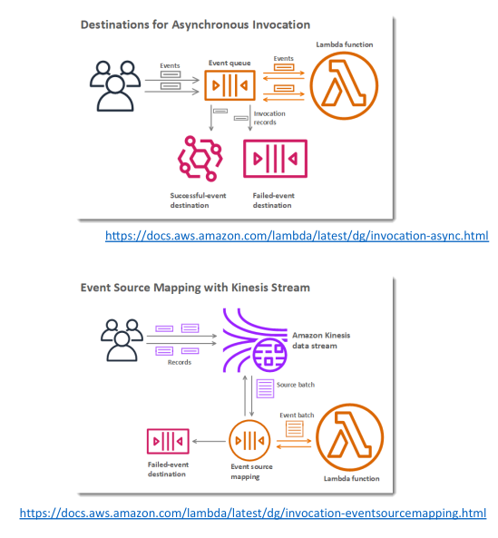

# Lambda Destinations

ตั้งแต่เดือนพฤศจิกายน 2019 AWS ได้แนะนำฟีเจอร์ที่มีประโยชน์มากชื่อ **Lambda Destinations** ฟีเจอร์นี้ช่วยแก้ปัญหาในการติดตาม **asynchronous invocations** หรือ **event mappers** ที่ก่อนหน้านี้ยากที่จะทราบว่า invocation ใดล้มเหลวหรือสำเร็จ และดึงข้อมูลที่เกี่ยวข้องออกมา

## จุดประสงค์ของ Lambda Destinations

แนวคิดหลักของ **Destinations** คือการส่งผลลัพธ์ของ **asynchronous invocation** หรือความล้มเหลวของ **event mapper** ไปยัง **เป้าหมายที่กำหนดไว้** เพื่อให้สามารถติดตามและจัดการ event ที่สำเร็จและล้มเหลวได้ดียิ่งขึ้น

## Destinations สำหรับ Asynchronous Invocations

สำหรับ **asynchronous invocations** คุณสามารถกำหนด destinations สำหรับทั้ง **event ที่สำเร็จ** และ **event ที่ล้มเหลว**

* "สำเร็จ" และ "ล้มเหลว" หมายถึงผลลัพธ์ของการประมวลผล event

**เป้าหมายที่รองรับสำหรับ Destinations**:

* Amazon Simple Queue Service (SQS)
* Amazon Simple Notification Service (SNS)
* AWS Lambda functions
* Amazon EventBridge bus (เดิมชื่อ CloudWatch Events)

## วิธีการทำงานของ Lambda Destinations

ตัวอย่างเช่น เมื่อ Lambda function ถูกเรียกแบบ asynchronous เช่น ผ่าน event ของ S3:

* หาก Lambda สำเร็จ ผลลัพธ์สามารถถูกส่งไปยัง **successful event destination**
* หาก Lambda ล้มเหลว ข้อมูลความล้มเหลวสามารถส่งไปยัง **failed event destination**

## การเปรียบเทียบกับ Dead Letter Queues (DLQ)

คุณอาจสังเกตว่าฟีเจอร์นี้คล้ายกับ **DLQ** สำหรับ asynchronous invocations

* ปัจจุบัน **แนะนำให้ใช้ Destinations แทน DLQ** แม้สามารถใช้ร่วมกันได้
  **เหตุผลที่ควรใช้ Destinations:**

1. Destinations เป็นฟีเจอร์ใหม่กว่า
2. รองรับเป้าหมายได้หลากหลายกว่า
3. DLQ รองรับเฉพาะส่งความล้มเหลวไปยัง SQS และ SNS
4. Destinations ส่งทั้ง **สำเร็จ** และ **ล้มเหลว** ไปยัง SQS, SNS, Lambda และ EventBridge

## Destinations สำหรับ Event Source Mappings

สำหรับ **Event Source Mappings**

* Destinations ใช้เมื่อ **event batch ถูกละทิ้ง** เพราะไม่สามารถประมวลผลได้
* แทนที่จะหยุดการประมวลผล stream ทั้งหมด **event batch ที่ละทิ้งสามารถส่งไปยัง failed event destination** เช่น SQS หรือ SNS

**ตัวอย่าง:**

* อ่านจาก **Kinesis Data Stream** ด้วย Event Source Mapping
* หากการประมวลผล batch ล้มเหลว แทนที่จะบล็อก stream

  * สามารถส่ง batch ที่ละทิ้งไปยัง **failed event destination** เพื่อจัดการความล้มเหลวอย่างเหมาะสม

## ตัวเลือกสำหรับ SQS Event Source Mappings

* หาก Event Source Mapping อ่านจาก SQS

  * คุณสามารถเลือกตั้ง **failed destination**
  * หรือกำหนด **DLQ** บน SQS queue โดยตรง
* การเลือกขึ้นอยู่กับ **use case** และ **ความต้องการของคุณ**

## สรุป (Key Takeaways)

* Lambda Destinations ช่วยให้สามารถ **ส่งผลลัพธ์และความล้มเหลวของ asynchronous invocation ไปยังเป้าหมายต่าง ๆ**
* Destinations รองรับทั้ง **success และ failure events**
* เป้าหมายที่รองรับ: SQS, SNS, Lambda และ Amazon EventBridge
* Event Source Mappings สามารถส่ง **discarded event batches** ไปยัง **failed event destinations** เพื่อลดการบล็อกการประมวลผล stream