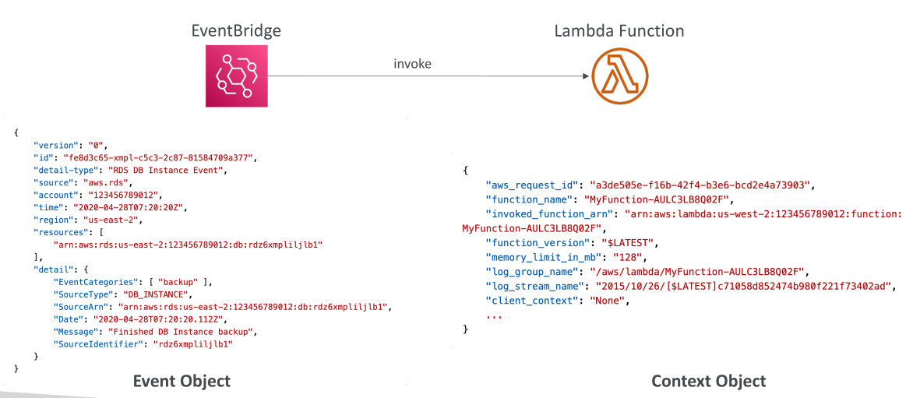
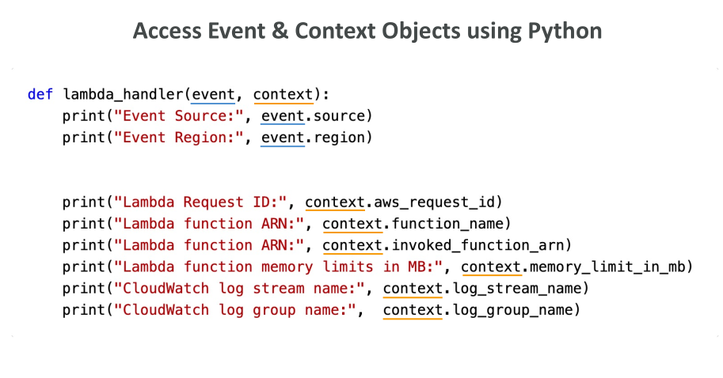

# Lambda Event & Context Objects

## การทำความเข้าใจ Event และ Context Objects ใน Lambda

ในการสอนนี้ เราจะมาทำความเข้าใจ **Event Object** และ **Context Object** ซึ่งเป็นสิ่งสำคัญมากสำหรับการเขียน Lambda function



## ตัวอย่าง Invocation โดย EventBridge

สมมติว่า Lambda ของคุณถูกเรียกโดย **EventBridge rule**

* EventBridge จะสร้าง **event** และส่งให้ Lambda function
* ข้อมูลนี้เรียกว่า **event object**
* **Event object** จะประกอบด้วยข้อมูลรายละเอียดเกี่ยวกับเหตุการณ์ เช่น แหล่งที่มาของ event และข้อมูลอื่น ๆ ที่ service ที่ trigger event ส่งมา

## Context Object

* นอกจาก event object แล้วยังมี **context object**
* เป็นส่วนที่สองของ input ของ Lambda function
* มี **metadata** เกี่ยวกับ Lambda function เช่น

  * AWS request ID
  * ชื่อฟังก์ชัน
  * Log group ที่เกี่ยวข้อง
  * Memory limit
  * ข้อมูลอื่น ๆ เกี่ยวกับ runtime

**สรุป:**

* Event object และ Context object **แตกต่างกันแต่ทำงานร่วมกัน**
* Event object เป็น JSON document ที่บรรจุข้อมูลที่ Lambda จะประมวลผล
* Service ที่เรียก Lambda เช่น EventBridge, SQS, SNS จะให้ข้อมูลที่จำเป็นทั้งหมดผ่าน event object

## การแปลง Event Object ตาม Runtime

* ขึ้นอยู่กับ runtime ของ Lambda

  * ตัวอย่างเช่น Python: event object จะถูกแปลงเป็น **dictionary**
  * ข้อมูล input หรือ arguments จาก service ที่เรียก จะอยู่ใน event object
* Context object ให้ **methods และข้อมูลเกี่ยวกับ invocation และ runtime environment**
* Lambda function จะได้รับ context object ขณะ runtime
* จาก context object เราสามารถดึงข้อมูล เช่น AWS request ID, function name, memory limit และข้อมูลอื่น ๆ

## ตัวอย่าง Handler Signature ใน Python

```python
def lambda_handler(event, context):
    print(event)   # ข้อมูลเกี่ยวกับ source หรือ region ของ event
    print(context) # ข้อมูล request ID, function ARN, memory limit, CloudWatch Logs details
```

* **event parameter**: ข้อมูลเกี่ยวกับ event ที่ trigger Lambda
* **context parameter**: ข้อมูลเกี่ยวกับ Lambda invocation และ runtime environment



## สรุป

* การเข้าใจความแตกต่างและการใช้งานของ **event** และ **context** จะช่วยให้เราเลือกใช้อย่างถูกต้องเพื่อดึงข้อมูลเฉพาะที่ต้องการ
* เป็นความรู้ที่สำคัญทั้งสำหรับการสอบและการพัฒนา Lambda function ในการทำงานจริง

## Key Takeaways

* Event object ใน Lambda เป็น **JSON-formatted data** เกี่ยวกับ event ที่ trigger Lambda
* Context object ให้ **metadata** เกี่ยวกับ Lambda invocation และ runtime environment
* Event data จะถูกแปลงเป็น object เฉพาะภาษา เช่น dictionary ใน Python
* ทั้ง event และ context เป็นสิ่งสำคัญและทำงานร่วมกันเพื่อประมวลผลและจัดการ Lambda function
