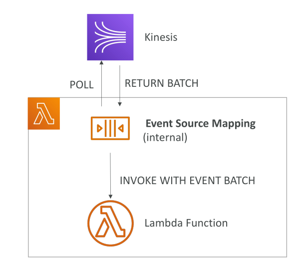
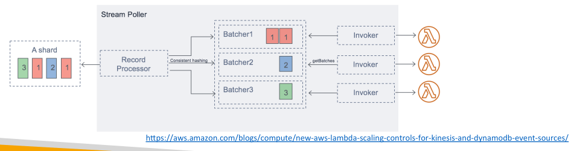
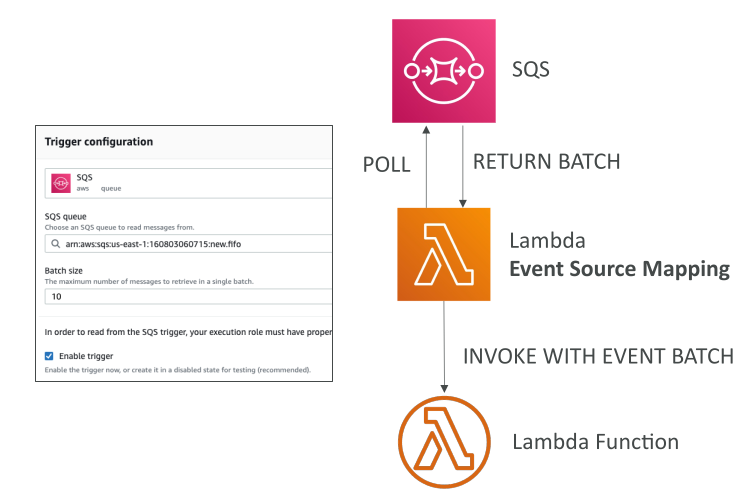

# Lambda Event Source Mapping

ก่อนหน้านี้เราได้เรียนรู้เกี่ยวกับ **การประมวลผลแบบ synchronous และ asynchronous** แล้ว ตอนนี้เราจะมาดู **Event Source Mapping** ซึ่งเป็นวิธีสุดท้ายของการที่ Lambda สามารถประมวลผล events ใน AWS

* Event Source Mapping ใช้กับ **Kinesis Data Streams, SQS (รวม SQS FIFO) และ DynamoDB Streams**
* จุดร่วมของบริการเหล่านี้คือ **ต้องมีการ poll records จาก source**
* Lambda จะดึงข้อมูลจากบริการเหล่านี้ แล้วทำการประมวลผล
* การประมวลผลใน Event Source Mapping ถือว่าเป็น **synchronous invocation**

## Event Source Mapping กับ Kinesis

* เมื่อ Lambda ถูกตั้งค่าให้ดึงข้อมูลจาก Kinesis จะมี **Event Source Mapping** ถูกสร้างขึ้นภายใน
* Mapping นี้ทำหน้าที่ **poll Kinesis และดึง batch ของ records**
* เมื่อมีข้อมูลพร้อม Lambda function จะถูก **invoke แบบ synchronous** พร้อมกับ batch ของ events

## ประเภทของ Event Source Mapping

แบ่งออกเป็น 2 ประเภท: **streams** และ **queues**

### Streams

* ได้แก่ **Kinesis Data Streams** และ **DynamoDB Streams**
* Event Source Mapping จะสร้าง **iterator** สำหรับแต่ละ shard
* Items ถูกประมวลผล **ตามลำดับในระดับ shard**
* สามารถตั้งค่าได้ว่าจะเริ่มอ่านจาก:

  * items ใหม่เท่านั้น
  * จากจุดเริ่มต้นของ shard
  * จาก timestamp ที่กำหนด

**ข้อสำคัญ:**

* เมื่อ item ถูกประมวลผลจาก shard จะ **ไม่ถูกลบจาก stream**
* ทำให้หลาย consumer สามารถอ่านข้อมูลเดียวกันได้

### การใช้งานและ Parallel Processing ของ Streams

* รองรับ **streams ที่มี traffic ต่ำและสูง**
* สำหรับ traffic ต่ำ: ใช้ **batch window** เพื่อสะสม records ก่อนประมวลผล
* สำหรับ throughput สูง: Lambda สามารถประมวลผลหลาย batch พร้อมกัน **บน shard เดียวกัน**
* AWS รองรับ **สูงสุด 10 batch processors ต่อ shard**
* แต่ละ batch ประมวลผล **ตามลำดับในระดับ partition key**

### การจัดการข้อผิดพลาดของ Stream

* ถ้า Lambda return error ทั้ง batch จะถูก **reprocess จนกว่าจะสำเร็จ** หรือจนกว่า items จะหมดอายุ
* ข้อผิดพลาดใน batch อาจทำให้ processing ของ shard นั้น **หยุดชั่วคราว**
* สามารถตั้งค่าเพื่อ:

  * ละทิ้ง events เก่า
  * จำกัดจำนวน retries
  * แบ่ง batch เมื่อเกิดข้อผิดพลาด

## Event Source Mapping กับ Queues

* ใช้กับ **SQS และ SQS FIFO queues**
* Lambda จะ **poll queue** ผ่าน Event Source Mapping
* เมื่อได้ batch ของ messages Lambda จะถูก **invoke แบบ synchronous**
* ใช้ **long polling** เพื่อประหยัด resource
* สามารถตั้งค่า **batch size 1–10 messages**
* แนะนำตั้ง **visibility timeout ของ queue = 6 เท่าของ Lambda timeout**
* หากต้องการ DLQ สำหรับ message ที่ไม่สามารถประมวลผลได้ ให้ตั้งค่า **บน SQS queue** ไม่ใช่บน Lambda

### การประมวลผลตามลำดับและการ scaling กับ SQS

* FIFO queue: messages ที่มี **group ID เดียวกัน** จะถูกประมวลผลตามลำดับ
* จำนวน Lambda scaling = จำนวน **active message groups**
* Standard queue: items **ไม่ประมวลผลตามลำดับ**
* Lambda จะ scale ให้เร็วที่สุดเพื่ออ่านทุก messages
* หากเกิดข้อผิดพลาด batch จะกลับไป queue และอาจถูกประมวลผลในลำดับต่างจาก batch เดิม
* อาจมีการ receive item ซ้ำจาก queue ดังนั้น Lambda function ต้อง **idempotent**
* เมื่อ processed แล้ว items จะถูกลบจาก queue

## สรุปการ Scaling ของ Event Source Mapping

* **Kinesis / DynamoDB Streams**: 1 Lambda invocation ต่อ shard, parallel up to 10 batches ต่อ shard
* **SQS Standard**: Lambda scale ประมาณ 16 instances ต่อ minute, สูงสุด 1000 batches ต่อ second
* **SQS FIFO**: messages ของ group ID เดียวกันประมวลผลตามลำดับ, scale = จำนวน active message groups

## Key Takeaways

* Event Source Mapping ช่วยให้ Lambda **invoke แบบ synchronous** โดย polling services เช่น **Kinesis, DynamoDB Streams, SQS**
* สำหรับ streams: ประมวลผล **ตามลำดับ shard**, สามารถตั้งค่า start position, parallel batch up to 10 ต่อ shard
* ข้อผิดพลาด batch จะทำให้ retry และอาจ pause shard จนกว่าจะแก้ไข
* สำหรับ SQS: Lambda poll messages ด้วย **long polling**, batch size 1–10, scale ตาม queue type และ group ID
* **Dead-letter queues** ตั้งค่าได้บน SQS, ไม่ใช่ Lambda
