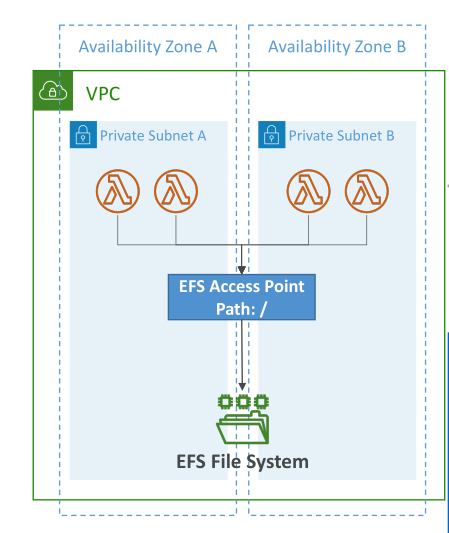
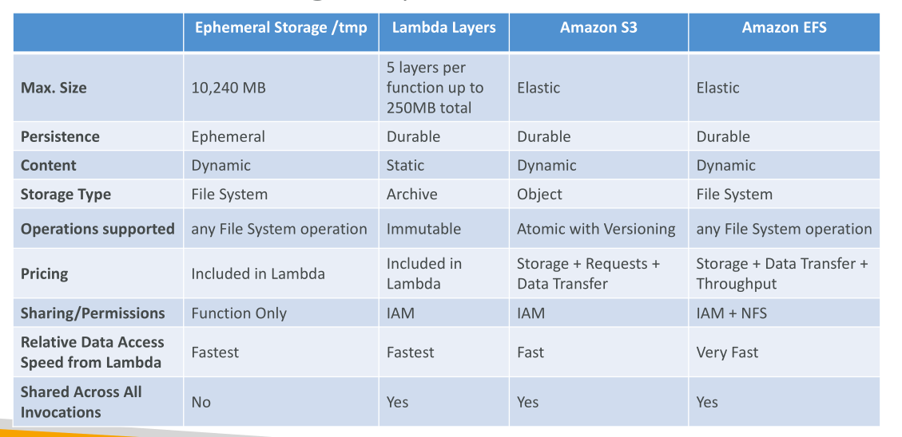

# Lambda File System Mounting

## การเชื่อมต่อระบบไฟล์สำหรับ Lambda

* Lambda สามารถเข้าถึง **EFS (Elastic File System)** ได้ **เมื่อทำงานภายใน VPC**

* วิธีทำ: กำหนดให้ Lambda **mount EFS** ไปยัง directory ภายในเครื่องระหว่างขั้นตอน initialization

* ต้องใช้ **EFS Access Points** ของ EFS

  * ตัวอย่าง: สร้าง EFS → สร้าง EFS Access Point → กำหนด Lambda ใน private subnet ของ VPC → พร้อมใช้งาน

* ข้อจำกัด:

  * แต่ละ Lambda instance จะสร้าง connection ไปยัง EFS → ต้องระวังไม่ให้เกิน **EFS connection limits**
  * หาก Lambda หลายฟังก์ชันถูกเรียกพร้อมกันเป็น burst → อาจเจอ **connection burst limits**

  

## การเปรียบเทียบตัวเลือกการเก็บข้อมูลสำหรับ Lambda

### 1. Ephemeral Storage (/tmp)

* ขนาดสูงสุด: 10 GB
* ความคงอยู่: ชั่วคราว → เมื่อ Lambda instance ถูกทำลาย ข้อมูลจะหาย
* เนื้อหา: ปรับแก้ได้
* ประเภท: File system ปกติ → รองรับทุก operation
* Storage รวม: 512 MB ฟรี; เกินจ่ายเพิ่ม
* การเข้าถึง: เฉพาะ Lambda function นั้น
* Performance: เร็วที่สุด
* การแชร์: ไม่แชร์ระหว่าง Lambda invocation

### 2. Lambda Layers

* ขนาดสูงสุด: 5 layers ต่อฟังก์ชัน รวมสูงสุด 250 MB
* ความคงอยู่: ถาวรและไม่เปลี่ยนแปลง (immutable)
* ประเภท: Archive / Static
* ราคาค่าบริการ: รวมใน Lambda function
* การเข้าถึง: ต้องมี IAM permissions
* Performance: เร็ว → ติดตั้งมาพร้อมฟังก์ชัน
* การแชร์: แชร์ระหว่าง Lambda invocation
* การแก้ไข: ไม่สามารถแก้ไขเนื้อหาใน layer

### 3. Amazon S3

* ขนาด: เกือบไม่จำกัด
* ความคงอยู่: ถาวร
* เนื้อหา: Dynamic
* ประเภท: Object storage → ใช้ผ่าน S3 API
* Operation: get, put, post, versioning
* ราคาค่าบริการ: จ่ายตาม storage, request, data transfer
* การเข้าถึง: ต้องมี IAM permissions
* Performance: ผ่าน network → ไม่เร็วที่สุด
* การแชร์: แชร์ระหว่าง Lambda invocation

### 4. Amazon EFS

* ยืดหยุ่นและถาวร
* เนื้อหา: Dynamic
* ประเภท: File system → รองรับทุก operation
* ราคาค่าบริการ: จ่ายตาม storage, throughput, data transfer
* การเข้าถึง: mount เป็น network file system บน Lambda
* Performance: เข้าถึงข้อมูลเร็วมาก
* การแชร์: แชร์ระหว่าง Lambda invocation

## สรุป (Key Takeaways)

* Lambda สามารถ **mount EFS** ได้เมื่ออยู่ใน VPC ผ่าน **EFS Access Points**
* **Ephemeral Storage (/tmp)**: ชั่วคราว 10 GB, dynamic, เฉพาะ Lambda instance
* **Lambda Layers**: ถาวร, immutable, 250 MB, แชร์ระหว่าง invocation
* **Amazon S3**: เกือบไม่จำกัด, durable, object storage, แชร์ผ่าน API
* **Amazon EFS**: ยืดหยุ่น, durable, dynamic, mount เป็น network file system, แชร์ระหว่าง invocation