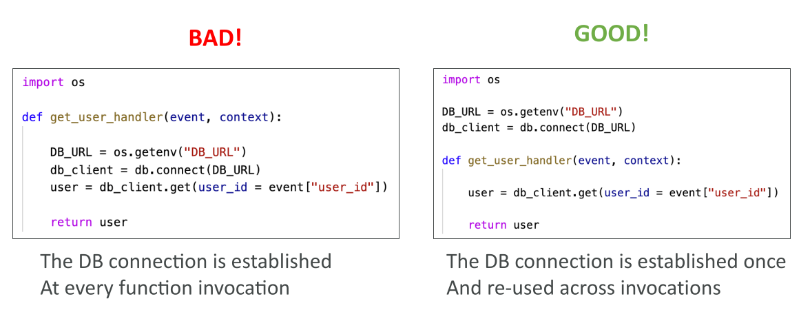

# Lambda Function Configuration



## การตั้งค่า Lambda และประสิทธิภาพ

### การจัดสรร RAM

* ค่าเริ่มต้นของ Lambda คือ **128 MB**

* สามารถปรับเพิ่มได้ถึง **10 GB** เป็น increment ทีละ 1 MB

* การเพิ่ม RAM จะ **เพิ่มจำนวน vCPU credits** ให้โดยอัตโนมัติ

  * ไม่สามารถกำหนดจำนวน vCPU โดยตรง
  * ต้องเพิ่ม RAM เพื่อให้ Lambda ได้ vCPU เพิ่ม

* เมื่อ Lambda ได้ **RAM 1,792 MB** → จะเทียบเท่ากับ 1 vCPU

* หากต้องการใช้ **หลาย vCPU** ต้องทำ **multi-threading** ในแอป

* สำหรับ **CPU-bound applications** ที่ทำการคำนวณเยอะ → การเพิ่ม RAM จะช่วยลดเวลา execution

### Timeout ของ Lambda

* ค่าเริ่มต้นของ Lambda = **3 วินาที**
* สามารถปรับได้ **สูงสุด 900 วินาที (15 นาที)**
* หาก process ต้องใช้เวลาเกิน 15 นาที → ควรใช้บริการอื่น เช่น **AWS Fargate, ECS, EC2**

### Lambda Execution Context

* Execution context = **runtime environment ชั่วคราว**
* ใช้ในการ **initial external dependencies** ที่โค้ดต้องการ
* Context นี้จะถูก **reuse** หาก Lambda ถูกเรียกซ้ำในเวลาใกล้กัน → ช่วย **ประหยัดเวลา**
* สามารถเก็บไฟล์ชั่วคราวใน **/tmp directory** ซึ่ง persist ภายใน context เดียวกัน

### การจัดการ Database Connection แบบไม่ประสิทธิภาพ

ตัวอย่างโค้ดไม่ดี:

```python
def get_user_handler(event, context):
    DB_URL = os.getenv('DB_URL')
    db_client = database.connect(DB_URL)
    # Logic to get user using db_client
    return user
```

* การเชื่อมต่อ database อยู่ **ใน handler** → ทุกครั้งที่เรียก Lambda จะ reconnect → ช้า

### Best Practice: Initialize Outside Handler

* แนะนำให้สร้าง **connection ข้างนอก handler** → reuse ได้หลาย invocation

ตัวอย่างโค้ดปรับปรุง:

```python
DB_URL = os.getenv('DB_URL')
db_client = database.connect(DB_URL)

def get_user_handler(event, context):
    # ใช้ db_client ที่มีอยู่แล้ว
    return user
```

* ใช้ได้ทั้ง **HTTP clients และ SDK clients**

### ใช้ /tmp สำหรับไฟล์ชั่วคราว

* /tmp ให้ **พื้นที่ 10 GB**
* ใช้สำหรับ download ไฟล์ใหญ่หรือ disk-intensive operations
* ไฟล์ใน /tmp **persist ภายใน execution context เดียวกัน**
* สามารถเก็บไฟล์ ~0.5 GB เพื่อ **หลีกเลี่ยงการดาวน์โหลดซ้ำ**

### Persistent Storage และ Encryption

* หากต้องการเก็บไฟล์ **ถาวร** → ใช้ **Amazon S3**
* /tmp ไม่มีการเข้ารหัสอัตโนมัติ → ต้องใช้ **AWS KMS** สร้าง data key และเข้ารหัสด้วยตัวเอง

## สรุป

* เพิ่ม RAM → เพิ่ม vCPU credits → เหมาะกับ CPU-bound apps
* Timeout ปรับได้ 3 วินาที → 900 วินาที
* Execution context persist → reuse resources เช่น database connection, temporary files
* ใช้ /tmp สำหรับไฟล์ชั่วคราว (10 GB) → เก็บถาวรใช้ S3
* การเข้ารหัสใน /tmp ต้องทำเองด้วย KMS