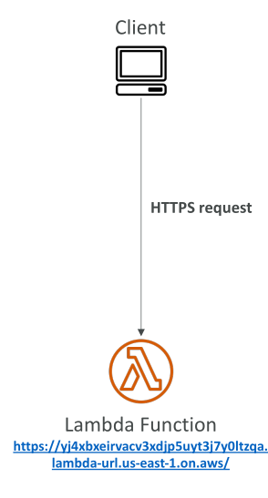
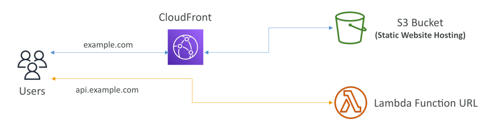
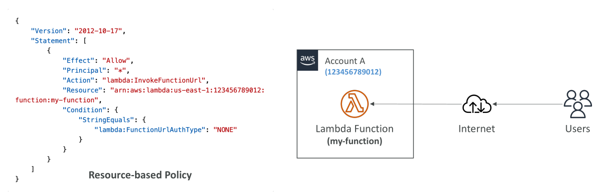
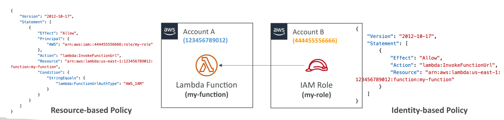

# Lambda Function URL

เรามาพูดถึง **Lambda function URL** กัน
หากคุณต้องการเปิดเผย Lambda function ของคุณเป็น **HTTP endpoint** โดยไม่ต้องใช้ API Gateway หรือ Application Load Balancer คุณสามารถใช้ **Function URL** ได้ ซึ่งจะสร้าง URL เฉพาะตัวสำหรับ Lambda function ของคุณที่ **ไม่เปลี่ยนแปลง** และรองรับทั้ง IPv4 และ IPv6

เมื่อคุณเผยแพร่ Lambda function เป็น Function URL คุณสามารถเข้าถึงและเรียกใช้งานผ่าน HTTPS ได้ด้วย **เว็บเบราว์เซอร์, command line, Postman, หรือ HTTP client ใดก็ได้** แต่ Function URL นี้สามารถเข้าถึงได้ **ผ่านอินเทอร์เน็ตสาธารณะเท่านั้น** หากต้องการเข้าถึงแบบส่วนตัวด้วย URL ส่วนตัว วิธีนี้จะไม่สามารถใช้ได้

ถ้าคุณเรียก Function URL จากโดเมนอื่น คุณสามารถตั้งค่า **CORS** เพื่อให้รองรับการเรียกข้ามโดเมนได้ สำหรับความปลอดภัย **resource-based policies** จะกำหนดว่าใครสามารถเข้าถึง Function URL ของ Lambda ได้ ซึ่งสามารถใช้ได้กับ **function alias หรือ LATEST version** แต่ไม่สามารถใช้กับเวอร์ชันเฉพาะ

คุณสามารถสร้างและตั้งค่า Function URL ผ่าน **AWS Management Console หรือ API** หากต้องการจำกัดจำนวนครั้งที่ Lambda function สามารถรันได้ สามารถใช้ **reserved concurrency** ของ Lambda ควบคุมจำนวน concurrent executions สูงสุด

## ความปลอดภัยของ URL และการควบคุมการเข้าถึง

* **Resource-based policies**: แนบกับ Lambda function เพื่อกำหนดว่าบัญชีใด, ช่วง IP (CIDR), หรือ IAM principal ใดสามารถเข้าถึง Function URL ได้
* **CORS**: หากเรียก Function URL จากโดเมนต่างกัน เช่น S3 bucket ที่อยู่หลัง CloudFront (example.com) และ API ของคุณเป็น Lambda Function URL (api.example.com) คุณต้องตั้งค่า CORS บน Function URL เพื่อให้รองรับ cross-domain requests

## ประเภทการ Authentication

1. **AuthType = NONE**

   * อนุญาตให้เข้าถึง Function URL แบบสาธารณะและไม่ต้อง authenticate
   * การเข้าถึงจะขึ้นกับ **resource-based policy** ต้องกำหนดให้ public access เช่น ใช้ principal `"*"` กับ `InvokeFunctionUrl`

   

2. **AuthType = AWS_IAM**

   * ใช้ IAM เพื่อ authenticate และ authorize การเรียก Lambda function
   * จะประเมินทั้ง **identity-based policy ของ principal** และ **resource-based policy ของ Lambda function**
   * ต้องมี **lambda:InvokeFunctionUrl permission** ในหนึ่งในสอง policy
   * ใน **บัญชีเดียวกัน** หาก policy ใดอนุญาตการเรียกก็สามารถเข้าถึงได้
   * ใน **cross-account** ทั้ง identity-based policy และ resource-based policy ต้องอนุญาตพร้อมกัน

     * ตัวอย่าง: Account A มี resource-based policy อนุญาต role ใน Account B
     * IAM role ใน Account B ต้องมี identity-based policy อนุญาต invoke ด้วย
     * เมื่อทั้งสอง policy ถูกตั้งค่าแล้ว role ใน Account B จะสามารถใช้ Lambda Function URL ของ Account A ได้

     

## สรุป

* **Lambda function URLs** ให้ HTTPS endpoint เฉพาะตัวและถาวรสำหรับ Lambda function โดยไม่ต้องใช้ API Gateway หรือ Load Balancer
* Function URLs **เข้าถึงได้ผ่านอินเทอร์เน็ตสาธารณะเท่านั้น** หากต้องการ private access ต้องใช้วิธีอื่น
* **Resource-based policies และ CORS** ใช้จัดการการเข้าถึงและการเรียกข้ามโดเมน
* การ authentication สามารถตั้งเป็น **NONE** สำหรับ public access หรือ **AWS_IAM** สำหรับ IAM-based access โดยต้องมี policy ที่เหมาะสม โดยเฉพาะในกรณี cross-account