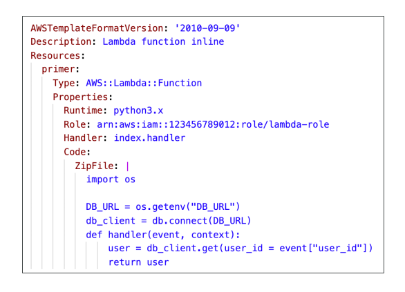
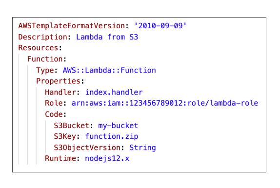
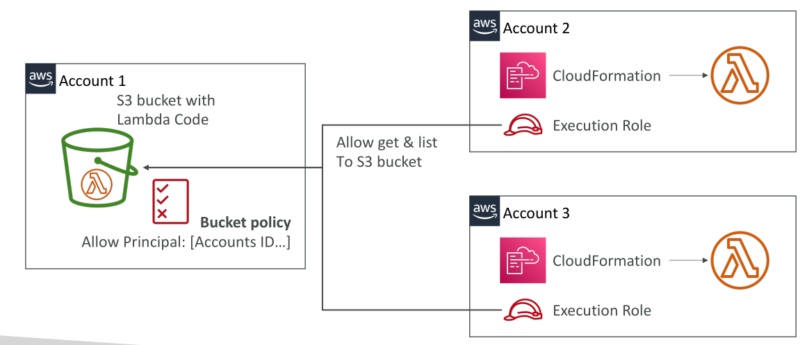

# Lambda และ CloudFormation

## การอัปโหลด Lambda Functions ด้วย CloudFormation

CloudFormation รองรับการอัปโหลด Lambda Functions ได้ 2 วิธีหลัก:

### 1. **Inline Code**

* เขียนโค้ด Lambda **ฝังอยู่ใน CloudFormation template** โดยตรง
* ตัวอย่าง: ใช้ **Code.ZipFile** property ใน template
* เหมาะกับ **ฟังก์ชันง่าย ๆ**
* **ข้อจำกัด:** ไม่สามารถรวม dependencies ภายนอกได้ → ใช้ได้เฉพาะโค้ดที่ **ไม่ต้องพึ่งพาไลบรารีหรือแพ็กเกจอื่น ๆ**

### 2. **Zip File ใน S3**

* แพ็ก Lambda function เป็น **ไฟล์ zip** แล้วอัปโหลดไปยัง **Amazon S3**
* ใน CloudFormation template อ้างอิงไฟล์ zip นี้
* ต้องระบุ:

  * **S3 bucket name**
  * **S3 key** (path เต็มของไฟล์ zip)
  * **S3 object version** (ถ้าเปิด versioning ใน bucket) → แนะนำให้ใส่เพื่อให้ CloudFormation ตรวจจับการอัปเดต

**เหตุผล:**

* ถ้าอัปเดตไฟล์ใน S3 แต่ไม่เปลี่ยน bucket, key หรือ object version ใน template → CloudFormation จะ **ไม่ตรวจจับการเปลี่ยนแปลง** และไม่อัปเดต Lambda
* เมื่อมี versioning และระบุ object version ใหม่ → CloudFormation จะตรวจจับและอัปเดต Lambda ตามนั้น

## การ Deploy Lambda ข้ามหลาย AWS Accounts

* สมมติคุณเก็บ Lambda code ใน S3 ของ **Account 1** และต้องการ deploy ผ่าน CloudFormation ไปยัง **Account 2 และ Account 3**

**ขั้นตอนสำคัญ:**

1. **เรียกใช้ CloudFormation** ใน Account 2 หรือ 3
2. Template ใน Account เหล่านี้ อ้างอิง S3 bucket ของ Account 1
3. ต้องตั้งค่า **Bucket Policy** ใน S3 ของ Account 1 → อนุญาตให้ CloudFormation ใน Account อื่นเข้าถึงไฟล์ code
4. สร้าง **Execution Role** สำหรับ CloudFormation ใน Target Accounts

   * Role ต้องมีสิทธิ์ **GetObject และ ListBucket** ใน S3 ของ Account 1

* ด้วยการรวม **Bucket Policy + Execution Role** → CloudFormation จะสามารถดึง Lambda code จาก S3 และสร้าง Lambda function ใน Target Accounts ได้
* วิธีนี้ใช้ได้กับหลายบัญชี (Account 3 หรืออื่น ๆ) โดยต้องตั้งค่า bucket policy และ execution role ให้ถูกต้อง

## สรุป (Key Takeaways)

* CloudFormation มี **สองวิธี** ในการอัปโหลด Lambda: **Inline code** และ **Zip file ใน S3**
* Inline code → ใช้ได้กับฟังก์ชันง่าย ๆ **ไม่มี dependencies**
* Zip file ใน S3 → ต้องระบุ **bucket, key, และ object version** เพื่อให้ CloudFormation ตรวจจับการอัปเดต
* Deploy Lambda ข้ามหลาย AWS accounts → ต้องมี **S3 bucket policy** และ **CloudFormation execution roles** เพื่อให้สามารถเข้าถึงไฟล์ได้