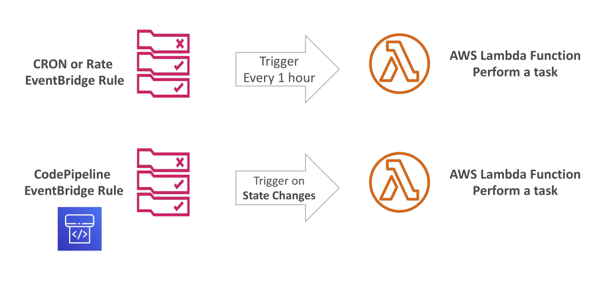

# การรวม Lambda กับ CloudWatch Events / EventBridge

ในส่วนนี้เราจะพูดถึงวิธีการรวม **CloudWatch Events** หรือ **EventBridge** เข้ากับ **AWS Lambda**

มีวิธีหลัก ๆ อยู่ 2 แบบในการรวมกัน:

### 1. การตั้งเวลาแบบ Serverless CRON หรือ Rate-Based Scheduling

* สร้าง **EventBridge Rule** ที่เรียก Lambda function ตามช่วงเวลาที่กำหนด เช่น ทุก ๆ ชั่วโมง
* ทำให้ Lambda function สามารถทำงานแบบ **scheduled tasks อัตโนมัติ**

### 2. การเรียกใช้งานแบบ Event-Driven ตามการเปลี่ยนแปลงของสถานะบริการ AWS

* ตัวอย่าง: สร้าง **EventBridge Rule** เพื่อตรวจจับทุกครั้งที่ **CodePipeline เปลี่ยนสถานะ**

* เมื่อเกิดการเปลี่ยนสถานะ Rule จะเรียก Lambda function เพื่อทำงานที่กำหนดไว้

* วิธีนี้ง่ายต่อการใช้งานและช่วยให้เกิด **workflow อัตโนมัติ** ทั้งจากเวลาและเหตุการณ์

## Key Takeaways

* **CloudWatch Events** หรือ **EventBridge** สามารถรวมกับ Lambda เพื่อทำงานอัตโนมัติ
* **EventBridge Rules** สามารถเรียก Lambda function ตาม **schedule** เช่น แบบ serverless CRON หรือ rate-based
* **EventBridge Rules** สามารถเรียก Lambda function ตาม **การเปลี่ยนแปลงสถานะของบริการ AWS** เช่น การเปลี่ยนสถานะของ CodePipeline
* การรวมนี้ช่วยสร้าง **workflow แบบ event-driven อัตโนมัติ** ด้วย Lambda