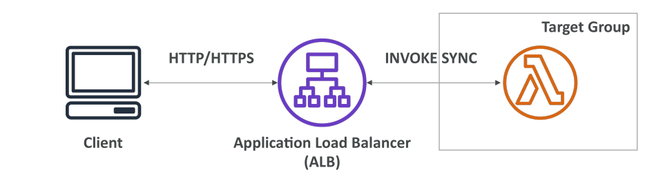
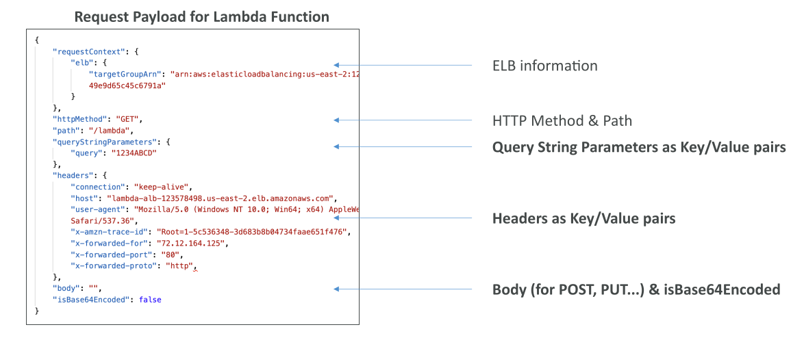
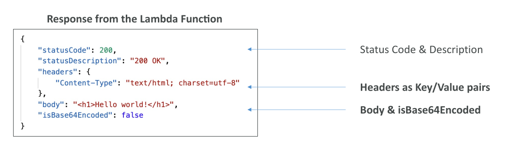
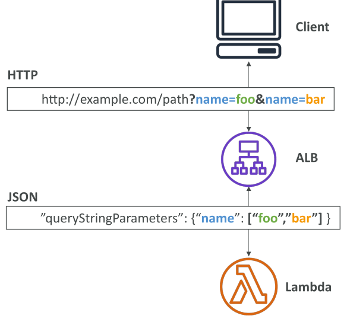

# Lambda & Application Load Balancer

## การรวม Lambda กับ ALB

ในปัจจุบัน Lambda function สามารถเรียกใช้งานผ่าน CLI หรือ SDK ได้ แต่ถ้าคุณต้องการ **เผยแพร่ Lambda ให้เข้าถึงจากอินเทอร์เน็ต** จะต้องมี HTTP หรือ HTTPS endpoint สำหรับผู้ใช้งาน ซึ่งทำได้สองวิธี:

1. ใช้ **Application Load Balancer (ALB)**
2. ใช้ **API Gateway**

ในบทนี้เราจะเน้นที่ **ALB**



## การทำงานของ ALB กับ Lambda

1. ต้อง **ลงทะเบียน Lambda function ใน target group** ของ ALB
2. เมื่อ client ส่ง HTTP/HTTPS request ไปยัง ALB
3. ALB จะ **เรียก Lambda function แบบ synchronous** คือรอผลลัพธ์จาก Lambda ก่อนส่ง response กลับ client

## ALB แปลง HTTP Request เป็น Lambda Invocation อย่างไร

ALB จะเปลี่ยน HTTP request ที่เข้ามาเป็น **JSON document** เพื่อส่งให้ Lambda function

ตัวอย่าง JSON payload:

* ส่วนบนของ JSON มีข้อมูล ELB เช่น ELB ไหนเรียก Lambda และ target group
* มี **HTTP method** (เช่น GET, POST) และ **path** (เช่น /lambda)
* Query string parameters ถูกส่งเป็น **key-value pairs**
* Headers ถูกส่งเป็น **key-value pairs**
* Body สำหรับ POST/PUT รวมถึง **flag บอกว่า body เป็น Base64 หรือไม่**



สรุป: **Query parameters, headers และ body ถูกแปลงเป็น JSON ทั้งหมด**

## รูปแบบ Response ของ Lambda

Lambda function ต้องส่ง **JSON document** กลับ ALB

JSON response ต้องมี:

* **status code** และคำอธิบาย
* **response headers** เป็น key-value pairs
* **body** ของ response
* **flag บอกว่า body เป็น Base64 หรือไม่**



ALB จะทำการแปลง JSON response กลับเป็น HTTP response ให้

## ฟีเจอร์ Multi-Value Header ของ ALB

ALB รองรับฟีเจอร์ **multi-value headers** ซึ่งสามารถเปิดใช้งานได้โดยตรง

* ใช้เมื่อ client ส่ง headers หรือ query string parameter **หลายค่าของ key เดียวกัน**
* ALB จะเก็บทุกค่าไว้และส่งไปให้ Lambda เป็น **array**

ตัวอย่าง:

```cli
?name=foo&name=bar
```

* Key `name` มีสองค่า (foo, bar)
* ถ้าเปิด multi-value header, Lambda จะได้รับเป็น array: `["foo", "bar"]`
* ใช้ได้ทั้ง **HTTP headers** และ **query string parameters**



## สรุปและข้อควรจำ

* Lambda function สามารถเรียกผ่าน CLI, SDK หรือเผยผ่าน HTTP/HTTPS endpoint ด้วย **ALB หรือ API Gateway**
* การรวม Lambda กับ ALB ต้อง **ลงทะเบียน Lambda ใน target group**
* ALB จะ **เรียก Lambda แบบ synchronous** และส่ง response กลับ client
* ALB แปลง HTTP request เป็น JSON สำหรับ Lambda รวม ELB info, HTTP method, path, query parameters, headers และ body
* Lambda ต้องส่ง JSON response กลับ ALB พร้อม status code, headers, body และ Base64 flag
* ALB รองรับ **multi-value headers** สำหรับ query parameters หรือ headers ที่มีหลายค่า