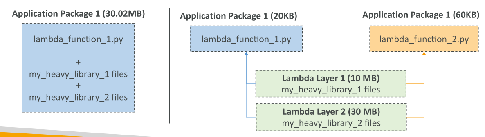

# Lambda Layers

Lambda Layers เป็นฟีเจอร์ใหม่ของ AWS Lambda ที่มีสองประโยชน์หลัก

### 1. Custom Runtimes

* Lambda Layers ช่วยให้สามารถสร้าง **custom runtimes** ได้
* หมายความว่าสามารถใช้ **ภาษาโปรแกรมที่ Lambda ไม่รองรับโดยตรง** เช่น **C++ หรือ Rust**
* ภาษาพวกนี้สามารถนำมาพัฒนา Lambda function ได้โดยใช้ **custom runtimes** ผ่าน layers

### 2. Externalizing Dependencies

* ใช้เพื่อ **แยก dependencies ออกจากแพ็กเกจแอป** เพื่อให้ reuse ได้

* ตัวอย่าง:

  * แพ็กเกจ Lambda ปกติ + ไลบรารีขนาดใหญ่ ~30 MB
  * หากต้องอัปเดตฟังก์ชันอื่น ต้องอัปโหลดไฟล์ zip ทั้งหมดซ้ำ → ใช้เวลานาน

* ส่วนใหญ่ dependencies **ไม่เปลี่ยนบ่อย** → สามารถแยกออกเป็น **Layer**

  * ตัวอย่าง:

    * Application code: 20 KB
    * Layer 1: 10 MB
    * Layer 2: 30 MB

* Lambda function จะ **อ้างอิงถึง layers เหล่านี้**

* ข้อดี:

  * Deployment เร็วขึ้น → อัปเดตเฉพาะโค้ดโดยไม่ต้องแพ็ก dependencies ทุกครั้ง
  * หลายฟังก์ชันสามารถใช้ **layer เดียวกัน** → ลดการซ้ำซ้อน

* ตัวอย่าง: ฟังก์ชันอื่นขนาด 60 KB ก็สามารถอ้างอิง layer เดียวกัน → ไม่ต้องซ้ำ dependencies

### สรุป

* Lambda Layers ช่วยสร้าง **custom runtimes** สำหรับภาษาใหม่ ๆ เช่น C++ และ Rust
* แยก dependencies ออกจากแอป → Deployment เร็วขึ้น
* หลาย Lambda function สามารถ **reuse layer เดียวกัน** → ลดขนาดแพ็กเกจและเวลาอัปโหลด
* ช่วยให้การจัดการโค้ดและ dependencies มีประสิทธิภาพมากขึ้น
