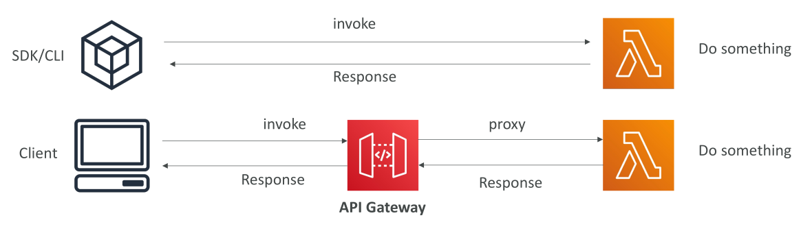

# Lambda Synchronous Invocations

เรามาดูรายละเอียดของการเรียกใช้งาน Lambda แบบ **Synchronous** ซึ่งเป็นประเภทการเรียกใช้งานที่เราใช้บ่อยแล้ว

คุณกำลังทำ **การเรียกแบบ synchronous** เมื่อใช้:

* CLI
* SDK
* API Gateway
* หรือแม้แต่ Application Load Balancer

## Synchronous หมายถึงอะไร?

* หมายถึงคุณ **รอผลลัพธ์กลับ** ก่อน
* ผลลัพธ์หรือข้อผิดพลาดจะถูกส่งกลับมาที่ client
* **ข้อผิดพลาดต้องจัดการที่ฝั่ง client**

ตัวอย่าง:

* ถ้า Lambda function ล้มเหลวและคุณเรียกใช้งานจาก console
* คุณสามารถคลิก **retry** เพื่อเรียกใช้งานอีกครั้ง
* หมายความว่า **client ต้องตัดสินใจเอง** ว่าจะ retry หรือทำ exponential backoff

## การเรียกใช้งานแบบ synchronous

* เป็นการเรียกตรง ๆ (direct invocation)
* CLI และ SDK จะเรียก Lambda function → Lambda ทำงาน → ส่งผลลัพธ์กลับ
* เช่นเดียวกันกับ API Gateway:

  1. Client เรียก API Gateway
  2. API Gateway ส่ง request ไป Lambda function
  3. Lambda ทำงานและส่ง response กลับ
  4. API Gateway ส่ง response กลับ client

> ในกระบวนการนี้ **เรารอผลลัพธ์กลับ ทำให้เป็น synchronous**

## บริการที่เรียก Lambda แบบ synchronous

บริการที่เรียก Lambda แบบ synchronous ได้แก่:

* การเรียกโดยผู้ใช้ (user-invoked) → เป็น synchronous
* **Elastic Load Balancing ผ่าน Application Load Balancer**
* **API Gateway**
* **CloudFront กับ Lambda@Edge**

บริการอื่น ๆ ที่เรียก Lambda แบบ synchronous:

* Amazon S3 Batch
* Cognito
* Step Functions
* Lex
* Alexa
* Kinesis Data Firehose

> ในคอร์สนี้จะครอบคลุม **Application Load Balancer, API Gateway, CloudFront, Cognito และ Step Functions**

## สรุปสำหรับการนำไปใช้งาน

* **Synchronous invocation** คือการรอผลลัพธ์ของ Lambda ก่อนดำเนินการต่อ
* ข้อผิดพลาดต้องจัดการที่ฝั่ง client
* บริการอย่าง CLI, SDK, API Gateway, Application Load Balancer เรียก Lambda แบบ synchronous
* Lambda ที่เรียกโดยผู้ใช้ และ integration เช่น CloudFront กับ Lambda@Edge ก็ใช้ synchronous เช่นกัน