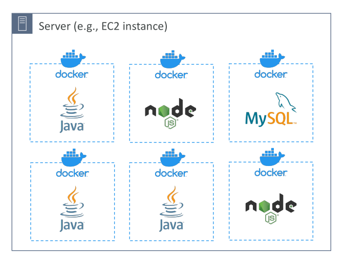
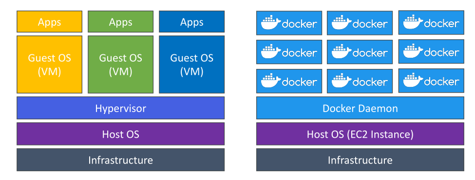
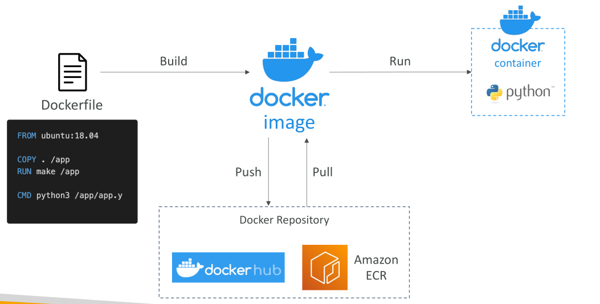
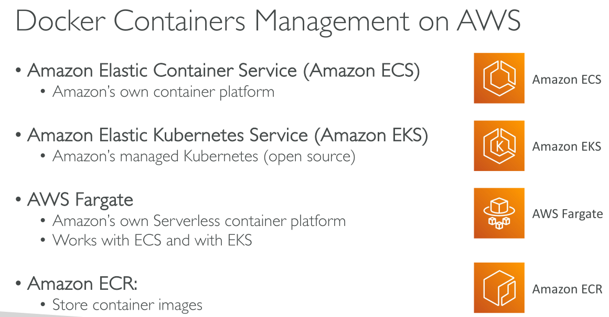

# Docker Introduction

ในส่วนนี้ เราจะพูดถึงคอนเทนเนอร์ โดยเน้นไปที่ Docker, Amazon ECS และ Amazon EKS

## Docker คืออะไร?

Docker เป็นแพลตฟอร์มสำหรับพัฒนาซอฟต์แวร์ที่ใช้สำหรับ deploy แอปพลิเคชัน โดยเป็น **เทคโนโลยีคอนเทนเนอร์** ซึ่งแอปพลิเคชันจะถูกบรรจุลงในคอนเทนเนอร์

คอนเทนเนอร์เหล่านี้มีมาตรฐาน ทำให้สามารถรันบนระบบปฏิบัติการใดก็ได้ เมื่อแอปพลิเคชันถูกคอนเทนเนอร์แล้ว จะรันเหมือนกันทุกเครื่อง ลดปัญหาความเข้ากันไม่ได้ และพฤติกรรมสามารถคาดเดาได้ Docker ช่วยให้การบำรุงรักษาและการ deploy ง่ายขึ้น และรองรับทุกภาษา โปรแกรม และเทคโนโลยี

## การใช้งาน Docker

* สถาปัตยกรรมแบบ Microservices
* ย้ายแอปพลิเคชันจาก On-Premises ไปยัง Cloud (Lift and Shift)
* รันแอปพลิเคชันที่เป็นคอนเทนเนอร์ใด ๆ

## Docker ทำงานอย่างไรบนระบบปฏิบัติการ

คุณมีเซิร์ฟเวอร์ เช่น EC2 หรือเซิร์ฟเวอร์อื่น ๆ บนเซิร์ฟเวอร์นี้ จะรัน **Docker Daemon** จากนั้นสามารถเริ่มคอนเทนเนอร์ Docker ได้

ตัวอย่าง:

* คอนเทนเนอร์หนึ่งมี Java application
* อีกคอนเทนเนอร์มี Node.js application

สามารถรันหลาย instance ของคอนเทนเนอร์เดียวกันได้ เช่น Java หรือ Node.js หลายคอนเทนเนอร์ รวมถึงรันฐานข้อมูล เช่น MySQL

จากมุมมองของเซิร์ฟเวอร์ ทั้งหมดนี้คือ **Docker Containers** ทำให้ Docker มีความยืดหยุ่นสูง

## Docker Images และ Repositories

Docker images จะถูกเก็บใน Docker repositories มีหลายตัวเลือก:

* **Docker Hub**: Repository สาธารณะ มี base images สำหรับหลายเทคโนโลยี เช่น Ubuntu, MySQL
* **Amazon Elastic Container Registry (ECR)**: Repository ส่วนตัวสำหรับเก็บ images สามารถเลือก public repository (Amazon ECR Public Gallery) ได้

## Docker กับ Virtual Machines

Docker เป็นเทคโนโลยี virtualization แต่ต่างจาก Virtual Machines (VMs)

**Virtual Machines**:

* Architecture: Infrastructure → Host OS → Hypervisor → Guest OS → Applications
* แต่ละ VM แยกตัว มี OS และ resources ของตัวเอง
* ตัวอย่าง: EC2 instance

**Docker Containers**:

* Architecture: Infrastructure → Host OS → Docker Daemon → Containers
* Containers ใช้ resources ของ Host OS ร่วมกัน
* รันหลายคอนเทนเนอร์บนเซิร์ฟเวอร์เดียวได้
* สามารถแชร์ network และข้อมูลบางส่วน

แม้ว่า containers จะไม่แยกตัวเท่า VMs ทำให้ความปลอดภัยน้อยกว่าเล็กน้อย แต่สามารถรันหลาย instance บนเซิร์ฟเวอร์เดียวได้

## การเริ่มต้นใช้งาน Docker

ขั้นตอนการใช้ Docker:

1. เขียน **Dockerfile** เพื่อกำหนดวิธีสร้าง Docker container
2. ใช้ base Docker image และเพิ่มไฟล์หรือ config
3. Build Dockerfile เพื่อสร้าง Docker image
4. Push Docker image ไปยัง repository เช่น Docker Hub หรือ Amazon ECR
5. Pull Docker image จาก repository เมื่อจำเป็น
6. Run Docker image → สร้าง Docker container ที่รันแอปพลิเคชัน

## การจัดการ Docker Container บน AWS

AWS มีบริการหลายตัวสำหรับจัดการ Docker container:

* **Amazon ECS (Elastic Container Service)**: บริการจัดการ Docker ของ AWS
* **Amazon EKS (Elastic Kubernetes Service)**: บริการ Kubernetes แบบ managed
* **AWS Fargate**: Serverless container platform ทำงานร่วมกับ ECS และ EKS
* **Amazon ECR**: เก็บ container images ทั้ง private และ public

## ข้อสรุปสำคัญ (Key Takeaways)

* Docker เป็นเทคโนโลยีคอนเทนเนอร์ที่บรรจุแอปลงใน container มาตรฐาน ทำให้รันเหมือนกันทุก OS/เครื่อง
* Docker containers ใช้ resources ของ Host OS ร่วมกัน ทำให้รันหลาย container บนเซิร์ฟเวอร์เดียวได้ ต่างจาก VM ที่แยกตัวเต็มรูป
* Docker images เก็บใน repositories เช่น Docker Hub (public) หรือ Amazon ECR (private/public)
* AWS มีบริการจัดการ container ได้แก่ Amazon ECS, Amazon EKS, AWS Fargate และ Amazon ECR