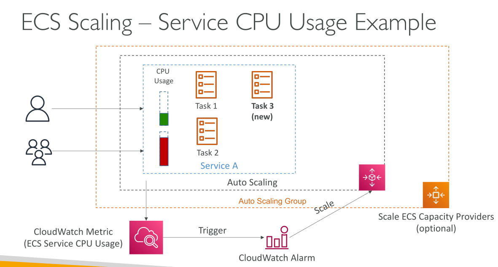

# Amazon ECS – Auto Scaling

## บทนำเกี่ยวกับ ECS Service Auto Scaling

เราสามารถเพิ่มจำนวน ECS tasks ใน service ของเราแบบ **manual** ได้ แต่เรายังสามารถทำให้ **เพิ่มหรือลดจำนวน tasks อัตโนมัติ** ได้ด้วยการใช้บริการ **AWS Application Auto Scaling**

## Metrics สำหรับ Auto Scaling

มี **3 metrics หลัก** ที่ใช้ในการตั้งค่า auto scaling:

1. **CPU Utilization** ของ ECS Service
2. **Memory Utilization** (RAM ที่ใช้ของ ECS Service)
3. **ALB Request Count Per Target** (มาจาก Application Load Balancer)

นี่คือ metrics ที่ต้องจำสำหรับการตั้งค่า auto scaling

## ประเภทของ Auto Scaling

เราสามารถตั้งค่า Auto Scaling ได้หลายแบบ:

* **Target Tracking:** ติดตามค่า target ของ metrics ที่กำหนด
* **Step Scaling:** ปรับ scale เป็นขั้นตอนตามค่า threshold ของ metrics
* **Scheduled Scaling:** ปรับ scale ล่วงหน้าตาม pattern ที่คาดการณ์ได้

## ความแตกต่างระหว่าง Service Scaling กับ Cluster Scaling

* การปรับขนาด **ECS Service** ที่ระดับ task ไม่เหมือนกับการปรับขนาด **EC2 cluster** หากใช้ EC2 Launch Type
* หากใช้ **Fargate** จะง่ายกว่า เพราะไม่มี EC2 backend ทุกอย่างเป็น serverless → การตั้งค่า auto scaling ทำได้ง่าย
* นี่เป็นเหตุผลที่ Fargate เป็นที่แนะนำในข้อสอบ

## การปรับขนาด EC2 Instances ใน Backend

สำหรับ EC2 Launch Type สามารถปรับขนาด EC2 backend ได้หลายวิธี:

1. **Auto Scaling Group (ASG) Scaling:**

   * ปรับ EC2 instance ตาม CPU Utilization
   * ตัวอย่าง: หาก CPU usage สูงขึ้น → เพิ่ม EC2 instances ตามต้องการ

2. **ECS Cluster Capacity Provider:**

   * ฟีเจอร์ใหม่และฉลาดกว่า ASG Scaling
   * เมื่อไม่พอ capacity สำหรับ task ใหม่ → จะ scale ASG อัตโนมัติ
   * Capacity Provider ทำงานคู่กับ Auto Scaling Group
   * หาก RAM หรือ CPU ไม่พอ → EC2 instances จะถูกสร้างอัตโนมัติ
   * **แนะนำใช้ ECS Cluster Capacity Provider สำหรับ EC2 Launch Type**

## ตัวอย่าง ECS Service Auto Scaling

* สมมติว่า **Service A** มี 2 tasks และมีการใช้ CPU
* หากมีผู้ใช้มากขึ้น → CPU usage สูงขึ้น → **CloudWatch metric** ตรวจจับและ trigger **CloudWatch Alarm**
* Alarm นี้จะ trigger **Scaling Activity** ของ ECS Service → เพิ่ม **Desired Capacity** → สร้าง task ใหม่
* หากใช้ **EC2 Launch Type** → **ECS Capacity Provider** จะช่วย scale EC2 cluster อัตโนมัติ

## Key Takeaways

* **ECS Service Auto Scaling** สามารถปรับจำนวน tasks อัตโนมัติตาม metrics
* Metrics หลัก 3 ตัว: CPU Utilization, Memory Utilization, ALB Request Count Per Target
* วิธีการ Auto Scaling: Target Tracking, Step Scaling, Scheduled Scaling
* สำหรับ **EC2 Launch Type** → ใช้ **ECS Cluster Capacity Provider** เป็นวิธีที่แนะนำและฉลาดที่สุดในการ scale EC2 อัตโนมัติ