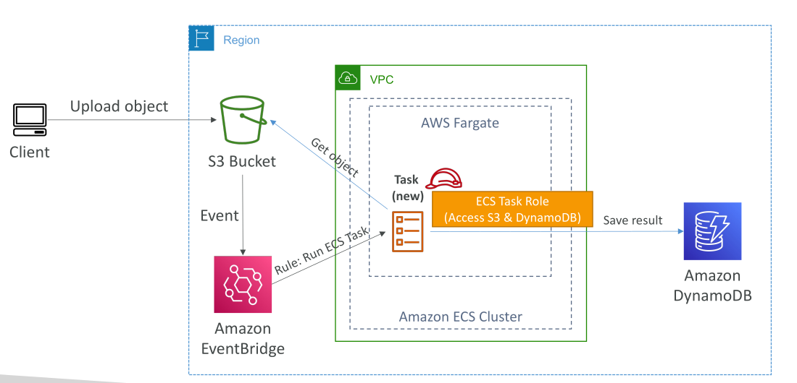
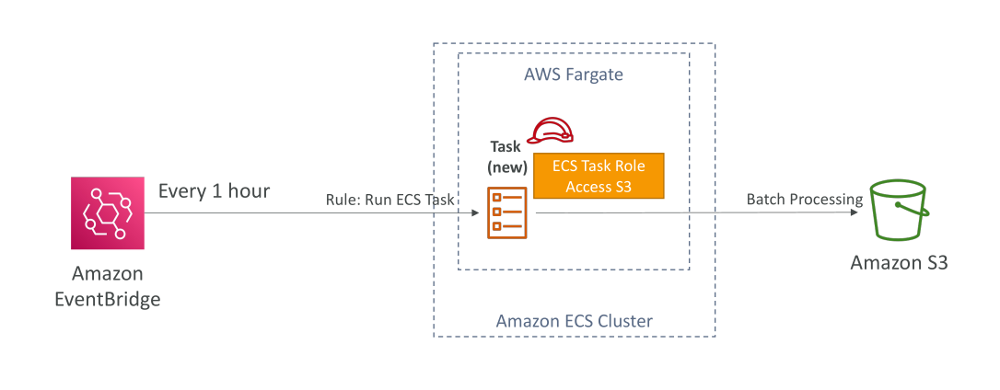
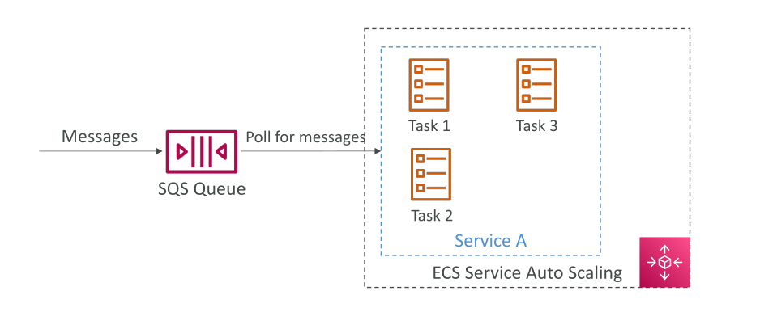
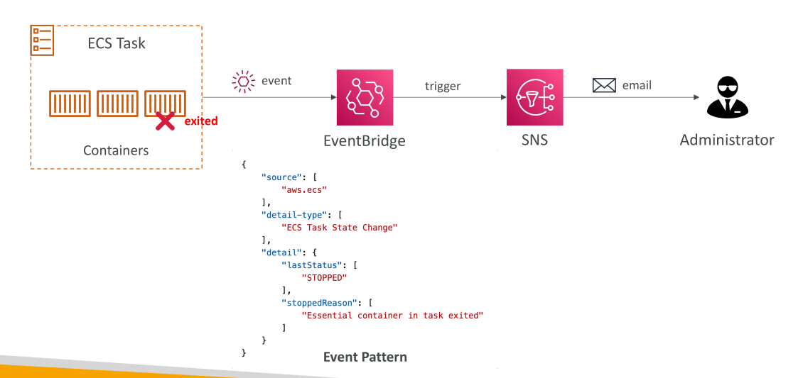

# Amazon ECS - Solutions Architectures

## ECS Tasks ที่ถูกเรียกโดย EventBridge

* สมมติว่าเรามี **Amazon ECS cluster** ที่ใช้ **Fargate** ทำงานร่วมกับ **S3 buckets**
* ผู้ใช้อัปโหลด object ลงใน S3 bucket
* S3 bucket สามารถเชื่อมกับ **Amazon EventBridge** เพื่อส่ง event ทั้งหมดไปยัง EventBridge
* EventBridge สามารถตั้ง **rule** ให้เรียก ECS tasks แบบ dynamic

**Flow การทำงาน:**

1. ECS task ถูกสร้างขึ้นพร้อมกับ **ECS task role**
2. Task สามารถเข้าถึง object ใน S3, ประมวลผลข้อมูล, แล้วส่งผลลัพธ์ไปยัง **Amazon DynamoDB**

* สถาปัตยกรรมนี้เป็น **serverless** สำหรับประมวลผลรูปภาพหรือ object จาก S3 ด้วย ECS task และ Docker container

## ECS Tasks ตามตารางเวลา EventBridge

* อีกหนึ่งสถาปัตยกรรม ใช้ **EventBridge schedule**
* ECS cluster บน Fargate ทำงานร่วมกับ EventBridge
* ตั้ง rule ให้ trigger ทุก ๆ ชั่วโมง

**Flow การทำงาน:**

1. ทุก ๆ ชั่วโมง ECS task ใหม่จะถูกสร้างใน Fargate cluster
2. Task ทำงานตามที่กำหนด เช่น เข้าถึงไฟล์ใน S3 และทำ batch processing

* ECS task role ช่วยให้ container เข้าถึง S3 ได้
* สถาปัตยกรรมนี้ **เต็มรูปแบบ serverless**

## ECS Service ร่วมกับ SQS Queue

* ตัวอย่างเพิ่มเติม ใช้ ECS กับ **SQS queue**
* ECS service รันด้วยสอง ECS tasks
* ข้อความถูกส่งเข้า SQS queue → ECS service ดึงข้อความไปประมวลผล

**Flow การทำงาน:**

* สามารถเปิด **ECS Service Auto Scaling**
* เมื่อจำนวนข้อความใน SQS queue เพิ่มขึ้น → จำนวน ECS tasks ก็จะ scale ขึ้นอัตโนมัติ

## การมอนิเตอร์ ECS Task Lifecycle ด้วย EventBridge

* EventBridge สามารถดักจับ event จาก ECS cluster ได้ เช่น task ที่ **start หรือ exit**

**Flow การทำงาน:**

1. Task ใด ๆ ที่เริ่มหรือหยุดใน ECS cluster → trigger event ใน EventBridge
2. Event มีข้อมูล เช่น task state เป็น "stopped" และเหตุผลที่หยุด
3. สามารถแจ้งเตือนผ่าน **SNS topic** ส่งอีเมลไปยัง admin

* EventBridge ช่วยให้เข้าใจ **lifecycle ของ container** ใน ECS cluster

## สรุป

* สถาปัตยกรรมเหล่านี้แสดงให้เห็นวิธีสร้าง **แอปพลิเคชันแบบ scalable, serverless และ event-driven**
* ใช้ **Amazon ECS, EventBridge, S3, DynamoDB, SQS และ SNS** ร่วมกัน

## Key Takeaways

* ECS tasks สามารถถูกเรียกโดย EventBridge เพื่อสร้างสถาปัตยกรรมแบบ serverless
* EventBridge schedule ทำให้ ECS tasks ทำงานตามรอบเวลา เช่น batch processing ทุกชั่วโมง
* ECS services สามารถเชื่อมกับ SQS queue → auto-scaling ตามปริมาณข้อความ
* EventBridge สามารถมอนิเตอร์ lifecycle ของ ECS tasks → ใช้สำหรับ alert และ operational insight