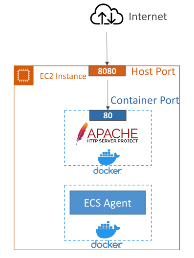
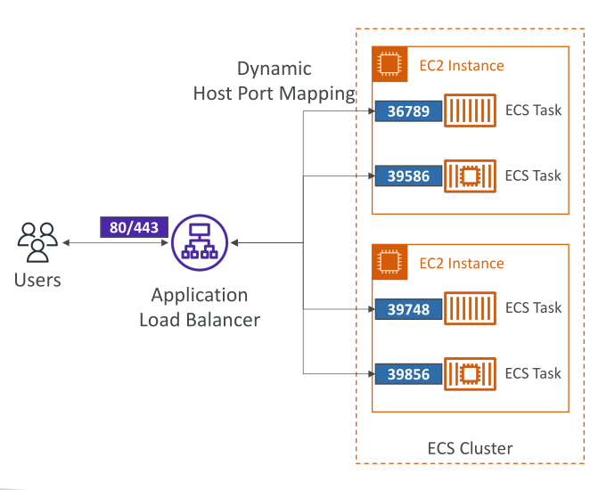
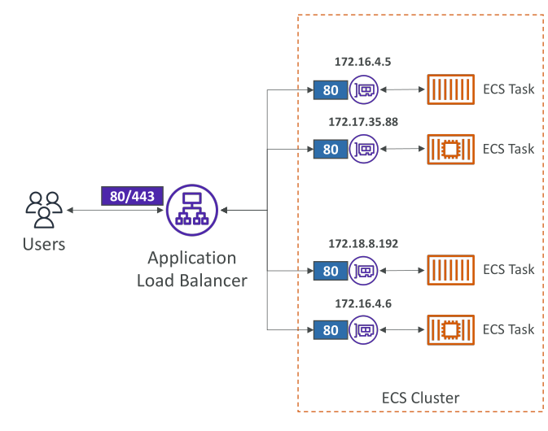
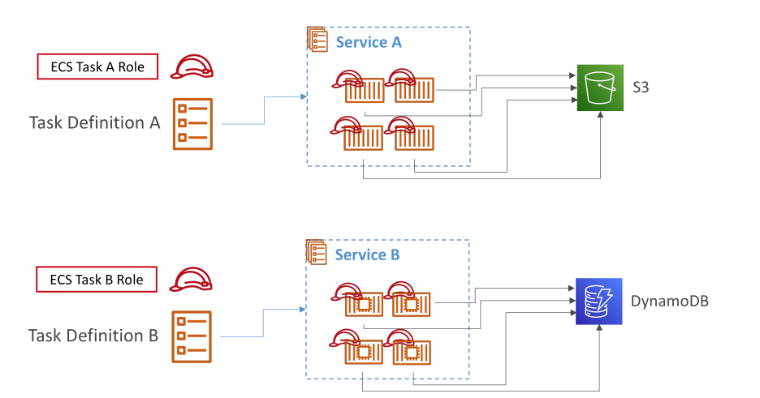
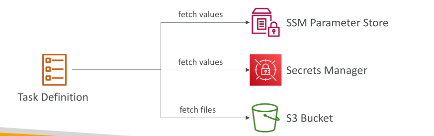
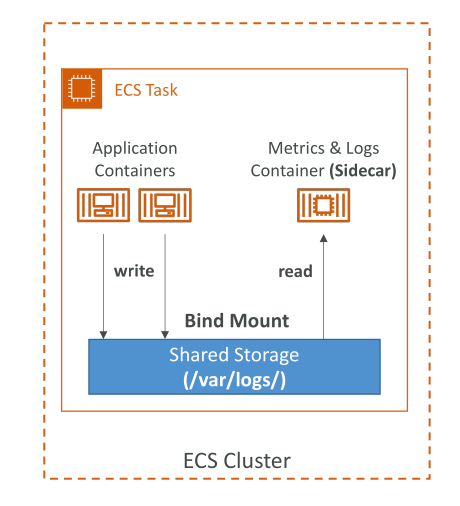

# Amazon ECS Task Definitions - Deep Dive

**Task Definitions ของ Amazon ECS** จะถูกกำหนดในรูปแบบ JSON คุณสามารถเขียน JSON ด้วยตัวเองหรือใช้ **AWS Console** ช่วยสร้างได้ Task Definition บอก ECS service ว่าจะรัน Docker container หนึ่งหรือหลายตัวอย่างไร

## ข้อมูลสำคัญใน Task Definition

* ชื่อของ Docker **Image**
* การ **Port Binding** ระหว่าง Container กับ Host (สำหรับ EC2)
* ขนาด **CPU และ Memory** ที่ container ต้องการ
* **Environment Variables**
* ข้อมูลเครือข่าย
* **IAM Role** ที่เชื่อมกับ Task Definition
* การตั้งค่า **Logging** เช่น CloudWatch

เหล่านี้คือฟิลด์ที่สำคัญและมักถูกสอบ

## ตัวอย่าง Scenario

* มี EC2 instance ลงทะเบียนกับ ECS cluster และรัน **ECS Agent**
* ต้องการรัน Docker container เช่น **Apache HTTP server**
* ตั้งค่า **container port** เป็น 80 เพื่อเปิด HTTP server ภายใน container
* สำหรับ EC2 ต้องกำหนด **host port** เช่น 80 หรือ 8080

  * Host port ช่วยให้ network ภายนอกเข้าถึง EC2 instance และ container port 80

**หมายเหตุ:** Task definition สามารถมีได้มากสุด 10 containers

## Container Port และ Dynamic Host Port Mapping

* สำหรับ **EC2 Launch Type** + **Load Balancer**
* สามารถกำหนด **container port** แล้วตั้ง **host port = 0** → ECS จะสุ่ม host port ให้แต่ละ task
* Application Load Balancer (ALB) จะเชื่อมกับ ECS tasks ได้อัตโนมัติผ่าน **Dynamic Host Port Mapping**
* **Classic Load Balancer** ใช้งานไม่ได้ในกรณีนี้
* Security group ของ EC2 ต้องอนุญาต traffic จาก ALB security group

## การตั้งค่า Port สำหรับ Fargate

* แต่ละ ECS task บน Fargate ได้ **private IP** เฉพาะตัวผ่าน **Elastic Network Interface (ENI)**
* ไม่มี host ดังนั้น **กำหนดเฉพาะ container ports**
* ALB เชื่อมต่อแต่ละ task บน container port เดียวกัน (เช่น port 80)
* Security group ของ ENI ต้องอนุญาต inbound traffic จาก ALB security group
* ALB security group อนุญาต inbound traffic จากอินเทอร์เน็ตบน port 80 หรือ 443 (ถ้าใช้ SSL)

## IAM Roles ใน ECS

* IAM role ถูกกำหนดที่ **Task Definition level**
* ECS tasks ที่สร้างจาก Task Definition จะสืบทอด **ECS Task Role**
* Task role ใช้สำหรับเข้าถึง AWS services เช่น S3 หรือ DynamoDB
* สามารถสร้างหลาย Task Definitions พร้อม IAM roles ต่างกัน

## Environment Variables ใน Task Definitions

* สามารถได้มาจากหลายแหล่ง:

  * Hardcode ใน Task Definition สำหรับค่าคงที่
  * AWS SSM Parameter Store หรือ Secrets Manager สำหรับข้อมูลลับ เช่น API keys หรือรหัสผ่าน
  * อ้างอิงใน Task Definition แล้วดึงค่า runtime inject เป็น environment variable
  * โหลดเป็น bulk จากไฟล์ใน S3

  

## การแชร์ข้อมูลระหว่าง ECS Tasks

* Task สามารถมีหลาย containers
* Containers ใน task เดียวกันสามารถแชร์ข้อมูลผ่าน **data volume (bind mount)**
* **EC2 tasks:** ใช้ storage ของ EC2 instance → ข้อมูลอยู่ได้จนกว่า EC2 instance หยุด
* **Fargate tasks:** ใช้ ephemeral storage → ข้อมูลอยู่จน task หยุด (storage ลบอัตโนมัติ)
* Fargate รองรับ shared storage 20–200 GB
* Sidecar containers สามารถอ่าน metrics/logs จาก storage ที่ application container เขียน

## สรุป

* Task Definition กำหนดวิธีรัน Docker containers ใน ECS
* สำหรับ **EC2 launch type:** container ports → host ports (dynamic สำหรับ ALB)
* สำหรับ **Fargate launch type:** แต่ละ task มี private IP ของตัวเอง → กำหนดเฉพาะ container ports
* IAM roles ถูกกำหนดที่ Task Definition → ECS tasks สามารถเข้าถึง AWS services
* Environment variables สามารถ hardcode, ใช้ SSM/Secrets Manager หรือโหลดจาก S3
* การแชร์ข้อมูลระหว่าง containers ใช้ **bind mount**

## Key Takeaways

1. Task Definitions กำหนดการรัน container พร้อม CPU, Memory, ports, environment, IAM roles และ logging
2. EC2 launch type → container ports map ไปยัง host ports, dynamic host port ช่วย ALB route traffic
3. Fargate launch type → private IP ของแต่ละ task, container ports เท่านั้น
4. IAM roles อยู่ที่ Task Definition → ECS tasks ใช้ role เข้าถึง AWS services
5. Environment variables → hardcode, SSM/Secrets Manager, หรือ S3
6. การแชร์ข้อมูลระหว่าง containers → bind mount สำหรับ EC2 และ Fargate