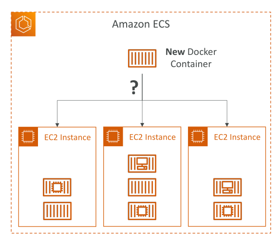
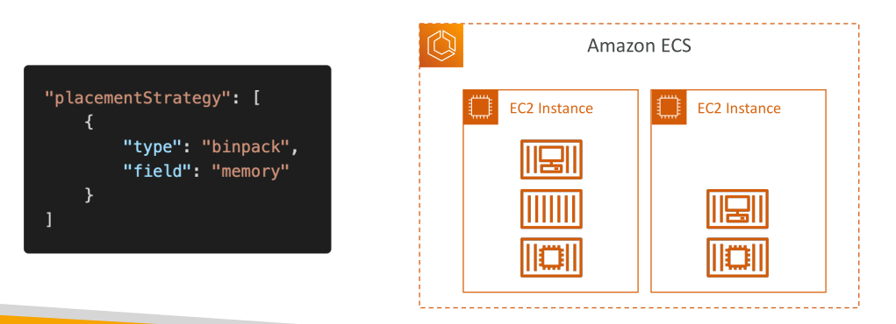
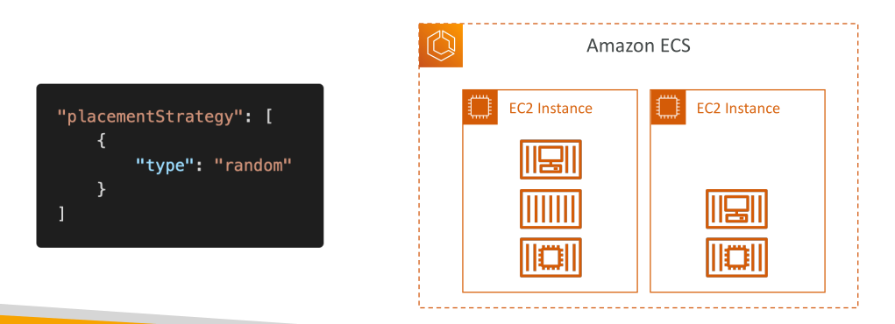
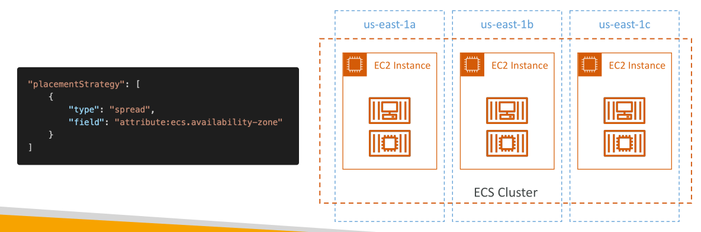

# Amazon ECS – Task Placement Process



* **Task Placement Strategies** เป็นเพียง “best effort” หรือพยายามให้ดีที่สุดตามเงื่อนไข
* เมื่อ Amazon ECS จะวาง task มันจะทำตามขั้นตอนดังนี้:

  1. ระบุ EC2 instances ที่รองรับ **CPU, memory, และ port** ที่กำหนดใน task definition
  2. ระบุ instances ที่สอดคล้องกับ **Task Placement Constraints**
  3. ระบุ instances ที่สอดคล้องกับ **Task Placement Strategies**
  4. เลือก instance ที่เหมาะสมที่สุดและวาง task ลงไป

## ECS Task Placements

* เมื่อสร้าง task แบบ **EC2 launch type** ECS ต้องเลือกว่าจะวาง task ที่ instance ไหนตาม **CPU, memory, port** ที่ว่างอยู่
* ตัวอย่าง:

  * ECS cluster มี 3 EC2 instances
  * มี tasks บางตัวอยู่แล้ว
  * ถ้า service ต้องการรัน container ใหม่ ECS ต้องตัดสินใจว่าจะวาง task ใหม่ที่ instance ไหน
* ในกรณีที่ service scale in (ลดจำนวน task) ECS ต้องตัดสินใจว่าจะ terminate task ไหน

**หมายเหตุ:**

* การวาง task ด้วย constraints และ strategies จะใช้ได้ **เฉพาะ ECS บน EC2**
* สำหรับ Fargate, AWS จะจัดการ placement ให้เอง

## Task Placement Strategies

1. **Binpack**

   * วาง tasks บน instance ที่มี **CPU หรือ memory เหลือน้อยที่สุด** ก่อน
   * ช่วยลดจำนวน EC2 instances ในการใช้งาน → ประหยัดค่าใช้จ่าย

   ```json
   {
     "type": "binpack",
     "field": "memory"
   }
   ```

   

   * ECS จะพยายามใส่ containers ให้เต็ม instance หนึ่งก่อน แล้วจึงย้ายไป instance ถัดไป

2. **Random**

   * วาง tasks แบบสุ่ม ไม่มีลำดับ logic

   ```json
   {
     "type": "random"
   }
   ```

   

3. **Spread**

   * กระจาย tasks ตามค่า attribute เช่น **instance ID** หรือ **availability zone (AZ)**

   ```json
   {
     "type": "spread",
     "field": "attribute:ecs.availability-zone"
   }
   ```

   

   * ตัวอย่าง: มี 3 EC2 instances ใน 3 AZ → task จะถูกกระจายสลับกัน AZ-A → AZ-B → AZ-C
   * เพิ่ม **high availability** ของ service

* **สามารถผสม strategies ได้**

  * เช่น spread ตาม AZ + binpack ตาม memory
* สำหรับสอบ ให้เข้าใจ **binpack, spread, random**

## ECS Task Placement Constraints

1. **distinctInstance**

   * ทำให้แต่ละ task อยู่ **คนละ EC2 instance**

   ```json
   {
     "type": "distinctInstance"
   }
   ```

2. **memberOf**

   * วาง task บน instances ที่ตรงตาม **expression** ของ cluster query language

   ```json
   {
     "type": "memberOf",
     "expression": "attribute:ecs.instance-type == t2.*"
   }
   ```

   * ตัวอย่าง: tasks จะรันเฉพาะบน **t2 instances**

**สรุป:**

* distinctInstance → เข้าใจง่าย
* memberOf → ซับซ้อนขึ้น ใช้ expression กำหนดเงื่อนไข

## สรุป Key Takeaways

1. ECS task placement กำหนด **ที่วาง task บน EC2** ตาม resource และ strategy ที่กำหนด
2. **Task placement strategies** มี 3 แบบหลัก:

   * **Binpack** → ประหยัดค่าใช้จ่าย
   * **Random** → วางแบบสุ่ม
   * **Spread** → กระจายเพื่อ availability
3. **Task placement constraints**:

   * **distinctInstance** → task อยู่คนละ instance
   * **memberOf** → task อยู่บน instance ที่ตรงตามเงื่อนไข
4. concepts เหล่านี้ **ใช้เฉพาะ ECS บน EC2**

   * Fargate จะจัดการ placement อัตโนมัติ