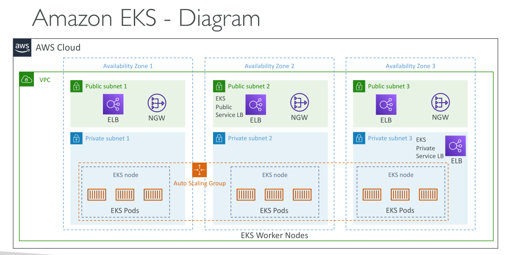
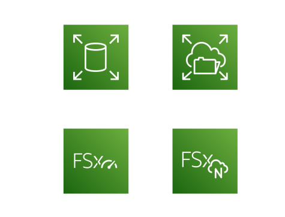

# Amazon EKS

## บทนำเกี่ยวกับ Amazon EKS

* **Amazon EKS** ย่อมาจาก **Amazon Elastic Kubernetes Service** เป็นบริการสำหรับ **เปิดและจัดการ Kubernetes cluster บน AWS**

## Kubernetes คืออะไร?

* Kubernetes เป็น **ระบบโอเพนซอร์ส** สำหรับการ **deploy, scale และจัดการแอปพลิเคชันแบบ containerized** (โดยทั่วไปคือ Docker)
* Kubernetes เป็นทางเลือกของ ECS ซึ่งมีเป้าหมายคล้ายกันคือรัน container แต่ใช้ **API ที่ต่างกัน**
* จุดแตกต่างคือ **ECS ไม่ใช่โอเพนซอร์ส** ในขณะที่ Kubernetes เป็นโอเพนซอร์สและใช้ได้กับหลาย cloud provider ซึ่งทำให้เกิด **มาตรฐานการใช้งาน**

## โหมดการเปิดใช้งาน Amazon EKS

Amazon EKS รองรับ **สองโหมดการเปิดใช้งาน**:

1. **EC2 Launch Mode**: เปิด worker node เป็น EC2 instances
2. **Fargate Mode**: เปิด container แบบ serverless บน EKS cluster

**Use Case:**

* สำหรับองค์กรที่ใช้ Kubernetes อยู่แล้วบน on-premises หรือ cloud อื่น
* ผู้ที่ต้องการใช้ **Kubernetes API** พร้อมใช้ AWS จัดการ cluster

## Kubernetes Cloud Agnosticism

* Kubernetes เป็น **cloud agnostic** ใช้ได้กับ cloud อื่น เช่น Azure, Google Cloud
* ทำให้ **การย้าย container ระหว่าง cloud ง่ายขึ้น** หากใช้ Amazon EKS

## สถาปัตยกรรม Amazon EKS

* โดยทั่วไป EKS จะอยู่ใน **VPC** ที่มี 3 Availability Zones (AZ) แยกเป็น **public และ private subnet**
* **EKS Worker Nodes** (EC2 instances) จะรัน **Pods**

  * Pod คือ container group ใน Kubernetes คล้ายกับ ECS task
* Node สามารถบริหารด้วย **Auto Scaling Group**
* การ expose service ของ EKS/Kubernetes สามารถใช้ **load balancer แบบ private หรือ public**

## ประเภทของ Node ใน Amazon EKS

1. **Managed Node Groups**: AWS สร้างและจัดการ EC2 instances ให้เป็นส่วนหนึ่งของ Auto Scaling Group (รองรับทั้ง On-Demand และ Spot Instances)
2. **Self-Managed Nodes**: คุณสร้างและจัดการ nodes เอง

   * ลงทะเบียนกับ EKS cluster และจัดการใน Auto Scaling Group
   * ใช้ **EKS Optimized AMI** หรือสร้าง AMI เอง
   * รองรับทั้ง On-Demand และ Spot Instances
3. **Fargate Mode**: ไม่มี nodes ให้เห็นหรือจัดการ

   * Containers รันแบบ **serverless** บน EKS

## ตัวเลือก Storage สำหรับ Amazon EKS

* สามารถ attach data volumes บน EKS cluster โดยใช้ **StorageClass manifest** ผ่าน **Container Storage Interface (CSI)**
* ตัวเลือก Storage ที่รองรับ:

  * **Amazon EBS**
  * **Amazon EFS** (storage class เดียวที่ compatible กับ Fargate)
  * **Amazon FSx for Lustre**
  * **Amazon FSx for NetApp ONTAP**

  

## สรุป

* Amazon EKS เป็นบริการ **Kubernetes ที่บริหารจัดการโดย AWS**
* รองรับทั้ง **EC2 และ Fargate**
* มีตัวเลือก node และ storage ยืดหยุ่นสำหรับองค์กรที่ใช้ Kubernetes

## Key Takeaways

1. Amazon EKS เป็น **Managed Kubernetes service บน AWS** รองรับทั้ง EC2 และ Fargate
2. Kubernetes เป็น **โอเพนซอร์ส** สำหรับ deploy, scale และ manage containerized applications
3. EKS รองรับ **Managed Node Groups, Self-Managed Nodes และ Fargate serverless nodes**
4. Storage options: **Amazon EBS, Amazon EFS (compatible กับ Fargate), Amazon FSx** ผ่าน CSI