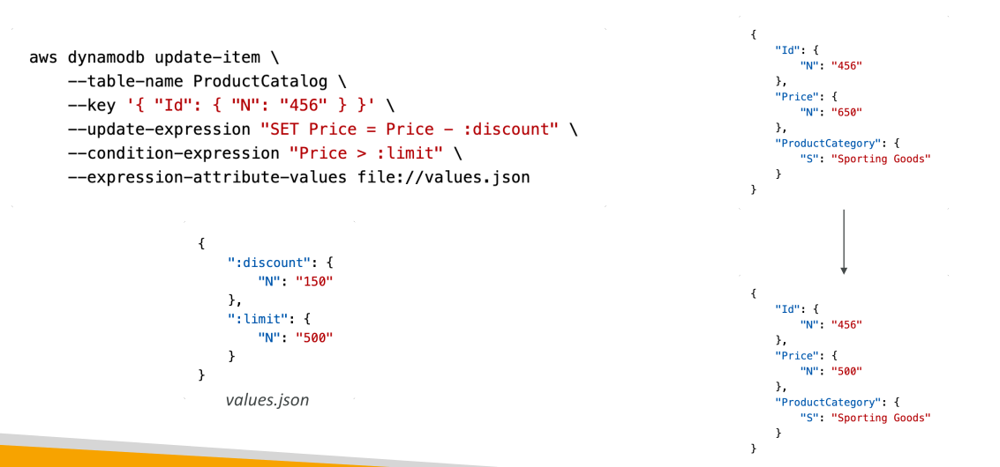
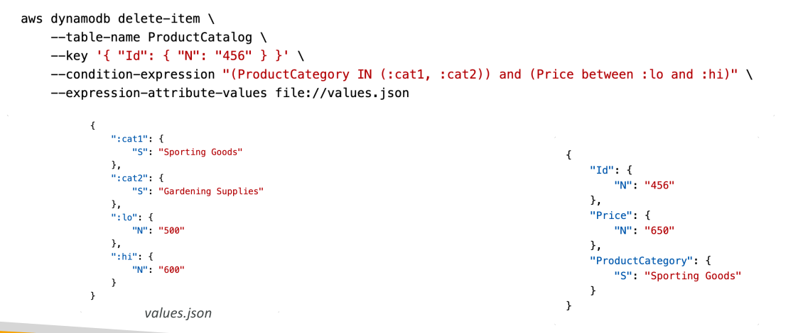
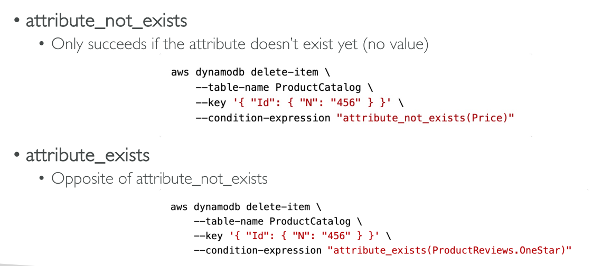

# DynamoDB – Conditional Writes

DynamoDB รองรับ **การเขียนแบบมีเงื่อนไข** สำหรับคำสั่งเขียนข้อมูล ได้แก่:

* **PutItem**
* **UpdateItem**
* **DeleteItem**
* **BatchWriteItem**

การเขียนแบบมีเงื่อนไขช่วยให้คุณกำหนด **Condition Expression** เพื่อกำหนดว่า item ไหนควรถูกแก้ไขหรือไม่

## Condition Expressions ที่ใช้ได้

ตัวอย่างของ condition expressions:

* **attribute_exists** และ **attribute_not_exists** → ตรวจสอบว่ามี attribute อยู่หรือไม่
* **attribute_type** → ตรวจสอบประเภทของ attribute
* **contains** และ **begins_with** → สำหรับการเปรียบเทียบ string
* **IN** → ตรวจสอบว่าค่าตรงกับ set ของค่าที่กำหนดหรือไม่
* **between** → ตรวจสอบว่าค่าอยู่ในช่วงที่กำหนดหรือไม่
* **Comparison operators** เช่น >, <
* **size()** → ตรวจสอบความยาวของ string

**ข้อสำคัญ:**

* **Filter Expressions** → ใช้กรองผลลัพธ์ของ **read queries**
* **Condition Expressions** → ใช้กับ **write operations** เพื่อกำหนดว่า write จะสำเร็จหรือไม่

## ตัวอย่าง: Conditional UpdateItem

* สมมติ table ชื่อ `productcatalog`
* ต้องการ **ปรับราคา** (`price`) ให้ลดลงตาม discount แต่ทำได้เฉพาะถ้า **ราคาเกิน limit**
* Condition Expression จะตรวจสอบก่อนว่า item ผ่านเงื่อนไขหรือไม่



ตัวอย่าง values.json:

```json
{
  "discount": 150,
  "limit": 500
}
```

* ถ้า item มี key `456` ราคา 650 → update จะลดราคาเหลือ 500
* ถ้าเรียก update อีกครั้ง → จะไม่สำเร็จ เพราะราคาไม่เกิน limit → ป้องกันไม่ให้ราคาต่ำเกินไป

## Conditional DeleteItem

* สามารถใช้ **condition expressions กับ DeleteItem** ได้
* ตัวอย่าง: ลบ item **เฉพาะถ้า attribute ไม่มีอยู่**

  * ใช้ `attribute_not_exists` → ลบเฉพาะ item ที่ attribute หายไป
  * ใช้ `attribute_exists` → ลบเฉพาะ item ที่มี attribute อยู่ เช่น ลบรีวิวสินค้าที่ได้ 1 ดาว



## ป้องกันการ overwrite ด้วย Condition Expressions

* ใช้ `attribute_not_exists` บน **partition key** → item จะถูกเขียน **เฉพาะถ้าไม่เคยมีอยู่**
* ถ้า table ใช้ **partition key + sort key** → สามารถกำหนด `attribute_not_exists` ทั้งคู่ เพื่อป้องกัน overwrite



## ตรวจสอบค่าใน Condition Expressions

* สามารถตรวจสอบว่าค่า attribute อยู่ใน **set หรือ range**

  * เช่น ตรวจสอบ category ของ product อยู่ใน list → ใช้ **IN**
  * ตรวจสอบราคาอยู่ระหว่าง low และ high → ใช้ **between :low และ :high**
* ถ้า item ผ่านเงื่อนไข → write ดำเนินการต่อ
* ถ้าไม่ผ่าน → write ล้มเหลว

## การเปรียบเทียบ string ใน Condition Expressions

* รองรับ **begins_with** และ **contains**
* ตัวอย่าง: ลบ item ที่ attribute string ขึ้นต้นด้วย `"http://"` → เพื่อลบ URL ภาพไม่ปลอดภัยจาก catalog

## สรุป

* Condition Expressions ช่วยสร้างเงื่อนไข **กำหนดว่า write จะเกิดขึ้นหรือไม่**
* ช่วย **รักษาความถูกต้องของข้อมูล** → ป้องกัน overwrite หรือ delete ที่ไม่ต้องการ
* สามารถใช้ logic ซับซ้อนในการเขียนข้อมูล

## Key Takeaways

* Conditional writes → กำหนดเงื่อนไขก่อนว่า write จะสำเร็จหรือไม่
* Condition expressions ได้แก่: `attribute_exists`, `attribute_not_exists`, `attribute_type`, `contains`, `begins_with`, `IN`, `between`, `size`
* **ต่างจาก filter expressions** → condition ใช้กับ write, filter ใช้กับ read
* ช่วยป้องกัน overwrite และทำให้ update/delete เป็นแบบมีเงื่อนไข
