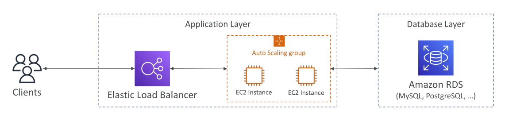
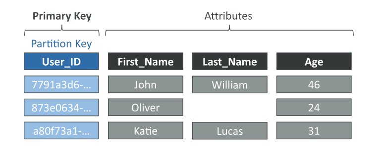
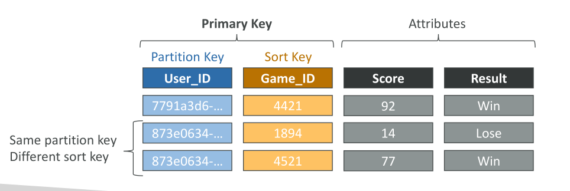

# DynamoDB

ตอนนี้เรามาดู **DynamoDB** กันบ้าง ซึ่งเป็นฐานข้อมูล **NoSQL แบบ Serverless**

## ภาพรวมสถาปัตยกรรมแบบดั้งเดิม

ในสถาปัตยกรรมแบบดั้งเดิมที่เราได้เรียนมาก่อนหน้านี้ ลูกค้าจะเชื่อมต่อกับ **application layer**

* เลเยอร์นี้อาจมี Elastic Load Balancer และ EC2 instances ที่จัดกลุ่มและสเกลด้วย Auto Scaling Group
* ส่วนของข้อมูลจะต้องถูกเก็บไว้ใน **database layer** ซึ่งมักใช้ Amazon RDS (เช่น MySQL, PostgreSQL ฯลฯ)

แอปพลิเคชันดั้งเดิมมักใช้ **RDBMS (Relational Database Management System)** เพราะมี **SQL query language** ซึ่งทรงพลังมาก ช่วยให้สามารถ

* กำหนดรูปแบบข้อมูลด้วยตารางและสคีมา
* ทำการ **joins, aggregations และคำนวณที่ซับซ้อน** ได้ดี

## ข้อจำกัดของการสเกล RDBMS

อย่างไรก็ตาม การสเกลของฐานข้อมูลแบบดั้งเดิมมักรองรับเพียง **vertical scaling**

* ถ้าอยากได้ฐานข้อมูลที่ดีกว่า ต้องเปลี่ยนไปใช้เครื่องที่มี CPU แรงขึ้น, RAM มากขึ้น หรือ Disk I/O ดีกว่า
* การสเกลแนวนอนมีเพียงการเพิ่มความสามารถในการอ่าน เช่น

  * เพิ่ม EC2 instances ที่ application layer
  * ใช้ RDS Read Replicas ที่ database layer (แต่จำนวน replicas มีข้อจำกัด)

❌ ไม่มี **horizontal write scaling** สำหรับ RDS

## NoSQL Databases

**NoSQL (Not Only SQL)** คือฐานข้อมูลแบบไม่สัมพันธ์ (non-relational) ถูกออกแบบให้ **กระจายข้อมูลและรองรับ horizontal scalability**

ตัวอย่าง: **MongoDB, DynamoDB**

ลักษณะสำคัญ:

* ไม่รองรับ query joins (หรือรองรับได้น้อยมาก → ให้คิดว่าไม่มี)
* ข้อมูลที่จำเป็นทั้งหมดต้องอยู่ในแถว (row) เดียว
* ไม่รองรับการคำนวณ aggregation เช่น `SUM`, `AVG`

✅ ข้อดีของ NoSQL คือ **สเกลแนวนอนได้ดีมาก**

* ถ้าต้องการ read/write มากขึ้น สามารถเพิ่ม instances เบื้องหลังได้
* ไม่มี “ถูกหรือผิด” ระหว่าง SQL และ NoSQL → ขึ้นอยู่กับ **data modeling, application, query และ scaling needs**

## DynamoDB

**DynamoDB** เป็นฐานข้อมูล **NoSQL แบบ Fully Managed**

* มี **High Availability** และ **replicate ข้อมูลข้าม AZ** โดยอัตโนมัติ
* ไม่ใช่ relational database แบบ RDS
* รองรับการสเกลไปยัง workload ขนาดใหญ่:

  * รองรับ **ล้าน requests/วินาที**
  * เก็บได้ **trillions of rows** และ **hundreds of TBs**

**คุณสมบัติเด่น:**

* **Latency ต่ำ** และประสิทธิภาพคงที่
* ทำงานร่วมกับ **IAM** เพื่อจัดการ security, authorization และ administration
* รองรับ **event-driven programming** ผ่าน DynamoDB Streams
* **ราคาถูก** และรองรับ **Auto Scaling**
* มี table class แบบ **Standard** และ **Infrequent Access (IA)** ให้เลือก

## พื้นฐาน DynamoDB

* DynamoDB มีโครงสร้างเป็น **Tables**
* แต่ละ table ต้องกำหนด **Primary Key** ตั้งแต่สร้าง
* แต่ละ table สามารถมี **items (rows)** ได้ไม่จำกัด
* แต่ละ item มี **attributes (คอลัมน์)** ซึ่งสามารถเพิ่มทีหลังได้ และบาง attribute อาจเป็น null หรือหายไปในบาง rows

ข้อจำกัด:

* 1 item (row) มีได้สูงสุด **400 KB**

ชนิดข้อมูลที่รองรับ:

1. **Scalar types** → String, Number, Binary, Boolean, Null
2. **Document types** → Lists, Maps (รองรับ nested data)
3. **Set types** → String Set, Number Set, Binary Set

## การเลือก Primary Key ใน DynamoDB

การเลือก **Primary Key** สำคัญมาก และเป็นประเด็นที่ออกสอบ

มี 2 แบบ:

1. **Partition Key (Hash Strategy)**

   * ต้อง unique ต่อ item
   * ควรเลือก key ที่หลากหลายพอเพื่อกระจายข้อมูลให้สม่ำเสมอ
   * เช่น Table `Users` → Partition Key: `User_ID`

   

2. **Partition Key + Sort Key (Hash + Range)**

   * ต้อง unique เมื่อรวมกัน
   * ข้อมูลจะถูกจัดกลุ่มตาม Partition Key
   * เช่น Table `Users-Games` → Partition Key: `User_ID`, Sort Key: `Game_ID`
   * User เดียวกันสามารถเข้าหลายเกมได้ โดยใช้ combination ของ key ทั้งคู่เพื่อความ unique

   

💡 การออกแบบที่ดีต้องเลือก Partition Key ที่ช่วย **กระจายข้อมูลได้อย่างสมดุล**

## แบบฝึกหัดในข้อสอบ: เลือก Partition Key ที่ดีที่สุด

โจทย์: สร้างฐานข้อมูลภาพยนตร์ และต้องเลือก Partition Key ที่กระจายข้อมูลได้ดีที่สุด

* `movie_id`
* `producer_name`
* `lead_actor_name`
* `movie_language`

✅ คำตอบ: **`movie_id`**

* เพราะ unique ต่อ row → กระจายข้อมูลได้ดี
  ❌ ถ้าเลือก `movie_language` จะไม่ดี เพราะมีค่า distinct น้อย (เช่น หนังส่วนใหญ่เป็นภาษาอังกฤษ) → ทำให้ข้อมูล skew

## สรุป (Conclusion)

* DynamoDB คือ **Serverless NoSQL Database แบบ Fully Managed**
* แตกต่างจาก RDBMS ที่ใช้ Schema + SQL → DynamoDB ใช้ Primary Key (Partition / Partition + Sort) เพื่อกระจายข้อมูล
* NoSQL ไม่รองรับ **joins/aggregations ที่ซับซ้อน** ต้องออกแบบข้อมูลให้เหมาะสม
* **Partition Key ที่ดีต้องมี cardinality สูง** (ค่า unique เยอะ) → กระจายข้อมูลและปรับปรุง performance

## Key Takeaways (สรุปสำคัญ)

* DynamoDB เป็น **ฐานข้อมูล NoSQL ที่ Serverless และ Fully Managed** รองรับ horizontal scalability และ high availability
* ใช้ **Primary Key (Partition Key หรือ Partition + Sort Key)** เพื่อกระจายข้อมูล
* NoSQL ไม่มี joins และ aggregations ที่ซับซ้อน → ต้องออกแบบ schema ให้เหมาะ
* เลือก Partition Key ที่มี **cardinality สูงที่สุด** เพื่อกระจายข้อมูลได้ดีและให้ performance สูงสุด
