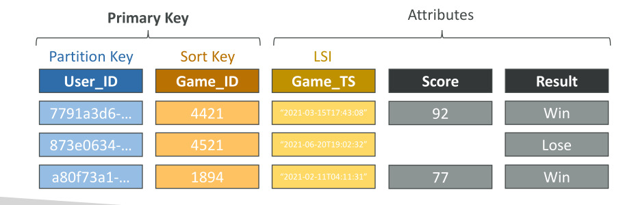

# DynamoDB Indexes (GSI + LSI)

ใน DynamoDB มี **ดัชนีสองประเภท** ที่ควรรู้จัก ได้แก่:

* **Local Secondary Index (LSI)**
* **Global Secondary Index (GSI)**

## Local Secondary Index (LSI)

* LSI ให้ **sort key ทางเลือก** สำหรับตารางของคุณ
* ใช้ **partition key เดียวกับตารางหลัก** แต่เพิ่ม **sort key ใหม่**
* Sort key ของ LSI ต้องเป็น **scalar attribute** เช่น string, number, หรือ binary
* สามารถสร้างได้สูงสุด **5 LSIs ต่อหนึ่งตาราง**
* **LSIs ต้องสร้างตอนสร้างตาราง** ไม่สามารถเพิ่มทีหลังได้ → ต้องวางแผนดีตั้งแต่แรก

**คุณสมบัติการใช้งาน LSI**:

* เลือกบาง attribute หรือทั้งหมดจากตารางหลักเพื่อใช้ใน LSI
* ทำให้ query บน attribute ที่ไม่ใช่ sort key ของตารางหลักทำได้อย่างมีประสิทธิภาพ

**ตัวอย่าง**:
ตารางมี attribute: `user ID`, `game ID`, `game timestamp`, `score`, `results`

* Query บน `user ID` และ `game ID` → ทำได้ง่าย
* Query บน `user ID` และ `game timestamp` → ต้อง scan และ filter บน client → ไม่ efficient

**วิธีแก้ปัญหา**:

* สร้าง LSI โดยใช้ sort key เป็น `game timestamp`
* จะสามารถ query เกมทั้งหมดของผู้ใช้ในช่วงเวลาที่กำหนด เช่น 2020–2021
* **Partition key** ของ LSI = Partition key ของตารางหลัก
* **Sort key** ของ LSI = ต่างจาก sort key ของตารางหลัก

## Global Secondary Index (GSI)

* GSI ให้ **primary key ทางเลือก** → สามารถมี **partition key และ/หรือ sort key แตกต่างจากตารางหลัก**
* ช่วยให้ query บน **attribute ที่ไม่ใช่ key ของตารางหลัก** ทำได้เร็วขึ้น
* สามารถเลือก project attribute บางส่วนหรือทั้งหมดลงใน GSI

**คุณสมบัติ GSI**:

* GSI ทำงานเหมือน **ตารางแยกต่างหาก** → ต้อง provision **RCU และ WCU แยกต่างหาก**
* สามารถเพิ่มหรือแก้ไขหลังสร้างตารางหลักได้

**ตัวอย่าง**:

* ตารางมี `user ID`, `game ID`, `game timestamp`
* Query ตาม `user ID` → ทำได้ แต่ query ตาม `game ID` → ไม่ efficient
* สร้าง GSI:

  * Partition key = `game ID`
  * Sort key = `game timestamp`
  * Project attribute `user ID` ลงใน GSI
* จะได้ **ความสามารถในการ query ใหม่** บน partition และ sort key ใหม่

**เคล็ดลับ**:

* วางแผนการ query ของคุณก่อนออกแบบ LSI/GSI

## การพิจารณา Throttling

* ถ้ามี **GSI** และเกิด **throttling บน WCU ของ GSI** → ตารางหลักก็ถูก throttled ด้วย

* แม้ WCU ของตารางหลักเพียงพอ แต่ถ้า GSI ถูก throttled → ตารางหลักก็ถูก throttled

* ดังนั้นต้องเลือก **partition key ของ GSI** และ **WCU อย่างรอบคอบ**

* **LSI** ใช้ WCU/RCU ของตารางหลัก → ไม่มีปัญหา throttling แยกต่างหาก

## สรุป Key Takeaways

* **LSI**:

  * ให้ sort key ทางเลือก ใช้ partition key เดียวกับตารางหลัก
  * ต้องสร้างตอนสร้างตาราง
* **GSI**:

  * สามารถมี partition key และ sort key แตกต่างจากตารางหลัก
  * สามารถเพิ่มหรือแก้ไขหลังสร้างตาราง
  * ต้อง provision RCU และ WCU แยกต่างหาก
* **Throttling**:

  * GSI → ถ้า throttled → ตารางหลักก็ถูก throttled
  * LSI → ใช้ capacity ของตารางหลัก ไม่มี throttling แยก