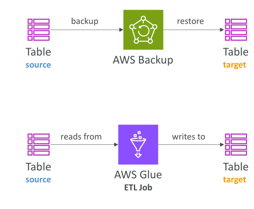

# การดำเนินการของ DynamoDB

## ภาพรวมการดำเนินการของ DynamoDB

ในบทเรียนนี้เราจะพูดถึง **การดำเนินการของ DynamoDB 2 แบบ** ที่อาจปรากฏในการสอบ

## วิธีล้างข้อมูลในตาราง (Table Cleanup Methods)

มี **สองวิธี** ในการล้างข้อมูลใน DynamoDB table:

**วิธีที่ 1:**

* Scan ข้อมูลทั้งหมดในตารางแล้วลบทีละรายการ
* วิธีนี้ **ช้ามาก** และใช้ **RCU สูง** ในการ scan และใช้ **WCU สูง** ในการลบ ทำให้ค่าใช้จ่ายสูง

**วิธีที่ 2:**

* **ลบตารางแล้วสร้างใหม่**
* วิธีนี้ **เร็ว, มีประสิทธิภาพ และค่าใช้จ่ายต่ำ**
* สิ่งสำคัญคือสร้างตารางใหม่ให้ **ตั้งค่าเหมือนเดิมกับตารางต้นฉบับ**

## การคัดลอกตาราง DynamoDB (Copying a DynamoDB Table)

มีหลายวิธีในการคัดลอกตาราง DynamoDB:

1. **ใช้ AWS Backup:**

   * Backup ตารางต้นฉบับแล้ว Restore ในบัญชีเดียวกันหรือต่างบัญชี

2. **ใช้ AWS Glue:**

   * เป็นบริการ ETL ที่สร้างสคริปต์เพื่อ **อ่านจากตารางต้นฉบับ** แล้ว **เขียนข้อมูลไปยังที่ต้องการ**

3. **เขียนโค้ดเองโดยใช้ API calls** เช่น scan, put item, หรือ batch write item

   * วิธีนี้ทำได้ แต่ **ซับซ้อนกว่า** การใช้บริการ AWS

## สรุป

* การล้างตารางทีละรายการ **ช้าและมีค่าใช้จ่ายสูง**
* การลบแล้วสร้างตารางใหม่ **เร็วและประหยัดกว่า**
* AWS Backup ใช้คัดลอกตารางข้ามบัญชีได้
* AWS Glue เป็นบริการ ETL สำหรับย้ายข้อมูลจาก source table
* การเขียนโค้ดเองทำได้ แต่ **ซับซ้อนกว่าใช้บริการ AWS**

## ข้อสรุปสำคัญ (Key Takeaways)

* การ scan แล้วลบทีละรายการ **ช้าและค่าใช้จ่ายสูง**
* การ drop แล้ว recreate ตาราง **เร็วกว่าและประหยัดกว่า**
* ใช้ AWS Backup เพื่อคัดลอกตาราง DynamoDB ข้ามบัญชี
* AWS Glue ช่วยอ่านจาก source table และเขียนไปที่อื่น
* การเขียนโค้ดเองด้วย API เช่น scan, put item, batch write **ทำได้แต่ซับซ้อนกว่า**
