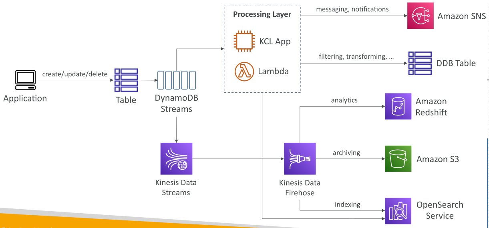
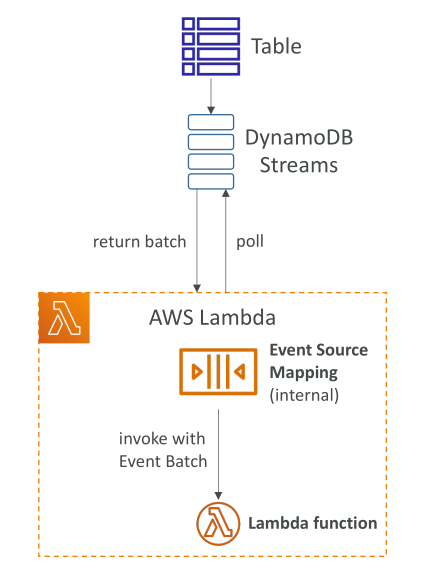

# DynamoDB Streams

**DynamoDB Streams** คือ **รายการแบบเรียงลำดับของการแก้ไขระดับไอเท็ม (item-level modifications)** เช่น การสร้าง (create), การแก้ไข (update), และการลบ (delete) ที่เกิดขึ้นในตาราง DynamoDB

* ทุกครั้งที่คุณ **เพิ่ม แก้ไข หรือ ลบ item** การเปลี่ยนแปลงนั้นจะปรากฏใน **stream**
* **stream** จะแสดงรายการการเปลี่ยนแปลงทั้งหมดของตารางตามเวลา

## การส่ง Stream ไปยังปลายทาง

* สามารถส่ง **DynamoDB Stream** ไปยังหลายปลายทางได้ เช่น:

  * **Kinesis Data Streams** เพื่อนำไปประมวลผลต่อ
  * **AWS Lambda** เพื่ออ่านจาก stream โดยตรง
  * **Kinesis Client Library (KCL) applications** เพื่ออ่านจาก stream

* **เวลาการเก็บข้อมูล (data retention)** ใน DynamoDB Stream คือ **สูงสุด 24 ชั่วโมง**

  * หากต้องเก็บข้อมูลนานกว่า 24 ชั่วโมง ต้องบันทึกไปยังที่อื่น เช่น Kinesis Data Streams หรือเก็บด้วย Lambda/KCL

## กรณีการใช้งาน (Use Cases)

DynamoDB Streams ช่วยให้ตอบสนองต่อการเปลี่ยนแปลงข้อมูล **แบบเรียลไทม์** เช่น:

* ส่งอีเมลต้อนรับผู้ใช้เมื่อลงทะเบียน
* ทำการวิเคราะห์ข้อมูลตามการเปลี่ยนแปลง
* สร้างตารางอนุพันธ์ (derivative tables) ใน DynamoDB
* ส่งข้อมูลไปยัง **OpenSearch** เพื่อทำดัชนีและค้นหาข้อมูล
* ใช้กับ **global tables** และ **cross-region replication**

## สถาปัตยกรรมของ DynamoDB Streams

* แอปพลิเคชันทำการ **create, update, delete** บนตาราง DynamoDB

* การเปลี่ยนแปลงจะปรากฏใน **DynamoDB Stream**

* จากนั้นสามารถส่งไปยัง **Kinesis Data Streams**

  * ด้วย **Kinesis Data Firehose** สามารถส่งไปยัง:

    * **Amazon Redshift** สำหรับการวิเคราะห์
    * **Amazon S3** สำหรับเก็บถาวร
    * **OpenSearch Service** เพื่อสร้างฟีเจอร์ค้นหา

* หากต้องการ **logic เฉพาะ** สามารถสร้าง **processing layer** เช่น:

  * **KCL application** บน EC2
  * **Lambda function** อ่านจาก stream
  * ทำงาน เช่น ส่ง notification, filter/transform data, insert กลับไปยัง DynamoDB, หรือส่งไปยัง OpenSearch

## ตัวเลือกเนื้อหาใน Stream (Stream Content Options)

สามารถเลือกข้อมูลที่ปรากฏใน stream ได้ดังนี้:

* **KEYS_ONLY**: แสดงเฉพาะ attributes ของ key ที่ถูกแก้ไข
* **NEW_IMAGE**: แสดง item ใหม่หลังการแก้ไข
* **OLD_IMAGE**: แสดง item ก่อนการแก้ไข
* **NEW_AND_OLD_IMAGES**: แสดงทั้ง item ใหม่และเก่า เพื่อดูการเปลี่ยนแปลง

## DynamoDB Streams และ Shards

* DynamoDB Streams ประกอบด้วย **shards** คล้ายกับ Kinesis Data Streams
* **KCL** สามารถทำงานกับทั้ง DynamoDB Streams และ Kinesis Data Streams
* **ไม่ต้อง provision shards** สำหรับ DynamoDB Streams เพราะ AWS จัดการให้

> หมายเหตุ: หลังจากเปิดใช้งาน Stream **จะไม่ดึงข้อมูลย้อนหลัง** จะเก็บเฉพาะการเปลี่ยนแปลงที่เกิดหลังจากเปิดใช้งาน

## การเชื่อมต่อ DynamoDB Streams กับ Lambda

* ต้องกำหนด **Event Source Mapping** เพื่อให้ Lambda อ่านจาก stream
* Lambda ต้องมี **permissions** ในการดึงข้อมูลจาก stream
* Lambda จะถูก **invoke แบบ synchronous**

ตัวอย่าง workflow:

1. ตารางส่งการเปลี่ยนแปลงไปยัง DynamoDB Stream
2. Lambda มี Event Source Mapping ดึง records แบบ batch จาก stream
3. Lambda ถูกเรียก synchronous พร้อม batch ของ records

## สรุป

* DynamoDB Streams ช่วยจับ **รายการการแก้ไข item แบบเรียงลำดับ** เช่น create, update, delete
* Stream สามารถส่งไปยังหลายปลายทาง เช่น **Kinesis Data Streams, Lambda**
* ข้อมูลใน Stream **เก็บได้นานสูงสุด 24 ชั่วโมง** หากต้องเก็บนานกว่านี้ต้อง persist ภายนอก
* Lambda สามารถประมวลผล records แบบ batch ผ่าน **Event Source Mapping**