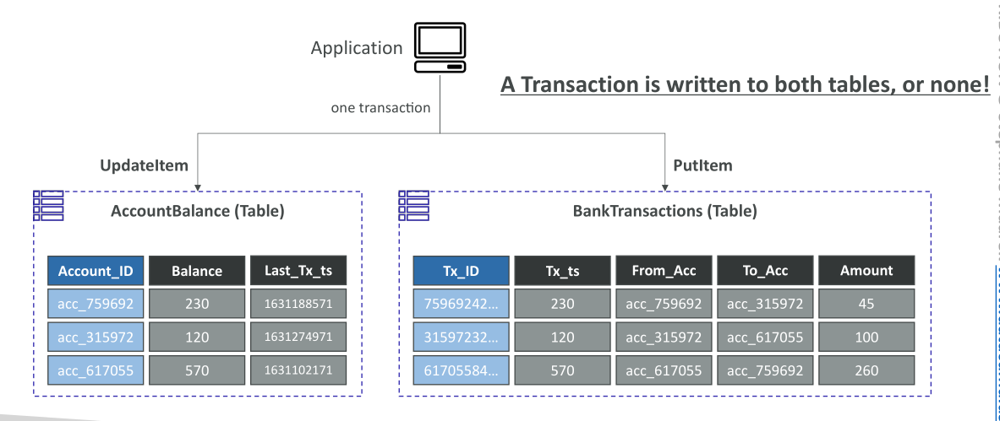

# DynamoDB Transactions

DynamoDB Transactions ช่วยให้คุณสามารถทำ **การดำเนินการแบบ all-or-nothing** ข้ามหลาย item และหลายตารางได้ ซึ่งหมายความว่าคุณสามารถ **update, delete, หรือ insert item** ไม่เพียงในตารางเดียว แต่ในหลายตารางพร้อมกัน และทำให้มั่นใจได้ว่า **ทั้งชุดการเขียนสำเร็จพร้อมกันทั้งหมด หรือไม่สำเร็จเลย** พฤติกรรมแบบ atomic นี้จึงเรียกว่า transactions

ความสามารถนี้ทำให้ DynamoDB รองรับ **คุณสมบัติ ACID** ได้แก่:

* **Atomicity (ความเป็นหนึ่งเดียว)**
* **Consistency (ความสอดคล้อง)**
* **Isolation (การแยกการทำงาน)**
* **Durability (ความคงทน)**

## โหมดของ Transaction ใน DynamoDB

### 1. โหมดอ่าน (Read Modes)

DynamoDB รองรับ 3 โหมดการอ่าน:

* **Eventual consistency**
* **Strong consistency**
* **Transactional consistency**: อ่านข้อมูลจากหลายตารางพร้อมกันและได้มุมมองที่สอดคล้องกัน

### 2. โหมดเขียน (Write Modes)

* **Standard writes**: เขียนหลาย item ข้ามตาราง โดยบาง item อาจล้มเหลว
* **Transactional writes**: เขียนหลาย item ข้ามตารางทั้งหมด **สำเร็จพร้อมกัน หรือไม่สำเร็จเลย** ทำให้มั่นใจถึงความเป็น atomic

## การใช้ Capacity ของ Transactions

* การทำ transactions ใช้ **RCUs และ WCUs 2 เท่า** เมื่อเทียบกับการทำงานปกติ
* เพราะ DynamoDB ต้องทำ **สองขั้นตอนเบื้องหลังต่อ item**:

  1. เตรียม transaction
  2. commit transaction

## Transaction APIs

DynamoDB มี API หลักสองตัวสำหรับ transactions:

1. **TransactGetItems**: อ่าน item หลายตัวใน transaction
2. **TransactWriteItems**: ทำ PutItem, UpdateItem, หรือ DeleteItem หลายตัวใน transaction เดียว

## กรณีการใช้งาน (Use Cases)

Transactions จำเป็นเมื่อ **ต้องการคุณสมบัติ ACID** ตัวอย่างเช่น:

* ธุรกรรมทางการเงิน
* ระบบจัดการคำสั่งซื้อ (Order Management)
* เกมหลายผู้เล่น (Multiplayer Games)

## ตัวอย่าง: ธุรกรรมบัญชีธนาคาร

สมมติว่ามีสองตาราง:

1. **AccountBalance**: เก็บ account ID, balance, last transaction timestamp
2. **BankTransactions**: บันทึก transaction ID, timestamp, บัญชีต้นทาง, บัญชีปลายทาง, จำนวนเงิน

เมื่อทำธุรกรรม:

* อัปเดต **AccountBalance**
* เพิ่ม record ใน **BankTransactions**
* ด้วย transaction ทั้งสองการดำเนินการ **สำเร็จพร้อมกัน หรือไม่สำเร็จเลย**
* Atomicity นี้สำคัญมากในระบบการเงินเพื่อป้องกันความไม่สอดคล้อง

## การคำนวณ Capacity สำหรับ Transactions

### Transactional Writes

สมมติอยากทำ **3 transactional writes ต่อวินาที** ขนาด item 5 KB

* แต่ละ WCU เขียน 1 KB/วินาที
* 5 KB → ใช้ 5 WCUs
* Transactional write ใช้ 2 เท่า → 5 × 2 = 10 WCUs ต่อ item
* 3 writes → 3 × 10 = **30 WCUs**

### Transactional Reads

สมมติทำ **5 transactional reads ต่อวินาที** ขนาด item 5 KB

* แต่ละ RCU อ่าน 4 KB/วินาที
* 5 KB → ต้องใช้ 2 RCU (4 KB + เศษ)
* Transactional read ใช้ 2 เท่า → 2 × 2 = 4 RCUs ต่อ item
* 5 reads → 5 × 4 = **20 RCUs**

## สรุป

* DynamoDB Transactions ให้ **ACID** ข้ามหลาย item และหลายตาราง
* รองรับ **read modes** (eventual, strong, transactional) และ **write modes** (standard, transactional)
* Transactional operations ใช้ **RCUs และ WCUs 2 เท่า**
* เหมาะกับกรณีที่ต้องการ **ความสอดคล้องสูง** เช่น ธุรกรรมการเงิน, การจัดการคำสั่งซื้อ, เกมหลายผู้เล่น

## ข้อสรุปสำคัญ (Key Takeaways)

* Transactions → atomic, consistent, isolated, durable (ACID) ข้ามหลาย item/tables
* รองรับ **read modes**: eventual, strong, transactional consistency
* รองรับ **write modes**: standard และ transactional
* Transactional operations → ใช้ RCUs/WCUs 2 เท่า
* ใช้ได้ในกรณีต้องการความสอดคล้องสูง เช่น ธุรกรรมการเงิน, order management, multiplayer games