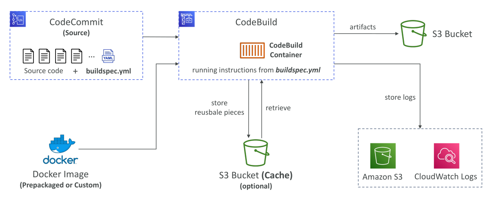
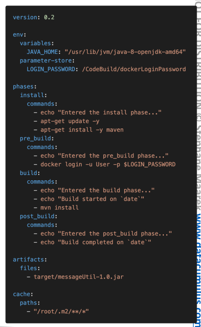

# CodeBuild

**AWS CodeBuild** ช่วยให้คุณสามารถนำซอร์สโค้ดจากแหล่งต่าง ๆ เช่น **CodeCommit, Amazon S3, Bitbucket หรือ GitHub** มาใช้และรันคำสั่งการ build ที่ถูกกำหนดไว้ในซอร์สนั้น ๆ

ในการสอบ สิ่งสำคัญที่ต้องจำคือ **ไฟล์ build instruction** ชื่อว่า `buildspec.yml`

* ไฟล์นี้ **ต้องอยู่ที่ root directory ของ code repository**
* ถึงแม้คุณจะสามารถใส่คำสั่ง build ลงใน Console ได้ แต่ **Best Practice** คือใช้ `buildspec.yml` ซึ่งเป็นสิ่งที่มักถูกถามในข้อสอบ

เมื่อแอปพลิเคชันถูก build เสร็จแล้ว

* **Output Logs** จะถูกเก็บไว้ใน **Amazon S3** และ **CloudWatch Logs** เพื่อวิเคราะห์ภายหลัง
* ใช้ **CloudWatch Metrics** เพื่อตรวจสอบสถิติการ build
* ใช้ **EventBridge** เพื่อตรวจจับการ build ล้มเหลวและ trigger การแจ้งเตือน
* ใช้ **CloudWatch Alarms** เพื่อตั้งเตือนเมื่อเกิดการล้มเหลวมากเกินไป

**Build Project** สามารถสร้างได้ทั้งภายใน **CodeBuild โดยตรง** หรือภายใน **CodePipeline** (ซึ่งสามารถเรียกใช้ Build Project ของ CodeBuild ได้เช่นกัน)

## สภาพแวดล้อมที่รองรับและการปรับแต่ง

CodeBuild รองรับการทดสอบสำหรับภาษา/แพลตฟอร์ม เช่น **Java, Ruby, Python, Go, Node.js, Android, .NET Core, และ PHP** โดยใช้ **pre-built images**
หากต้องการ environment อื่น ๆ สามารถ **ปรับแต่ง Docker image** เพื่อรองรับภาษา/สภาพแวดล้อมตามที่คุณต้องการได้

## วิธีการทำงานของ CodeBuild

สมมติว่าคุณมี source code อยู่ใน **CodeCommit**

* ที่ root ของ repo จะมีไฟล์สำคัญคือ `buildspec.yml`
* CodeBuild จะดึงซอร์สโค้ดนี้มา และรันภายใน **Container** ที่ให้สภาพแวดล้อม build เช่น Java หรือ Go
* Container จะโหลดซอร์สโค้ดทั้งหมดและไฟล์ `buildspec.yml` แล้ว **รันคำสั่งตามที่กำหนดไว้**

**Container ที่ใช้รัน**:

* CodeBuild จะดึง **Docker image** มาใช้
* Image อาจเป็น **pre-packaged โดย AWS** หรือ **Docker image ที่คุณสร้างเอง**

**กระบวนการ Build**:

* CodeBuild จะรันคำสั่งทั้งหมดจาก `buildspec.yml`
* ถ้าคำสั่งยาวหรือใช้เวลานาน สามารถเปิดใช้ **Cache (บน S3)** เพื่อเก็บ dependency และนำมาใช้ซ้ำได้ → ลดเวลา build

**Logs**:

* เก็บใน **CloudWatch Logs** และ **S3 (ถ้าเปิดใช้งาน)**

**Artifacts**:

* เมื่อ build/test เสร็จ CodeBuild สามารถสร้าง **Artifacts**
* ไฟล์เหล่านี้จะถูกดึงออกจาก container และเก็บใน **S3 bucket** เพื่อใช้งานต่อ

## ไฟล์ buildspec.yml

ไฟล์ `buildspec.yml` มีความสำคัญมากและต้องอยู่ที่ **root ของซอร์สโค้ด**
โครงสร้างหลัก ๆ ได้แก่:

1. **Environment**

   * กำหนด environment variables ที่ใช้ตอน build
   * สามารถใส่เป็น plaintext หรือดึงค่ามาจาก **SSM Parameter Store** หรือ **Secrets Manager** เพื่อเก็บข้อมูลสำคัญอย่างรหัสผ่าน

2. **Phases** (ขั้นตอนการรันคำสั่ง)

   * `install`: ติดตั้ง dependencies ที่จำเป็น
   * `pre_build`: รันคำสั่งก่อนเริ่ม build จริง
   * `build`: คำสั่งหลักในการ build
   * `post_build`: คำสั่งหลัง build เสร็จ เช่น zip ไฟล์ output

3. **Artifacts**

   * ระบุไฟล์ใดใน container ที่จะถูกส่งออกไปยัง S3
   * สามารถเข้ารหัสได้

4. **Cache**

   * ระบุไฟล์ (เช่น dependencies) ที่ต้องการ cache ไว้ใน S3 เพื่อเร่งการ build ครั้งต่อไป

## สรุป

* **CodeBuild** เป็นบริการสำหรับ build และทดสอบโค้ดแบบอัตโนมัติ
* รองรับหลายภาษา/สภาพแวดล้อมด้วย pre-built images และสามารถใช้ Docker image แบบ custom ได้
* **Logs** จะถูกเก็บใน CloudWatch และ/หรือ S3
* **Artifacts** สามารถส่งออกไปเก็บใน S3
* `buildspec.yml` คือหัวใจหลักในการกำหนดขั้นตอน build

## Key Takeaways

* `buildspec.yml` (ที่ root directory) = ไฟล์สำคัญสำหรับกำหนดคำสั่ง build
* Logs ถูกเก็บใน **CloudWatch Logs** และ **Amazon S3**
* รองรับหลายภาษาและ environment ผ่าน **pre-built images** หรือ **custom Docker image**
* `buildspec.yml` มี 5 ส่วนหลัก: **Environment, Phases, Artifacts, Cache**
