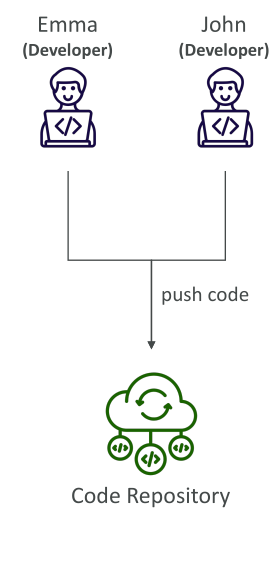
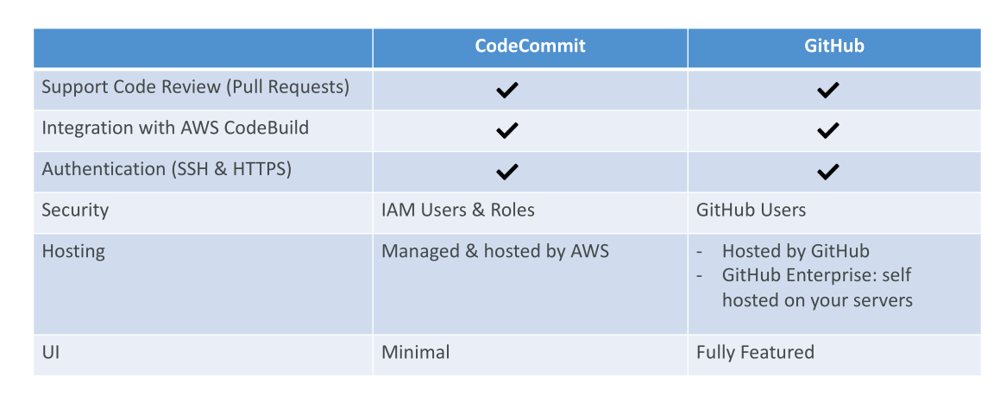

# CodeCommit

เรามาพูดถึง **AWS CodeCommit** ซึ่งเป็นบริการสำหรับ **version control**

## การเข้าใจ Version Control

Version control คือความสามารถในการติดตามการเปลี่ยนแปลงของโค้ดตลอดเวลา และสามารถย้อนกลับไปยังเวอร์ชันก่อนหน้าได้

* ช่วยให้เห็นว่าเกิดอะไรขึ้นในอดีต
* ใคร commit โค้ด
* อะไรถูกแก้ไข เพิ่ม หรือ ลบ
* สามารถย้อนกลับการเปลี่ยนแปลงได้หากจำเป็น

## Git เป็นเทคโนโลยีพื้นฐาน

เพื่อทำ version control อย่างมีประสิทธิภาพ **Git** เป็นเทคโนโลยีที่นิยมใช้

* Git repository สามารถ sync บนเครื่องคอมพิวเตอร์ของเรา แต่ปกติจะ upload ไปยัง **central online repository**
* central repository ทำให้ developer หลายคนสามารถทำงานร่วมกันบนโค้ดเดียวกันได้

## ข้อดีของ Central Online Git Repository

* ทำให้ developer หลายคนทำงานพร้อมกันบนโค้ดเดียวกันได้
* โค้ดถูก backup บน cloud แทนที่จะอยู่แค่บนเครื่อง
* สามารถติดตามว่าใคร commit อะไรและเมื่อไหร่
* สามารถ rollback การเปลี่ยนแปลงได้ง่าย

## ภาพรวม AWS CodeCommit

AWS CodeCommit คือบริการ **code repository** บน AWS

* นักพัฒนาสามารถ **push/pull โค้ด** จาก repository กลางที่ host บน AWS
* เหมาะสำหรับการทำงานร่วมกันระหว่างทีม เช่น Emma และ John

## ทำไมต้องใช้ AWS CodeCommit?

* Git repository บน third-party เช่น GitHub, GitLab, Bitbucket อาจมีค่าใช้จ่ายสูง
* CodeCommit ให้ **private Git repository** ภายใน AWS VPC ของคุณ
* ไม่มีขนาดจำกัดของ repository → รองรับโค้ดหลาย GB
* บริการ **fully managed** และมี **high availability**
* โค้ดอยู่ใน AWS cloud → ปลอดภัยและสอดคล้องกับ compliance

## ฟีเจอร์ด้านความปลอดภัยของ CodeCommit

* **Encryption at rest**: ใช้ AWS KMS
* **Access control**: ใช้ IAM policies
* ใช้ **Git command-line tools** พร้อม **SSH key หรือ HTTPS**
* **Encryption in transit**: ผ่าน HTTPS หรือ SSH
* สำหรับ **cross-account access** ใช้ IAM roles และ STS AssumeRole API แทนการแชร์ credentials

## การรวมและความเข้ากันได้

* CodeCommit สามารถ integrate กับ **CI/CD tools** เช่น Jenkins และ AWS CodeBuild
* ทำให้เหมาะสำหรับเก็บโค้ดใน pipeline อัตโนมัติ

## การเปรียบเทียบ: CodeCommit vs GitHub

| หัวข้อ                  | CodeCommit                                  | GitHub                      |
| ----------------------- | ------------------------------------------- | --------------------------- |
| Pull requests           | รองรับ                                      | รองรับ                      |
| Integrate กับ CodeBuild | รองรับ                                      | รองรับ                      |
| Authentication          | IAM-based                                   | GitHub users, SSO           |
| Hosting                 | บน AWS เท่านั้น                             | บน GitHub หรือ on-premises  |
| UI                      | Minimal                                     | มี UI ครบฟีเจอร์            |
| เหมาะกับ                | โค้ดอยู่เฉพาะ AWS เพื่อ security/compliance | องค์กรทั่วไป, UI ครบฟีเจอร์ |

* CodeCommit เหมาะกับองค์กรที่ต้องการให้โค้ด **อยู่ใน AWS เท่านั้น**

## ประกาศสำคัญ: การยกเลิก AWS CodeCommit และการย้ายไป GitHub

## ประกาศสำคัญ: การยกเลิก AWS CodeCommit

ในวันที่ **25 กรกฎาคม 2024** AWS ได้ยกเลิกบริการ **CodeCommit** โดยทันที

* หมายความว่าลูกค้าใหม่ไม่สามารถใช้งานบริการนี้ได้อีกต่อไป
* ผู้ใช้เดิมอาจไม่สามารถเข้าถึงบริการได้เช่นกัน

AWS แนะนำให้ **ย้ายไปใช้โซลูชัน Git ภายนอก** เช่น **GitHub, GitLab** หรือผู้ให้บริการอื่นที่รองรับการเข้าถึง Git

## ผลกระทบต่อคอร์สนี้

สิ่งที่ควรทราบเกี่ยวกับ CodeCommit ในคอร์สนี้:

* CodeCommit อาจยังปรากฏในข้อสอบบางส่วนในตอนนี้
* หากคุณเรียนคอร์สนี้เกิน **6 เดือนหลังจากวิดีโอเผยแพร่** อาจไม่เห็นการอ้างอิงถึง CodeCommit แล้ว
* การเข้าใจ CodeCommit ยังคงมีประโยชน์ในแง่ของการเก็บโค้ดใน repository
* ทุกครั้งที่ CodeCommit ถูกใช้ในคอร์สนี้ ให้ **ใช้ GitHub แทน**
* วิดีโอแรกที่สอนการตั้งค่า GitHub จะทำร่วมกัน เพื่อให้คุณมีความรู้เพียงพอในการใช้งาน GitHub อย่างมีประสิทธิภาพ

ดังนั้น หากคุณเห็นการใช้ CodeCommit เพียงไม่กี่วินาที ให้ทำ **การเปรียบเทียบและใช้ GitHub แทน**

* สิ่งสำคัญคือเข้าใจ **หลักการและแนวคิดเบื้องหลังบริการ** ไม่ใช่ตัวบริการ CodeCommit เอง

# สรุป

AWS CodeCommit เป็น **Git repository** ที่ **secure, scalable, managed** และผสานรวมกับ AWS ได้อย่างลงตัว

* เหมาะกับองค์กรที่ต้องการ **private repository** ภายใน AWS
* รองรับ Git commands ปกติ พร้อม **encryption** และ **IAM-based access control**
* ไม่มีข้อจำกัดขนาด repository → cost-effective
* แตกต่างจาก GitHub ในเรื่อง **hosting, security integration, และ UI**
* ทุกครั้งที่มีการพูดถึง CodeCommit ในคอร์ส ให้ **สมมติว่าเป็นการผสานกับ GitHub แทน**
* การเปลี่ยนแปลงนี้อาจแก้ไขคอร์สยาก แต่เราจะพยายามให้การย้ายไป GitHub เป็นไปอย่างราบรื่น

## ข้อสรุปสำคัญ (Key Takeaways)

* AWS CodeCommit เป็น Git repository ที่ **fully managed, scalable, secure** และผสานรวมกับ AWS cloud
* รองรับ Git commands ปกติ พร้อมฟีเจอร์ความปลอดภัย เช่น encryption, IAM-based access control, และ integration กับ AWS services
* ให้ private repository **ไม่มีขนาดจำกัด**, เหมาะกับองค์กรที่ต้องการโค้ดอยู่ใน AWS
* แตกต่างจาก GitHub ในเรื่อง **hosting, security integration, และ UI**, เหมาะกับ workflow แบบ AWS-centric
* AWS ยกเลิก **CodeCommit** เมื่อวันที่ 25 กรกฎาคม 2024 ทำให้บริการนี้ไม่สามารถใช้ได้สำหรับลูกค้าใหม่
* AWS แนะนำให้ **ย้ายไปใช้โซลูชัน Git ภายนอก** เช่น GitHub หรือ GitLab
* การอ้างอิง CodeCommit ในคอร์สนี้ ให้ถือว่าเป็น **GitHub integration**
* คอร์สจะสอนการตั้งค่าและใช้งาน GitHub แทน CodeCommit