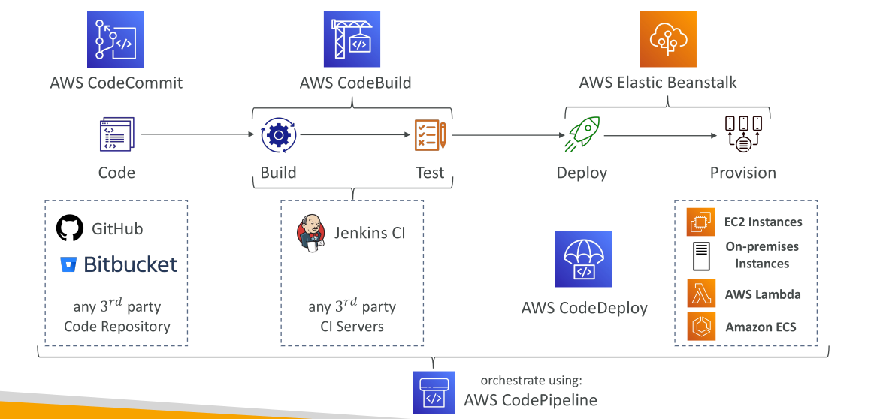
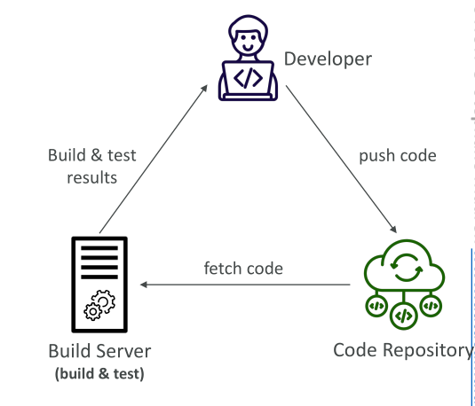
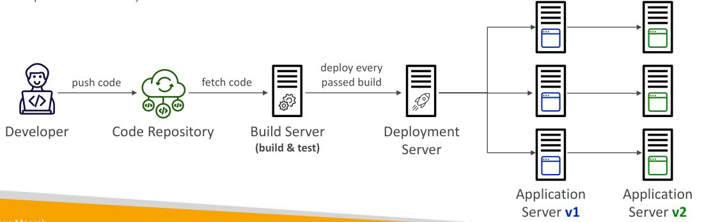
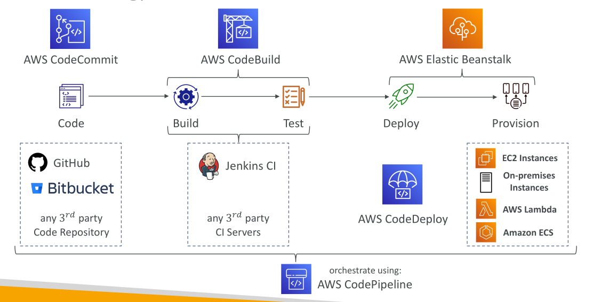

# Developer Tools

## บทนำสู่ CICD บน AWS

ยินดีต้อนรับสู่หนึ่งในหัวข้อที่ผมชอบมากใน AWS นั่นคือ **CICD** CICD มีความสำคัญอย่างยิ่งสำหรับนักพัฒนา และเป็นหัวข้อสำคัญในการสอบ AWS

ตลอดหลักสูตรนี้ เราได้เรียนรู้วิธีสร้างทรัพยากร AWS ด้วยตนเอง และเข้าใจพื้นฐานการทำงาน เราได้เรียนรู้วิธีโต้ตอบกับ AWS ผ่าน CLI และวิธี deploy โค้ดไปยัง AWS โดยใช้ **Elastic Beanstalk** อย่างไรก็ตาม ขั้นตอนเหล่านี้เป็นแบบ manual ทั้งหมด ซึ่งมีความเสี่ยงต่อข้อผิดพลาด

ในท้ายที่สุด สิ่งที่เราต้องการคือการ push โค้ดเข้า **repository เป้าหมาย** และให้โค้ดถูก deploy **อัตโนมัติบน AWS** การ deploy นี้ควรทำอย่างถูกต้อง โดยมีการทดสอบโค้ดก่อนทุกครั้ง เราอาจต้องการ deploy ไปยังหลาย stage เช่น **development, test, staging (pre-production), และ production** บางครั้งต้องมี **manual approval** ก่อน deploy ไป production ขั้นตอนทั้งหมดนี้ควร **automate** เพื่อความปลอดภัยและความรวดเร็วในการพัฒนา

### บริการ AWS ที่เกี่ยวข้องกับ CICD

เราจะเรียนรู้บริการดังต่อไปนี้:

* **CodeCommit**: เก็บ code repository
* **CodePipeline**: อัตโนมัติ pipeline จากโค้ดไปยังแพลตฟอร์ม เช่น Elastic Beanstalk
* **CodeBuild**: สร้างและทดสอบโค้ดโดยอัตโนมัติ
* **CodeDeploy**: Deploy โค้ดไปยัง EC2 หรือ environment อื่นโดยไม่ใช้ Elastic Beanstalk
* **CodeStar**: เครื่องมือรวมสำหรับจัดการกิจกรรมการพัฒนาซอฟต์แวร์ เช่น ผสาน CodeCommit, CodePipeline, CodeBuild, CodeDeploy
* **CodeArtifact**: เก็บ, เผยแพร่ และแชร์ software package
* **CodeGuru**: ตรวจสอบโค้ดอัตโนมัติด้วย machine learning

เราจะสำรวจบริการแต่ละตัวอย่างละเอียดในบทต่อ ๆ ไป

### CICD คืออะไร?

**CICD = Continuous Integration + Continuous Delivery**

#### Continuous Integration (CI)

* นักพัฒนาจะ **push โค้ดบ่อย ๆ** ไปยัง repository กลาง เช่น GitHub, AWS CodeCommit, Bitbucket
* หลังจาก push แล้ว **build/test server** จะตรวจสอบโค้ดโดยอัตโนมัติ เช่น AWS CodeBuild หรือ Jenkins
* server จะ fetch โค้ดและรันเทสต์ นักพัฒนาจะได้รับ feedback ว่าเทสต์ผ่านหรือไม่
* ข้อดี: เจอบั๊กเร็ว ไม่ต้องทดสอบบนเครื่องตัวเอง ทำให้ส่งโค้ดได้เร็วและบ่อย

#### Continuous Delivery (CD)

* เมื่อตัวโค้ดผ่านทุกเทสต์แล้ว จะ **deploy อัตโนมัติ** ไปยัง application servers
* ตัวอย่าง workflow:

  1. นักพัฒนาทำการ push โค้ด
  2. build server ทำการทดสอบโค้ด (CI)
  3. หากผ่านเทสต์, deployment server จะ deploy แอปไปยังเซิร์ฟเวอร์
* Continuous Delivery ทำให้ deployment เกิดขึ้น **บ่อยและรวดเร็ว** ลดข้อผิดพลาดและเร่งการส่งมอบ
* เครื่องมือสำหรับ deployment อัตโนมัติ เช่น AWS CodeDeploy, Jenkins CD, Spinnaker

### AWS CICD Tech Stack

* **Code Repository**: CodeCommit, GitHub, Bitbucket หรือ repository ภายนอกอื่น ๆ
* **Build & Test Phase**: CodeBuild บน AWS หรือ Jenkins CI
* **Deploy Phase**: CodeDeploy (deploy ไปยัง EC2, on-premises, Lambda, ECS)
* **Infrastructure Provisioning**: Elastic Beanstalk เป็นทางเลือกสำหรับ provision infra และ deploy แอป
* **Orchestration**: CodePipeline orchestrate กระบวนการ CICD ทั้งหมด และกำหนดขั้นตอนแต่ละ stage

### สรุป

* CICD ช่วย **automate การ deploy โค้ดไป AWS** ทำให้การ release เร็วและปลอดภัยขึ้น
* **Continuous Integration**: push โค้ดบ่อย ๆ + เทสต์อัตโนมัติ
* **Continuous Delivery**: deploy อัตโนมัติหลังเทสต์สำเร็จ, ส่งมอบโค้ดเร็วขึ้น
* AWS มีเครื่องมือครบสำหรับ CICD: **CodeCommit, CodeBuild, CodeDeploy, CodePipeline**

### ข้อสรุปสำคัญ (Key Takeaways)

1. CICD ทำให้การ deploy โค้ดบน AWS เป็นอัตโนมัติ, ส่งมอบเร็วและปลอดภัย
2. Continuous Integration = push โค้ดบ่อย + เทสต์อัตโนมัติ
3. Continuous Delivery = deploy อัตโนมัติหลังผ่านเทสต์, ส่งมอบหลายครั้งต่อวัน
4. AWS CICD tools = CodeCommit, CodeBuild, CodeDeploy, CodePipeline
