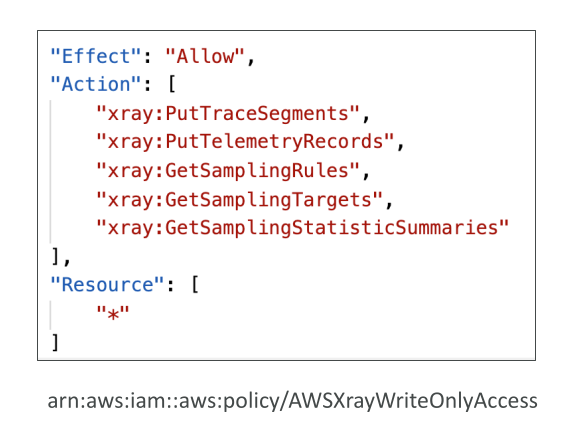
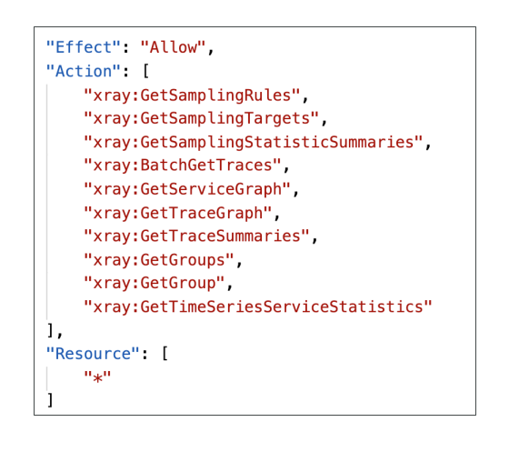

# X-Ray APIs

เรามาพูดถึง **X-Ray APIs** กัน ซึ่งสำคัญมากที่จะต้องเข้าใจภาพรวมว่ามี API อะไรบ้าง และแต่ละตัวทำหน้าที่อะไร เพราะในข้อสอบอาจถามให้ระบุว่า API ไหนที่เหมาะสมกับการทำงานในสถานการณ์หนึ่ง ๆ

## X-Ray Write API

**Write API** ใช้โดย **X-Ray daemon** สำหรับการเขียนข้อมูลเข้าไปยัง X-Ray service
API นี้ถูกควบคุมโดย **Managed Policy** ที่ชื่อว่า **X-Ray Write Only Access** ซึ่งรวม permission สำคัญไว้ 5 อย่าง

### 1. PutTraceSegments

ใช้สำหรับ **อัปโหลด segment documents** เข้า AWS X-Ray
นี่คือ permission หลักที่จำเป็นสำหรับการเขียนข้อมูลเข้า X-Ray

### 2. PutTelemetryRecords

อนุญาตให้ X-Ray daemon **อัปโหลดข้อมูล Telemetry** เช่น จำนวน segment ที่รับมา, จำนวนที่ถูกปฏิเสธ และ error ของการเชื่อมต่อ backend
สิ่งนี้ช่วยในการมอนิเตอร์ metrics เกี่ยวกับ data ingestion

### 3. GetSamplingRules

แม้ว่า Write API จะเน้นการเขียน แต่ก็มี **Get operation** ด้วย
เมื่อมีการเปลี่ยน **sampling rules** ใน X-Ray console ตัว daemon ต้องรู้ว่าควรส่งข้อมูลเมื่อใด
API นี้ใช้สำหรับ **ดึง sampling rules ปัจจุบัน** เพื่อให้ daemon อัปเดตตัวเองอัตโนมัติ

### 4. GetSamplingTargets และ 5. GetSamplingStatisticsSummaries

นี่คือ **API ขั้นสูง** ที่เกี่ยวข้องกับ sampling rules
ช่วยให้ daemon **จัดการพฤติกรรมการสุ่มตัวอย่าง (sampling behavior)** ได้อย่างมีประสิทธิภาพ

✅ **สรุป Write API**
X-Ray daemon ต้องการ permission สำหรับ:

* การเขียนข้อมูล → `PutTraceSegments`, `PutTelemetryRecords`
* การดึง sampling rules → `GetSamplingRules` และ API ที่เกี่ยวข้อง
  ซึ่งทั้งหมดนี้ต้องได้รับอนุญาตผ่าน **IAM Policy** ที่กำหนดให้ daemon

## X-Ray Read API

**Read API** ซับซ้อนกว่า และใช้สำหรับ **ดึงข้อมูลจาก X-Ray**
ถูกควบคุมโดย **Managed Policy** ที่มี Get permissions หลายตัว

### 1. GetServiceGraph

ดึง **Service Graph หลัก** ที่แสดงใน X-Ray console
ใช้ดู **ความสัมพันธ์และการเชื่อมต่อระหว่าง services**

### 2. BatchGetTraces

ดึง **list ของ traces** ที่ระบุด้วย Trace IDs
แต่ละ trace คือ collection ของ segment documents ที่มาจาก request เดียวกัน

### 3. GetTraceSummary

ดึง **Trace IDs และ Annotations** ภายในช่วงเวลาที่กำหนด
ช่วยให้สามารถ **ระบุ trace ที่น่าสนใจ** ก่อนจะดึงรายละเอียดแบบเต็ม

### 4. GetTraceGraph

ดึง **Service Graph ของ Trace ID(s) เฉพาะเจาะจง**
ช่วยให้วิเคราะห์เชิงลึกเกี่ยวกับการโต้ตอบระหว่าง service ภายใน trace นั้น

✅ **สรุป Read API**
Read APIs คือสิ่งสำคัญที่ใช้ใน X-Ray console เพื่อ **วิเคราะห์ trace data**
ต้องมั่นใจว่ามีการกำหนด IAM policies ที่ถูกต้องเพื่ออนุญาต API เหล่านี้

## สรุป

* **Write API** ใช้โดย X-Ray daemon เพื่ออัปโหลด **segment documents** และ **telemetry records**
* Write API มี permission หลัก เช่น `PutTraceSegments`, `PutTelemetryRecords`, `GetSamplingRules`
* **Read API** มีหลาย Get operations สำหรับดึง **Service Graphs, Trace Summaries, และ Trace Details**
* ทั้ง Write และ Read APIs ต้องมี IAM policies ที่ถูกต้องกำหนดไว้เพื่อใช้งาน
