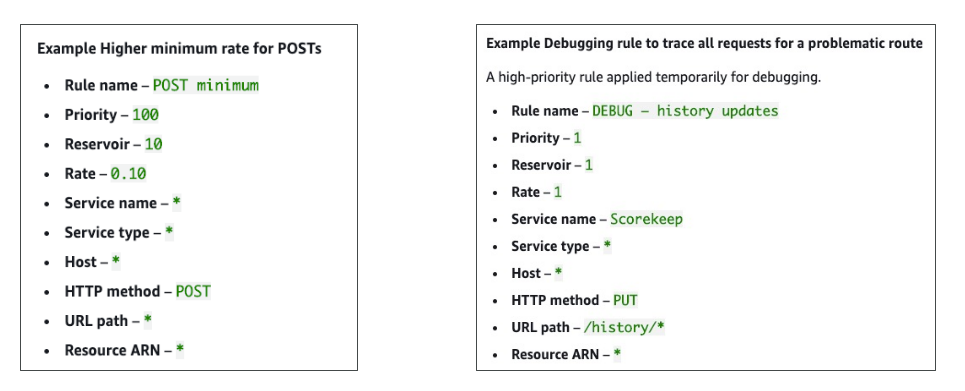

# X-Ray: Sampling Rules

ในการบรรยายนี้ เราจะเรียนรู้เกี่ยวกับตำแหน่งที่สามารถตั้งค่ากฎการสุ่มตัวอย่าง (Sampling Rules) สำหรับ X-Ray traces ใน **AWS CloudWatch**

หากต้องการกำหนดค่ากฎการสุ่มตัวอย่างสำหรับ X-Ray traces ให้ไปที่เมนูด้านซ้าย เลือก **Settings** ภายใต้ **CloudWatch settings** จะพบเมนู **Traces** ซึ่งสามารถจัดการได้ทั้ง **กฎการเข้ารหัส (encryption rules)**, **กฎกลุ่ม (group rules)** และ **กฎการสุ่มตัวอย่าง (sampling rules)** โดยในเซสชันนี้ เราจะโฟกัสที่กฎการสุ่มตัวอย่าง

## การดูค่า Default Sampling Rule

ปัจจุบันมีกฎการสุ่มตัวอย่างเริ่มต้น (default) ที่มี **priority = 10,000**
กฎนี้จะทำงานโดยสุ่ม **1 request ต่อวินาที** และมี **fixed rate = 5%**
โดยมี **matching criteria** ที่ตั้งไว้เพื่อ "จับทุกอย่าง"

คุณสามารถแก้ไขกฎเริ่มต้นนี้เพื่อเปลี่ยน **reservoir size** และ **fixed rate** ได้ แต่ไม่สามารถเปลี่ยน matching criteria ได้ เพราะมันถูกกำหนดมาแล้วเป็นค่าเริ่มต้น สิ่งที่ปรับได้มีเพียง **limits** เท่านั้น

## การสร้าง Custom Sampling Rule

คุณสามารถสร้างกฎของคุณเองได้ โดยกด **Create Sampling Rule** เช่น อาจตั้งชื่อว่า **DemoSampling**

เมื่อสร้างกฎใหม่ คุณสามารถตั้งค่า **priority** ได้ระหว่าง **1–9,999** (ยิ่งเลขน้อยยิ่งมีลำดับความสำคัญสูงกว่า)
เช่น หากตั้ง priority = **5,000** กฎนี้จะมีความสำคัญสูงกว่ากฎ default (10,000)

คุณยังสามารถระบุ **reservoir size** ซึ่งคือจำนวน request สูงสุดต่อวินาทีที่จะถูกสุ่ม เช่น อาจตั้งไว้ที่ **1** และกำหนด **fixed rate = 100%** ค่าเหล่านี้สามารถปรับเปลี่ยนได้ตามความต้องการ

## การกำหนดเป้าหมาย (Targeting) สำหรับ Service และ Requests

หากคุณต้องการสุ่มตัวอย่างเฉพาะบาง service สามารถใส่ชื่อ service ได้ เช่น `MYSERVICE`
รวมถึงระบุ **HTTP method** เช่น `POST` และ **URL path** ได้ด้วย
สิ่งนี้ช่วยให้คุณเก็บ trace ของทุก request ที่ส่งไปยัง service นั้นด้วยเงื่อนไขที่กำหนด เพื่อให้ได้ข้อมูล trace ที่ละเอียดขึ้นสำหรับ requests เฉพาะเจาะจง

## การใช้งาน Sampling Rules

เมื่อคุณสร้างกฎการสุ่มตัวอย่างใหม่ มันจะมีผลใช้งานทันที โดย **ไม่ต้อง restart X-Ray daemons**
ตัว daemons จะโหลดกฎใหม่ให้อัตโนมัติ และคุณจะเห็นผลลัพธ์ใน X-Ray console ได้เลย

## สรุป

นี่คือการตั้งค่ากฎการสุ่มตัวอย่างใน AWS X-Ray
การใช้กฎเหล่านี้ช่วยให้คุณควบคุมปริมาณและความเฉพาะเจาะจงของ trace data ที่ถูกเก็บ ทำให้การมอนิเตอร์และดีบักมีประสิทธิภาพมากขึ้น

## Key Takeaways

* กฎการสุ่มตัวอย่างใน X-Ray สามารถตั้งค่าได้ใน CloudWatch settings ภายใต้ **Traces**
* กฎเริ่มต้น (default) มี priority ตายตัวและจับทุก request แต่สามารถเปลี่ยน limits ได้
* สามารถสร้าง **custom sampling rules** ได้ โดยกำหนด priority, reservoir size, fixed rate และเงื่อนไขการจับ (matching criteria) เช่น service name, HTTP method, URL path
* การเปลี่ยนแปลงกฎจะมีผลทันที **โดยไม่ต้อง restart X-Ray daemons**
