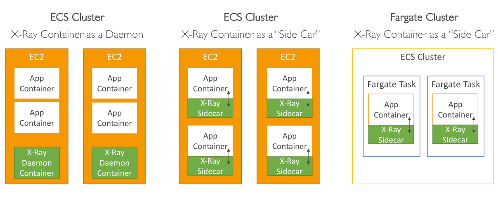

# ECS + X-Ray integration

บทเรียนนี้อธิบายวิธีการ **รวม AWS X-Ray กับ ECS Cluster** และมี 3 ตัวเลือกสำหรับการรัน **X-Ray Daemon** ภายในสภาพแวดล้อม ECS

## ตัวเลือก 1: รัน X-Ray Daemon เป็น Daemon Container บน EC2 Instances

* สำหรับ ECS cluster ที่มี **EC2 instances** ที่คุณจัดการเอง
* รัน **X-Ray Daemon** เป็น **Daemon task**

  * หมายความว่า **จะมี X-Ray Daemon container 1 ตัวต่อ EC2 instance**
  * ตัวอย่าง: ถ้า ECS cluster มี 10 EC2 instances จะมี X-Ray Daemon containers 10 ตัว (ตัวละ instance)
* Application containers ของคุณรันบน EC2 instances เหล่านี้ และเชื่อมต่อกับ X-Ray Daemon ผ่าน **UDP port**

## ตัวเลือก 2: Side Car Pattern

* ยังใช้ EC2 instances เหมือนเดิม
* แต่แทนที่จะรัน 1 Daemon container ต่อ instance
* รัน **X-Ray Daemon container คู่ขนานกับแต่ละ application container**

  * ตัวอย่าง: ถ้า EC2 instance มี application containers 20 ตัว จะมี X-Ray Daemon Side Car containers 20 ตัว
* "Side Car" หมายถึง X-Ray Daemon รันคู่ขนานกับ application container เพื่อให้แต่ละ container มี tracing ของตัวเอง

## ตัวเลือก 3: ใช้ X-Ray กับ Fargate Clusters

* ใน **Fargate clusters** คุณไม่สามารถเข้าควบคุม EC2 instances ได้
* ดังนั้น **ไม่สามารถรัน Daemon container แบบตัวเลือก 1**
* ต้องใช้ **Side Car Pattern**

  * รัน X-Ray Daemon container คู่ขนานกับแต่ละ application container ภายใน Fargate task
  * แต่ละ Fargate task จะมี **application container + X-Ray Side Car container**

## ตัวอย่าง Task Definition สำหรับ Side Car Pattern

* X-Ray Daemon container รันที่ **port 2000 (UDP)**
* Application container (เช่น Scorekeep API) มี **environment variable ชื่อ AWS_XRAY_DAEMON_ADDRESS**

  * ตัวแปรนี้ชี้ไปยัง **UDP port 2000 ของ X-Ray Daemon**
* Container ทั้งสองเชื่อมต่อเครือข่ายกัน ทำให้ application container สามารถ resolve hostname `xray-daemon`
* ช่วยให้ application container ส่ง trace data ไปยัง X-Ray Daemon ได้ถูกต้อง

## การตั้งค่าที่สำคัญ

1. Map **X-Ray Daemon container port 2000** เป็น **UDP**
2. ตั้ง **AWS_XRAY_DAEMON_ADDRESS** ใน application container ให้ชี้ไปที่ address และ port ของ X-Ray Daemon
3. Link container ทั้งสองเพื่อให้สามารถ resolve hostname และเชื่อมต่อเครือข่าย

## สรุป

* **Daemon container approach**: ใช้บน EC2 instances ที่คุณจัดการ
* **Side Car pattern**: รันคู่กับแต่ละ application container บน EC2 หรือ Fargate
* ตั้งค่าเครือข่ายให้ถูกต้อง: **port mapping, environment variable, container linking**
* ทำความเข้าใจตัวเลือกเหล่านี้สำคัญสำหรับการสอบ AWS และการวางระบบจริง

## Key Takeaways

* มี **3 ตัวเลือกหลัก** สำหรับรวม X-Ray กับ ECS:

  1. Daemon container บนแต่ละ EC2 instance
  2. Side Car คู่กับแต่ละ application container
  3. Side Car ใน Fargate clusters
* **Daemon container approach**: 1 X-Ray Daemon container ต่อ EC2 instance เก็บ traces จากทุก app container
* **Side Car pattern**: 1 X-Ray Daemon container คู่กับแต่ละ app container เพื่อให้ tracing แยกกัน
* ใน Fargate clusters ต้องใช้ Side Car เนื่องจากไม่สามารถควบคุม underlying instances
* การตั้งค่าเครือข่ายสำคัญ: map **port 2000 UDP**, ตั้ง **AWS_XRAY_DAEMON_ADDRESS**, link containers